# Design Document — AS Finance Loan Management System

## Overview

AS Finance LMS is a production-grade fullstack loan management system for a lending company operating in small cities and villages in India. The system manages the complete lending lifecycle: customer onboarding, loan product configuration, loan origination and approval, deterministic EMI schedule generation, field and office collection posting with automatic allocation, group lending, double-entry accounting, penalty management, foreclosure, reporting, SMS notifications, and comprehensive audit logging.

### Design Goals

1. **Financial Correctness First**: Every money calculation uses Decimal.js with explicit ROUND_HALF_UP rounding. All money persisted as integer paise. No floating-point money anywhere.
2. **Atomic Finance Operations**: Every finance-affecting mutation (disbursement, collection, reversal, penalty, foreclosure) executes within a single database transaction. Failure rolls back everything.
3. **Append-Only Finance History**: Finance events are never modified or deleted. Corrections via compensating entries only.
4. **Deterministic Schedules**: Identical inputs always produce byte-identical schedules.
5. **Auditable Everything**: Every finance and security action produces an immutable audit log entry.
6. **Field Usability**: Mobile-first collection workflows, large touch targets, explicit success/failure messaging, no optimistic UI for finance mutations.

### Technology Stack

| Layer | Technology |
|---|---|
| Frontend | Next.js 14+ (App Router), TypeScript, Tailwind CSS, shadcn/ui, React Hook Form + Zod, TanStack Query |
| Backend | NestJS, TypeScript, Prisma ORM, class-validator + class-transformer |
| Database | PostgreSQL 15+ |
| Testing | Vitest, fast-check, Supertest, Playwright |
| Storage | S3-compatible (MinIO local, S3 production) |
| Infrastructure | Docker + docker-compose, pnpm workspaces |

## Architecture

### Monorepo Structure

```
as-finance-lms/
├── apps/
│   ├── web/                    # Next.js frontend (App Router)
│   └── api/                    # NestJS backend
├── packages/
│   ├── shared/                 # Types, enums, constants, Zod schemas, pure utils
│   ├── config/                 # Shared ESLint, TS, Prettier configs
│   └── testing/                # Test factories, fixtures, helpers
├── docs/
├── docker-compose.yml
└── pnpm-workspace.yaml
```

### Backend Module Architecture

```
apps/api/src/modules/
├── auth/                       # Authentication, JWT, session management
├── user/                       # User CRUD, role assignment
├── customer/                   # Customer onboarding, KYC, family, guarantors
├── loan-product/               # Product configuration, versioning
├── loan/                       # Loan application lifecycle, state machine
├── schedule/                   # EMI schedule generation (pure calculation)
├── disbursement/               # Disbursement orchestration
├── collection/                 # Collection posting, allocation engine
├── reversal/                   # Collection reversal orchestration
├── penalty/                    # Overdue tracking, penalty calculation and posting
├── foreclosure/                # Early closure orchestration
├── group/                      # Group lending management
├── accounting/                 # Chart of accounts, journal entries, ledger
├── cashbook/                   # Cash transactions, expenses, handovers
├── receipt/                    # Receipt generation, sequencing
├── notification/               # Outbox, SMS dispatch, templates
├── document/                   # File upload, S3 abstraction, signed URLs
├── report/                     # Report generation, export pipeline
├── audit/                      # Audit log service
├── settings/                   # System settings, holiday calendar
└── health/                     # Health check endpoints
```

### Layered Architecture per Module

```
Controller → Service → Repository → Prisma
     ↓           ↓
   Guards    Transaction
   (RBAC)    Orchestrator
     ↓           ↓
  DTOs +     Journal Entry
  Validation   Service
```

Each module follows the pattern:
- **Controller**: HTTP handling, DTO validation, RBAC guard application. No business logic.
- **Service**: Business logic, validation, orchestration. Calls repository for data access.
- **Repository**: Prisma data access abstraction. No business logic.
- **Transaction Orchestrator**: For multi-step finance mutations, a dedicated service that manages `prisma.$transaction()` to ensure atomicity across multiple repositories.

### Cross-Module Communication

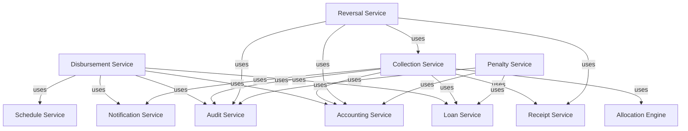

Finance-critical cross-module operations pass a Prisma transaction client (`tx`) through the call chain so all operations execute within a single transaction boundary.

### Request Flow

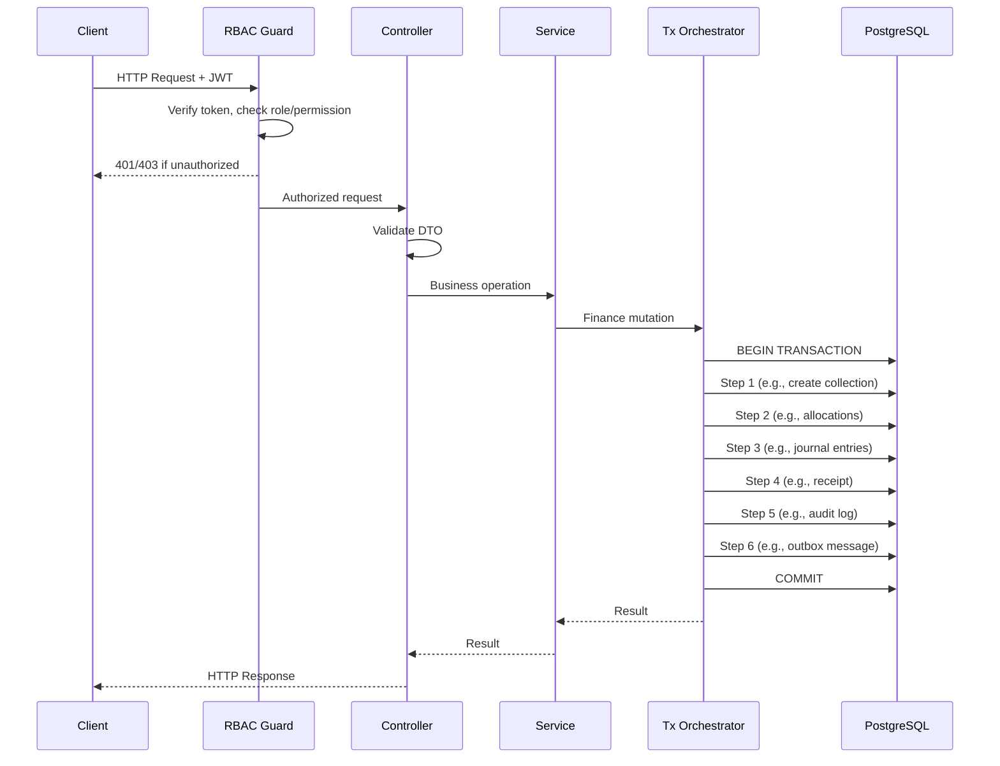


## Components and Interfaces

### 1. Authentication Module (`auth`)

**Responsibilities**: Login, logout, JWT issuance, refresh token rotation, password management, account lockout.

**Key Interfaces**:
```typescript
// auth.service.ts
interface AuthService {
  login(dto: LoginDto): Promise<{ accessToken: string; user: UserProfile }>;
  refreshToken(refreshToken: string): Promise<{ accessToken: string }>;
  logout(userId: string): Promise<void>;
  changePassword(userId: string, dto: ChangePasswordDto): Promise<void>;
}

// LoginDto
interface LoginDto {
  username: string;
  password: string;
}
```

**JWT Payload**:
```typescript
interface JwtPayload {
  sub: string;        // user UUID
  role: UserRole;
  iat: number;
  exp: number;
}
```

### 2. Customer Module (`customer`)

**Responsibilities**: Customer CRUD, KYC document management, family members, guarantors, duplicate detection, blacklisting.

**Key Interfaces**:
```typescript
interface CustomerService {
  create(dto: CreateCustomerDto, actorId: string): Promise<Customer>;
  update(id: string, dto: UpdateCustomerDto, actorId: string): Promise<Customer>;
  findById(id: string): Promise<Customer>;
  findAll(query: CustomerQueryDto): Promise<PaginatedResult<Customer>>;
  blacklist(id: string, dto: BlacklistDto, actorId: string): Promise<Customer>;
  addFamilyMember(customerId: string, dto: CreateFamilyMemberDto): Promise<FamilyMember>;
  addGuarantor(customerId: string, dto: CreateGuarantorDto): Promise<Guarantor>;
  checkDuplicate(aadhaar?: string, mobile?: string): Promise<DuplicateCheckResult>;
}
```

### 3. Loan Product Module (`loan-product`)

**Responsibilities**: Product configuration, versioning, validation of rate/tenure/principal bounds.

**Key Interfaces**:
```typescript
interface LoanProductService {
  create(dto: CreateLoanProductDto, actorId: string): Promise<LoanProduct>;
  update(id: string, dto: UpdateLoanProductDto, actorId: string): Promise<LoanProductVersion>;
  findById(id: string): Promise<LoanProduct>;
  findActiveVersion(productId: string): Promise<LoanProductVersion>;
  deactivate(id: string, actorId: string): Promise<LoanProduct>;
}
```

### 4. Loan Module (`loan`)

**Responsibilities**: Loan application CRUD, state machine enforcement, maker-checker for approval.

**Key Interfaces**:
```typescript
interface LoanService {
  create(dto: CreateLoanDto, actorId: string): Promise<Loan>;
  submit(loanId: string, actorId: string): Promise<Loan>;
  review(loanId: string, actorId: string): Promise<Loan>;
  approve(loanId: string, dto: ApproveLoanDto, actorId: string): Promise<Loan>;
  reject(loanId: string, dto: RejectLoanDto, actorId: string): Promise<Loan>;
  findById(id: string): Promise<LoanDetail>;
  findAll(query: LoanQueryDto): Promise<PaginatedResult<Loan>>;
  getOutstandingBalance(loanId: string): Promise<number>; // paise
  getDPD(loanId: string): Promise<{ dpd: number; bucket: OverdueBucket }>;
}
```

### 5. Schedule Module (`schedule`)

**Responsibilities**: Pure EMI calculation, schedule generation, holiday adjustment. No side effects — pure functions.

**Key Interfaces**:
```typescript
interface ScheduleService {
  generateSchedule(params: ScheduleParams): Installment[];
  calculateFlatEMI(principal: number, annualRateBps: number, tenureMonths: number): EMIBreakdown;
  calculateReducingBalanceEMI(principal: number, annualRateBps: number, tenureMonths: number): EMIBreakdown;
  adjustForHolidays(dueDates: Date[], holidays: Date[]): Date[];
}

interface ScheduleParams {
  principalPaise: number;
  annualRateBps: number;       // basis points (e.g., 1200 = 12%)
  tenureMonths: number;
  interestType: 'flat' | 'reducing_balance';
  frequency: 'daily' | 'weekly' | 'monthly';
  startDate: Date;             // IST business date
  holidays: Date[];
}

interface Installment {
  installmentNumber: number;
  dueDate: Date;
  principalPaise: number;
  interestPaise: number;
  totalPaise: number;
}
```

### 6. Disbursement Module (`disbursement`)

**Responsibilities**: Prerequisite verification, atomic disbursement execution, idempotency.

**Key Interfaces**:
```typescript
interface DisbursementService {
  disburse(dto: DisburseDto, actorId: string): Promise<DisbursementResult>;
  verifyPrerequisites(loanId: string): Promise<PrerequisiteCheckResult>;
}

interface DisburseDto {
  loanId: string;
  mode: 'cash' | 'bank';
  referenceNumber?: string;
  idempotencyKey: string;
}
```

### 7. Collection Module (`collection`)

**Responsibilities**: Payment posting, allocation engine, receipt generation trigger, idempotency.

**Key Interfaces**:
```typescript
interface CollectionService {
  postCollection(dto: PostCollectionDto, actorId: string): Promise<CollectionResult>;
  getAllocations(collectionId: string): Promise<CollectionAllocation[]>;
}

interface PostCollectionDto {
  loanId: string;
  amountPaise: number;
  paymentDate: string;          // ISO 8601
  paymentMode: 'cash' | 'bank_transfer' | 'online';
  idempotencyKey: string;
}

interface CollectionResult {
  collection: Collection;
  allocations: CollectionAllocation[];
  receipt: Receipt;
  updatedOutstanding: number;   // paise
}
```

### 8. Allocation Engine

The allocation engine is a pure function within the collection module. It takes the current loan state (schedule + existing allocations + penalties) and a payment amount, and returns the allocation breakdown.

```typescript
interface AllocationEngine {
  allocate(params: AllocationParams): AllocationResult;
}

interface AllocationParams {
  amountPaise: number;
  installments: InstallmentState[];   // ordered by due date
  pendingPenalties: PenaltyState[];   // ordered by date
  allocationOrder: ComponentOrder[];  // default: ['penalty', 'interest', 'principal']
}

interface AllocationResult {
  allocations: AllocationLine[];
  totalPenaltyAllocated: number;
  totalInterestAllocated: number;
  totalPrincipalAllocated: number;
  excessAmount: number;               // for advance payments
}
```

### 9. Reversal Module (`reversal`)

**Responsibilities**: Compensating entry creation, schedule rollback, ledger mirror entries.

```typescript
interface ReversalService {
  reverseCollection(dto: ReverseCollectionDto, actorId: string): Promise<ReversalResult>;
}

interface ReverseCollectionDto {
  collectionId: string;
  reason: string;
  idempotencyKey: string;
}
```

### 10. Accounting Module (`accounting`)

**Responsibilities**: Chart of accounts, journal entry creation and validation, ledger queries, trial balance, P&L, balance sheet.

```typescript
interface AccountingService {
  createJournalEntry(dto: CreateJournalEntryDto, tx?: PrismaTransaction): Promise<JournalEntry>;
  getTrialBalance(asOfDate: Date): Promise<TrialBalance>;
  getProfitAndLoss(startDate: Date, endDate: Date): Promise<ProfitAndLoss>;
  getBalanceSheet(asOfDate: Date): Promise<BalanceSheet>;
  getDaybook(startDate: Date, endDate: Date): Promise<JournalEntry[]>;
}

interface CreateJournalEntryDto {
  date: Date;
  description: string;
  sourceType: JournalSourceType;  // 'disbursement' | 'collection' | 'reversal' | 'penalty' | 'expense' | 'processing_fee'
  sourceId: string;
  lines: JournalLineDto[];
}

interface JournalLineDto {
  accountId: string;
  debitPaise: number;
  creditPaise: number;
}
```

### 11. Notification Module (`notification`)

**Responsibilities**: Outbox message enqueueing, background SMS dispatch, retry with exponential backoff, dead-letter handling.

```typescript
interface NotificationService {
  enqueue(dto: EnqueueNotificationDto, tx?: PrismaTransaction): Promise<OutboxMessage>;
}

interface SmsProvider {
  send(to: string, message: string): Promise<SmsResult>;
}

interface OutboxProcessor {
  processNextBatch(batchSize: number): Promise<number>;  // returns processed count
}
```

### 12. Document Module (`document`)

**Responsibilities**: File upload validation, S3 storage, signed URL generation.

```typescript
interface DocumentService {
  upload(file: Express.Multer.File, dto: UploadDocumentDto, actorId: string): Promise<FileMetadata>;
  getSignedUrl(fileId: string, actorId: string): Promise<string>;
  softDelete(fileId: string, actorId: string): Promise<void>;
}
```


## Data Models

### Entity Relationship Diagram

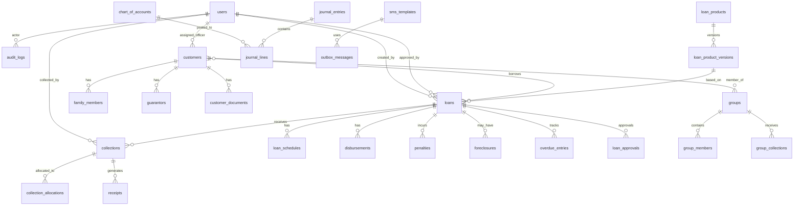

### Complete Database Schema

#### `users`
| Column | Type | Constraints | Notes |
|---|---|---|---|
| id | UUID | PK, DEFAULT gen_random_uuid() | External identifier |
| username | VARCHAR(100) | UNIQUE, NOT NULL | Login identifier |
| password_hash | VARCHAR(255) | NOT NULL | bcrypt hash |
| full_name | VARCHAR(200) | NOT NULL | Display name |
| email | VARCHAR(200) | UNIQUE, NULLABLE | Optional email |
| mobile | VARCHAR(15) | UNIQUE, NOT NULL | Contact number |
| role | ENUM(UserRole) | NOT NULL | super_admin, manager, field_officer, collection_officer, accountant, office_staff, viewer_auditor |
| is_active | BOOLEAN | NOT NULL, DEFAULT true | Soft disable |
| failed_login_attempts | INT | NOT NULL, DEFAULT 0 | Lockout counter |
| locked_until | TIMESTAMPTZ | NULLABLE | Account lockout expiry |
| last_login_at | TIMESTAMPTZ | NULLABLE | |
| version | INT | NOT NULL, DEFAULT 1 | Optimistic locking |
| created_at | TIMESTAMPTZ | NOT NULL, DEFAULT now() | |
| updated_at | TIMESTAMPTZ | NOT NULL | Auto-updated |

**Indexes**: `idx_users_username` (unique), `idx_users_role`, `idx_users_mobile` (unique)

#### `refresh_tokens`
| Column | Type | Constraints | Notes |
|---|---|---|---|
| id | UUID | PK | |
| user_id | UUID | FK → users.id, NOT NULL | |
| token_hash | VARCHAR(255) | NOT NULL | bcrypt hash of refresh token |
| expires_at | TIMESTAMPTZ | NOT NULL | 7-day expiry |
| is_revoked | BOOLEAN | NOT NULL, DEFAULT false | Revoked on logout/password change |
| created_at | TIMESTAMPTZ | NOT NULL, DEFAULT now() | |

**Indexes**: `idx_refresh_tokens_user_id`, `idx_refresh_tokens_token_hash`

#### `user_area_assignments`
| Column | Type | Constraints | Notes |
|---|---|---|---|
| id | UUID | PK | |
| user_id | UUID | FK → users.id, NOT NULL | Field officer or collection officer |
| area_name | VARCHAR(200) | NOT NULL | Branch/area/route name |
| is_active | BOOLEAN | NOT NULL, DEFAULT true | |
| assigned_by | UUID | FK → users.id, NOT NULL | Manager who assigned |
| created_at | TIMESTAMPTZ | NOT NULL, DEFAULT now() | |

**Indexes**: `idx_user_area_user_id`, `idx_user_area_area_name`, `idx_user_area_active` (unique: user_id + area_name WHERE is_active = true)

**Note**: Used for RBAC scope enforcement. Collection officers see only loans in their assigned areas. Field officers see only customers in their assigned areas.

#### `customers`
| Column | Type | Constraints | Notes |
|---|---|---|---|
| id | UUID | PK | |
| full_name | VARCHAR(200) | NOT NULL | |
| father_or_husband_name | VARCHAR(200) | NULLABLE | |
| mobile | VARCHAR(15) | NOT NULL | |
| alternate_mobile | VARCHAR(15) | NULLABLE | |
| aadhaar_number_encrypted | VARCHAR(500) | NOT NULL | Encrypted at rest |
| aadhaar_last_four | CHAR(4) | NOT NULL | For display/search |
| pan_number_encrypted | VARCHAR(500) | NULLABLE | Encrypted at rest |
| pan_last_four | CHAR(4) | NULLABLE | For display/search |
| dob | DATE | NULLABLE | Date of birth |
| age | INT | NULLABLE | If DOB not available |
| gender | VARCHAR(10) | NOT NULL | male, female, other |
| occupation | VARCHAR(200) | NULLABLE | |
| monthly_income_paise | BIGINT | NULLABLE | |
| work_or_business_details | TEXT | NULLABLE | |
| address_line1 | VARCHAR(500) | NOT NULL | |
| address_line2 | VARCHAR(500) | NULLABLE | |
| city | VARCHAR(100) | NOT NULL | |
| district | VARCHAR(100) | NOT NULL | |
| state | VARCHAR(100) | NOT NULL | |
| pincode | CHAR(6) | NOT NULL | |
| risk_level | ENUM(RiskLevel) | NOT NULL, DEFAULT 'medium' | low, medium, high |
| status | ENUM(CustomerStatus) | NOT NULL, DEFAULT 'active' | active, blacklisted, inactive |
| blacklist_reason | TEXT | NULLABLE | Required when blacklisted |
| blacklisted_at | TIMESTAMPTZ | NULLABLE | |
| blacklisted_by | UUID | FK → users.id, NULLABLE | |
| assigned_officer_id | UUID | FK → users.id, NULLABLE | Field officer assignment |
| photo_file_id | UUID | FK → file_metadata.id, NULLABLE | Primary photo |
| notes | TEXT | NULLABLE | General remarks/notes about the customer |
| version | INT | NOT NULL, DEFAULT 1 | Optimistic locking |
| created_by | UUID | FK → users.id, NOT NULL | |
| created_at | TIMESTAMPTZ | NOT NULL, DEFAULT now() | |
| updated_at | TIMESTAMPTZ | NOT NULL | |

**Indexes**: `idx_customers_aadhaar_last_four`, `idx_customers_mobile`, `idx_customers_status`, `idx_customers_assigned_officer`, `idx_customers_created_by`


#### `customer_documents`
| Column | Type | Constraints | Notes |
|---|---|---|---|
| id | UUID | PK | |
| customer_id | UUID | FK → customers.id, NOT NULL | |
| document_type | ENUM(DocType) | NOT NULL | aadhaar_front, aadhaar_back, pan, photo, address_proof, other |
| file_id | UUID | FK → file_metadata.id, NOT NULL | |
| is_verified | BOOLEAN | NOT NULL, DEFAULT false | |
| verified_by | UUID | FK → users.id, NULLABLE | |
| verified_at | TIMESTAMPTZ | NULLABLE | |
| is_active | BOOLEAN | NOT NULL, DEFAULT true | Soft delete |
| created_at | TIMESTAMPTZ | NOT NULL, DEFAULT now() | |

**Indexes**: `idx_customer_documents_customer_id`, `idx_customer_documents_type`

#### `family_members`
| Column | Type | Constraints | Notes |
|---|---|---|---|
| id | UUID | PK | |
| customer_id | UUID | FK → customers.id, NOT NULL | |
| name | VARCHAR(200) | NOT NULL | |
| relationship | VARCHAR(50) | NOT NULL | father, mother, spouse, sibling, child, other |
| contact_number | VARCHAR(15) | NULLABLE | |
| occupation | VARCHAR(200) | NULLABLE | |
| income_contribution | VARCHAR(200) | NULLABLE | Income contribution description |
| created_at | TIMESTAMPTZ | NOT NULL, DEFAULT now() | |

**Indexes**: `idx_family_members_customer_id`

#### `guarantors`
| Column | Type | Constraints | Notes |
|---|---|---|---|
| id | UUID | PK | |
| customer_id | UUID | FK → customers.id, NOT NULL | |
| name | VARCHAR(200) | NOT NULL | |
| relationship | VARCHAR(50) | NOT NULL | |
| mobile | VARCHAR(15) | NOT NULL | |
| aadhaar_number_encrypted | VARCHAR(500) | NOT NULL | |
| aadhaar_last_four | CHAR(4) | NOT NULL | |
| address | TEXT | NOT NULL | |
| photo_file_id | UUID | FK → file_metadata.id, NULLABLE | |
| created_at | TIMESTAMPTZ | NOT NULL, DEFAULT now() | |

**Indexes**: `idx_guarantors_customer_id`

#### `loan_products`
| Column | Type | Constraints | Notes |
|---|---|---|---|
| id | UUID | PK | |
| name | VARCHAR(200) | NOT NULL, UNIQUE | |
| is_active | BOOLEAN | NOT NULL, DEFAULT true | |
| current_version_id | UUID | FK → loan_product_versions.id, NULLABLE | Points to active version |
| created_by | UUID | FK → users.id, NOT NULL | |
| created_at | TIMESTAMPTZ | NOT NULL, DEFAULT now() | |
| updated_at | TIMESTAMPTZ | NOT NULL | |

**Indexes**: `idx_loan_products_name` (unique), `idx_loan_products_is_active`

#### `loan_product_versions`
| Column | Type | Constraints | Notes |
|---|---|---|---|
| id | UUID | PK | |
| product_id | UUID | FK → loan_products.id, NOT NULL | |
| version_number | INT | NOT NULL | Auto-incremented per product |
| interest_type | ENUM(InterestType) | NOT NULL | flat, reducing_balance |
| annual_rate_bps | INT | NOT NULL | Basis points (1200 = 12%) |
| min_principal_paise | BIGINT | NOT NULL | |
| max_principal_paise | BIGINT | NOT NULL | |
| min_tenure_months | INT | NOT NULL | |
| max_tenure_months | INT | NOT NULL | |
| repayment_frequency | ENUM(Frequency) | NOT NULL | daily, weekly, monthly |
| processing_fee_type | ENUM(FeeType) | NULLABLE | fixed, percentage |
| processing_fee_value | INT | NULLABLE | Paise if fixed, bps if percentage |
| penalty_grace_days | INT | NOT NULL, DEFAULT 0 | |
| penalty_type | ENUM(PenaltyType) | NULLABLE | flat_per_period, percentage_of_overdue |
| penalty_value | INT | NULLABLE | Paise if flat, bps if percentage |
| penalty_frequency | ENUM(Frequency) | NULLABLE | daily, weekly, monthly |
| max_concurrent_loans | INT | NOT NULL, DEFAULT 1 | |
| allocation_order | JSONB | NOT NULL, DEFAULT '["penalty","interest","principal"]' | |
| is_active | BOOLEAN | NOT NULL, DEFAULT true | |
| created_at | TIMESTAMPTZ | NOT NULL, DEFAULT now() | |

**Indexes**: `idx_lpv_product_id`, `idx_lpv_product_version` (unique: product_id + version_number)


#### `loans`
| Column | Type | Constraints | Notes |
|---|---|---|---|
| id | UUID | PK | |
| loan_number | VARCHAR(50) | UNIQUE, NOT NULL | Human-readable reference (e.g., LN-2024-00001) |
| customer_id | UUID | FK → customers.id, NOT NULL | |
| product_version_id | UUID | FK → loan_product_versions.id, NOT NULL | Frozen at creation |
| group_id | UUID | FK → groups.id, NULLABLE | For group loans |
| principal_paise | BIGINT | NOT NULL | Approved principal |
| tenure_months | INT | NOT NULL | |
| purpose | TEXT | NOT NULL | |
| status | ENUM(LoanStatus) | NOT NULL, DEFAULT 'draft' | See state machine |
| processing_fee_paise | BIGINT | NULLABLE | Calculated at approval, collected at disbursement |
| total_interest_paise | BIGINT | NULLABLE | Calculated at schedule generation |
| total_payable_paise | BIGINT | NULLABLE | principal + interest |
| cached_outstanding_paise | BIGINT | NULLABLE | Transactionally updated cache |
| disbursement_date | DATE | NULLABLE | IST business date |
| first_due_date | DATE | NULLABLE | |
| last_due_date | DATE | NULLABLE | |
| dpd | INT | NOT NULL, DEFAULT 0 | Days past due |
| overdue_bucket | ENUM(OverdueBucket) | NULLABLE | bucket_0, bucket_1_30, bucket_31_60, bucket_61_90, bucket_90_plus |
| created_by | UUID | FK → users.id, NOT NULL | Maker |
| approved_by | UUID | FK → users.id, NULLABLE | Checker (must differ from created_by) |
| version | INT | NOT NULL, DEFAULT 1 | Optimistic locking |
| created_at | TIMESTAMPTZ | NOT NULL, DEFAULT now() | |
| updated_at | TIMESTAMPTZ | NOT NULL | |

**Indexes**: `idx_loans_loan_number` (unique), `idx_loans_customer_id`, `idx_loans_status`, `idx_loans_group_id`, `idx_loans_product_version_id`, `idx_loans_created_by`, `idx_loans_dpd`, `idx_loans_overdue_bucket`

**CHECK constraints**: `principal_paise > 0`, `tenure_months > 0`, `dpd >= 0`

#### `loan_approvals`
| Column | Type | Constraints | Notes |
|---|---|---|---|
| id | UUID | PK | |
| loan_id | UUID | FK → loans.id, NOT NULL | |
| action | ENUM(ApprovalAction) | NOT NULL | submitted, under_review, approved, rejected |
| actor_id | UUID | FK → users.id, NOT NULL | |
| remarks | TEXT | NULLABLE | Required for rejection |
| created_at | TIMESTAMPTZ | NOT NULL, DEFAULT now() | |

**Indexes**: `idx_loan_approvals_loan_id`, `idx_loan_approvals_actor_id`

#### `loan_status_history`
| Column | Type | Constraints | Notes |
|---|---|---|---|
| id | UUID | PK | |
| loan_id | UUID | FK → loans.id, NOT NULL | |
| from_status | ENUM(LoanStatus) | NULLABLE | NULL for initial creation |
| to_status | ENUM(LoanStatus) | NOT NULL | |
| changed_by | UUID | FK → users.id, NOT NULL | |
| reason | TEXT | NULLABLE | Required for rejection, defaulting |
| metadata | JSONB | NULLABLE | Additional context (e.g., DPD value for defaulting) |
| created_at | TIMESTAMPTZ | NOT NULL, DEFAULT now() | |

**Indexes**: `idx_loan_status_history_loan_id`, `idx_loan_status_history_to_status`, `idx_loan_status_history_created_at`

#### `loan_schedules`
| Column | Type | Constraints | Notes |
|---|---|---|---|
| id | UUID | PK | |
| loan_id | UUID | FK → loans.id, NOT NULL | |
| installment_number | INT | NOT NULL | 1-based |
| due_date | DATE | NOT NULL | IST business date |
| principal_paise | BIGINT | NOT NULL | |
| interest_paise | BIGINT | NOT NULL | |
| total_paise | BIGINT | NOT NULL | principal + interest |
| principal_paid_paise | BIGINT | NOT NULL, DEFAULT 0 | Running total of principal allocated |
| interest_paid_paise | BIGINT | NOT NULL, DEFAULT 0 | Running total of interest allocated |
| penalty_paid_paise | BIGINT | NOT NULL, DEFAULT 0 | Running total of penalty allocated |
| status | ENUM(InstallmentStatus) | NOT NULL, DEFAULT 'pending' | pending, partial, paid, overdue, closed |
| version | INT | NOT NULL, DEFAULT 1 | Optimistic locking |
| created_at | TIMESTAMPTZ | NOT NULL, DEFAULT now() | |
| updated_at | TIMESTAMPTZ | NOT NULL | |

**Indexes**: `idx_schedules_loan_id`, `idx_schedules_due_date`, `idx_schedules_status`, `idx_schedules_loan_installment` (unique: loan_id + installment_number)

**CHECK constraints**: `principal_paise >= 0`, `interest_paise >= 0`, `principal_paid_paise >= 0`, `interest_paid_paise >= 0`

#### `disbursements`
| Column | Type | Constraints | Notes |
|---|---|---|---|
| id | UUID | PK | |
| loan_id | UUID | FK → loans.id, NOT NULL | |
| amount_paise | BIGINT | NOT NULL | |
| mode | ENUM(PaymentMode) | NOT NULL | cash, bank_transfer |
| reference_number | VARCHAR(100) | NULLABLE | Bank reference |
| disbursed_by | UUID | FK → users.id, NOT NULL | |
| disbursed_at | TIMESTAMPTZ | NOT NULL | |
| journal_entry_id | UUID | FK → journal_entries.id, NOT NULL | |
| idempotency_key | VARCHAR(255) | UNIQUE, NOT NULL | |
| created_at | TIMESTAMPTZ | NOT NULL, DEFAULT now() | |

**Indexes**: `idx_disbursements_loan_id`, `idx_disbursements_idempotency_key` (unique)


#### `collections`
| Column | Type | Constraints | Notes |
|---|---|---|---|
| id | UUID | PK | |
| loan_id | UUID | FK → loans.id, NOT NULL | |
| amount_paise | BIGINT | NOT NULL | Positive for payment, negative for reversal |
| payment_date | DATE | NOT NULL | IST business date |
| payment_mode | ENUM(PaymentMode) | NOT NULL | cash, bank_transfer, online |
| status | ENUM(CollectionStatus) | NOT NULL, DEFAULT 'posted' | posted, reversed |
| is_reversal | BOOLEAN | NOT NULL, DEFAULT false | |
| original_collection_id | UUID | FK → collections.id, NULLABLE | For reversals only |
| reversal_reason | TEXT | NULLABLE | Required for reversals |
| collected_by | UUID | FK → users.id, NOT NULL | |
| journal_entry_id | UUID | FK → journal_entries.id, NOT NULL | |
| receipt_id | UUID | FK → receipts.id, NULLABLE | |
| idempotency_key | VARCHAR(255) | UNIQUE, NOT NULL | |
| created_at | TIMESTAMPTZ | NOT NULL, DEFAULT now() | |

**Indexes**: `idx_collections_loan_id`, `idx_collections_payment_date`, `idx_collections_status`, `idx_collections_idempotency_key` (unique), `idx_collections_original_collection_id`

**CHECK constraints**: `amount_paise != 0`

#### `collection_allocations`
| Column | Type | Constraints | Notes |
|---|---|---|---|
| id | UUID | PK | |
| collection_id | UUID | FK → collections.id, NOT NULL | |
| installment_id | UUID | FK → loan_schedules.id, NOT NULL | |
| penalty_paise | BIGINT | NOT NULL, DEFAULT 0 | |
| interest_paise | BIGINT | NOT NULL, DEFAULT 0 | |
| principal_paise | BIGINT | NOT NULL, DEFAULT 0 | |
| total_paise | BIGINT | NOT NULL | penalty + interest + principal |
| created_at | TIMESTAMPTZ | NOT NULL, DEFAULT now() | |

**Indexes**: `idx_allocations_collection_id`, `idx_allocations_installment_id`

**CHECK constraints**: `penalty_paise >= 0`, `interest_paise >= 0`, `principal_paise >= 0`, `total_paise = penalty_paise + interest_paise + principal_paise`

#### `receipts`
| Column | Type | Constraints | Notes |
|---|---|---|---|
| id | UUID | PK | |
| receipt_number | VARCHAR(50) | UNIQUE, NOT NULL | Sequential (e.g., RCP-2024-00001) |
| collection_id | UUID | FK → collections.id, NOT NULL | |
| loan_id | UUID | FK → loans.id, NOT NULL | |
| customer_id | UUID | FK → customers.id, NOT NULL | |
| amount_paise | BIGINT | NOT NULL | |
| payment_date | DATE | NOT NULL | |
| payment_mode | ENUM(PaymentMode) | NOT NULL | |
| penalty_component_paise | BIGINT | NOT NULL, DEFAULT 0 | |
| interest_component_paise | BIGINT | NOT NULL, DEFAULT 0 | |
| principal_component_paise | BIGINT | NOT NULL, DEFAULT 0 | |
| outstanding_after_paise | BIGINT | NOT NULL | Balance after this collection |
| officer_name | VARCHAR(200) | NOT NULL | Snapshot at receipt time |
| customer_name | VARCHAR(200) | NOT NULL | Snapshot at receipt time |
| loan_number | VARCHAR(50) | NOT NULL | Snapshot |
| status | ENUM(ReceiptStatus) | NOT NULL, DEFAULT 'active' | active, reversed |
| compensating_receipt_id | UUID | FK → receipts.id, NULLABLE | Points to reversal receipt |
| is_reversal | BOOLEAN | NOT NULL, DEFAULT false | |
| original_receipt_id | UUID | FK → receipts.id, NULLABLE | For reversal receipts |
| created_at | TIMESTAMPTZ | NOT NULL, DEFAULT now() | |

**Indexes**: `idx_receipts_receipt_number` (unique), `idx_receipts_collection_id`, `idx_receipts_loan_id`, `idx_receipts_customer_id`, `idx_receipts_payment_date`

**Note**: Receipt content fields (amount, components, names, numbers) are immutable snapshots. They are never updated after creation.

#### `penalties`
| Column | Type | Constraints | Notes |
|---|---|---|---|
| id | UUID | PK | |
| loan_id | UUID | FK → loans.id, NOT NULL | |
| installment_id | UUID | FK → loan_schedules.id, NOT NULL | Source installment |
| amount_paise | BIGINT | NOT NULL | |
| penalty_period | VARCHAR(20) | NOT NULL | e.g., "2024-01-W3" or "2024-01-15" |
| calculation_details | JSONB | NOT NULL | { type, rate, base_amount, days, result } |
| is_paid | BOOLEAN | NOT NULL, DEFAULT false | |
| is_waived | BOOLEAN | NOT NULL, DEFAULT false | |
| waived_by | UUID | FK → users.id, NULLABLE | Waiver requester (maker) |
| waiver_approved_by | UUID | FK → users.id, NULLABLE | Waiver approver (checker, must differ from waived_by) |
| waived_reason | TEXT | NULLABLE | |
| journal_entry_id | UUID | FK → journal_entries.id, NOT NULL | |
| created_at | TIMESTAMPTZ | NOT NULL, DEFAULT now() | |

**Indexes**: `idx_penalties_loan_id`, `idx_penalties_installment_id`, `idx_penalties_unique_period` (unique: loan_id + installment_id + penalty_period)


#### `foreclosures`
| Column | Type | Constraints | Notes |
|---|---|---|---|
| id | UUID | PK | |
| loan_id | UUID | FK → loans.id, NOT NULL | |
| outstanding_principal_paise | BIGINT | NOT NULL | At time of foreclosure |
| accrued_interest_paise | BIGINT | NOT NULL | |
| pending_penalties_paise | BIGINT | NOT NULL | |
| rebate_paise | BIGINT | NOT NULL, DEFAULT 0 | |
| settlement_amount_paise | BIGINT | NOT NULL | principal + interest + penalties - rebate |
| rebate_reason | TEXT | NULLABLE | |
| rebate_authorized_by | UUID | FK → users.id, NULLABLE | |
| requested_by | UUID | FK → users.id, NOT NULL | Maker |
| approved_by | UUID | FK → users.id, NULLABLE | Checker (must differ from requested_by, NULL for quote status) |
| collection_id | UUID | FK → collections.id, NULLABLE | Settlement payment |
| status | ENUM(ForeclosureStatus) | NOT NULL, DEFAULT 'quote' | quote, approved, settled, expired |
| quote_expires_at | TIMESTAMPTZ | NOT NULL | Quote valid for 24 hours from creation |
| created_at | TIMESTAMPTZ | NOT NULL, DEFAULT now() | |
| settled_at | TIMESTAMPTZ | NULLABLE | |

**Indexes**: `idx_foreclosures_loan_id`, `idx_foreclosures_status`

#### `overdue_entries`
| Column | Type | Constraints | Notes |
|---|---|---|---|
| id | UUID | PK | |
| loan_id | UUID | FK → loans.id, NOT NULL | |
| recorded_date | DATE | NOT NULL | Date of DPD snapshot |
| dpd | INT | NOT NULL | |
| overdue_bucket | ENUM(OverdueBucket) | NOT NULL | |
| overdue_principal_paise | BIGINT | NOT NULL | |
| overdue_interest_paise | BIGINT | NOT NULL | |
| created_at | TIMESTAMPTZ | NOT NULL, DEFAULT now() | |

**Indexes**: `idx_overdue_entries_loan_id`, `idx_overdue_entries_date`, `idx_overdue_entries_bucket`

#### `groups`
| Column | Type | Constraints | Notes |
|---|---|---|---|
| id | UUID | PK | |
| name | VARCHAR(200) | NOT NULL | |
| meeting_day | ENUM(DayOfWeek) | NOT NULL | monday..sunday |
| branch_area | VARCHAR(200) | NOT NULL | |
| leader_id | UUID | FK → customers.id, NOT NULL | Group leader |
| status | ENUM(GroupStatus) | NOT NULL, DEFAULT 'active' | active, inactive, dissolved |
| created_by | UUID | FK → users.id, NOT NULL | |
| created_at | TIMESTAMPTZ | NOT NULL, DEFAULT now() | |
| updated_at | TIMESTAMPTZ | NOT NULL | |

**Indexes**: `idx_groups_status`, `idx_groups_leader_id`, `idx_groups_branch_area`

#### `group_members`
| Column | Type | Constraints | Notes |
|---|---|---|---|
| id | UUID | PK | |
| group_id | UUID | FK → groups.id, NOT NULL | |
| customer_id | UUID | FK → customers.id, NOT NULL | |
| joined_at | TIMESTAMPTZ | NOT NULL, DEFAULT now() | |
| left_at | TIMESTAMPTZ | NULLABLE | |
| is_active | BOOLEAN | NOT NULL, DEFAULT true | |

**Indexes**: `idx_group_members_group_id`, `idx_group_members_customer_id`, `idx_group_members_active` (unique: group_id + customer_id WHERE is_active = true)

**CHECK constraint**: Group size enforced at application level (5–15 active members).

#### `group_collections`
| Column | Type | Constraints | Notes |
|---|---|---|---|
| id | UUID | PK | |
| group_id | UUID | FK → groups.id, NOT NULL | |
| total_amount_paise | BIGINT | NOT NULL | |
| collection_date | DATE | NOT NULL | |
| collected_by | UUID | FK → users.id, NOT NULL | |
| idempotency_key | VARCHAR(255) | UNIQUE, NOT NULL | |
| member_breakdown | JSONB | NOT NULL | [{ customerId, loanId, amountPaise }] |
| created_at | TIMESTAMPTZ | NOT NULL, DEFAULT now() | |

**Indexes**: `idx_group_collections_group_id`, `idx_group_collections_date`, `idx_group_collections_idempotency_key` (unique)

#### `chart_of_accounts`
| Column | Type | Constraints | Notes |
|---|---|---|---|
| id | UUID | PK | |
| code | VARCHAR(20) | UNIQUE, NOT NULL | e.g., "1001", "4001" |
| name | VARCHAR(200) | NOT NULL | e.g., "Cash", "Loans Receivable" |
| category | ENUM(AccountCategory) | NOT NULL | asset, liability, income, expense, equity |
| parent_id | UUID | FK → chart_of_accounts.id, NULLABLE | Hierarchical |
| is_system | BOOLEAN | NOT NULL, DEFAULT false | System accounts cannot be deleted |
| is_active | BOOLEAN | NOT NULL, DEFAULT true | |
| created_at | TIMESTAMPTZ | NOT NULL, DEFAULT now() | |

**Indexes**: `idx_coa_code` (unique), `idx_coa_category`, `idx_coa_parent_id`

**Seed accounts**:
| Code | Name | Category |
|---|---|---|
| 1001 | Cash | asset |
| 1002 | Bank | asset |
| 1100 | Loans Receivable | asset |
| 4001 | Interest Income | income |
| 4002 | Processing Fee Income | income |
| 4003 | Penalty Income | income |
| 4004 | Other Income | income |
| 5001 | Salary Expense | expense |
| 5002 | Rent Expense | expense |
| 5003 | Travel Expense | expense |
| 5004 | Office Expense | expense |
| 5099 | Other Expense | expense |


#### `journal_entries`
| Column | Type | Constraints | Notes |
|---|---|---|---|
| id | UUID | PK | |
| entry_date | DATE | NOT NULL | IST business date |
| description | TEXT | NOT NULL | |
| source_type | ENUM(JournalSourceType) | NOT NULL | disbursement, collection, reversal, penalty, expense, processing_fee, foreclosure |
| source_id | UUID | NOT NULL | FK to source entity |
| total_debit_paise | BIGINT | NOT NULL | |
| total_credit_paise | BIGINT | NOT NULL | |
| created_by | UUID | FK → users.id, NOT NULL | |
| created_at | TIMESTAMPTZ | NOT NULL, DEFAULT now() | |

**Indexes**: `idx_je_entry_date`, `idx_je_source`, `idx_je_source_type`

**CHECK constraint**: `total_debit_paise = total_credit_paise` (enforced at application level and verified by reconciliation)

#### `journal_lines`
| Column | Type | Constraints | Notes |
|---|---|---|---|
| id | UUID | PK | |
| journal_entry_id | UUID | FK → journal_entries.id, NOT NULL | |
| account_id | UUID | FK → chart_of_accounts.id, NOT NULL | |
| debit_paise | BIGINT | NOT NULL, DEFAULT 0 | |
| credit_paise | BIGINT | NOT NULL, DEFAULT 0 | |
| created_at | TIMESTAMPTZ | NOT NULL, DEFAULT now() | |

**Indexes**: `idx_jl_journal_entry_id`, `idx_jl_account_id`

**CHECK constraints**: `debit_paise >= 0`, `credit_paise >= 0`, `NOT (debit_paise > 0 AND credit_paise > 0)` (a line is either debit or credit, not both)

#### `cash_transactions`
| Column | Type | Constraints | Notes |
|---|---|---|---|
| id | UUID | PK | |
| transaction_date | DATE | NOT NULL | |
| type | ENUM(CashTxType) | NOT NULL | inflow, outflow |
| category | ENUM(CashCategory) | NOT NULL | collection, disbursement, expense, handover_in, handover_out |
| amount_paise | BIGINT | NOT NULL | Always positive |
| description | TEXT | NOT NULL | |
| source_type | VARCHAR(50) | NULLABLE | collection, disbursement, expense, handover |
| source_id | UUID | NULLABLE | |
| recorded_by | UUID | FK → users.id, NOT NULL | |
| created_at | TIMESTAMPTZ | NOT NULL, DEFAULT now() | |

**Indexes**: `idx_cash_tx_date`, `idx_cash_tx_type`, `idx_cash_tx_category`

#### `cash_handover_records`
| Column | Type | Constraints | Notes |
|---|---|---|---|
| id | UUID | PK | |
| collection_officer_id | UUID | FK → users.id, NOT NULL | |
| receiving_officer_id | UUID | FK → users.id, NOT NULL | |
| handover_date | DATE | NOT NULL | |
| total_amount_paise | BIGINT | NOT NULL | |
| verification_status | ENUM(VerificationStatus) | NOT NULL, DEFAULT 'pending' | pending, verified, discrepancy |
| discrepancy_amount_paise | BIGINT | NULLABLE | |
| discrepancy_notes | TEXT | NULLABLE | |
| verified_at | TIMESTAMPTZ | NULLABLE | |
| created_at | TIMESTAMPTZ | NOT NULL, DEFAULT now() | |

**Indexes**: `idx_handover_officer`, `idx_handover_date`, `idx_handover_status`

#### `expenses`
| Column | Type | Constraints | Notes |
|---|---|---|---|
| id | UUID | PK | |
| category | VARCHAR(100) | NOT NULL | From configurable list |
| amount_paise | BIGINT | NOT NULL | |
| expense_date | DATE | NOT NULL | |
| description | TEXT | NOT NULL | |
| document_file_id | UUID | FK → file_metadata.id, NULLABLE | Supporting document |
| journal_entry_id | UUID | FK → journal_entries.id, NOT NULL | |
| recorded_by | UUID | FK → users.id, NOT NULL | |
| created_at | TIMESTAMPTZ | NOT NULL, DEFAULT now() | |

**Indexes**: `idx_expenses_date`, `idx_expenses_category`

#### `notifications` / `outbox_messages`
| Column | Type | Constraints | Notes |
|---|---|---|---|
| id | UUID | PK | |
| event_type | ENUM(NotificationEvent) | NOT NULL | loan_approved, loan_rejected, disbursed, collection_receipt, emi_reminder, overdue_reminder, penalty_notice, daily_collection_summary |
| recipient_mobile | VARCHAR(15) | NOT NULL | |
| template_id | UUID | FK → sms_templates.id, NULLABLE | |
| message_body | TEXT | NOT NULL | Rendered message |
| variables | JSONB | NOT NULL | Template variables snapshot |
| status | ENUM(OutboxStatus) | NOT NULL, DEFAULT 'pending' | pending, processing, sent, failed, dead_letter |
| retry_count | INT | NOT NULL, DEFAULT 0 | |
| max_retries | INT | NOT NULL, DEFAULT 3 | |
| next_retry_at | TIMESTAMPTZ | NULLABLE | |
| provider_response | JSONB | NULLABLE | |
| source_type | VARCHAR(50) | NOT NULL | collection, disbursement, penalty, etc. |
| source_id | UUID | NOT NULL | |
| created_at | TIMESTAMPTZ | NOT NULL, DEFAULT now() | |
| processed_at | TIMESTAMPTZ | NULLABLE | |

**Indexes**: `idx_outbox_status`, `idx_outbox_next_retry`, `idx_outbox_source`

#### `sms_templates`
| Column | Type | Constraints | Notes |
|---|---|---|---|
| id | UUID | PK | |
| event_type | ENUM(NotificationEvent) | NOT NULL | |
| language | VARCHAR(10) | NOT NULL, DEFAULT 'en' | en, hi |
| template_body | TEXT | NOT NULL | With {{variable}} placeholders |
| is_active | BOOLEAN | NOT NULL, DEFAULT true | |
| created_at | TIMESTAMPTZ | NOT NULL, DEFAULT now() | |
| updated_at | TIMESTAMPTZ | NOT NULL | |

**Indexes**: `idx_sms_templates_event_lang` (unique: event_type + language)


#### `audit_logs`
| Column | Type | Constraints | Notes |
|---|---|---|---|
| id | UUID | PK | |
| action_type | ENUM(AuditAction) | NOT NULL | See enum below |
| actor_id | UUID | FK → users.id, NOT NULL | |
| actor_role | ENUM(UserRole) | NOT NULL | Role at time of action |
| target_entity | VARCHAR(50) | NOT NULL | customer, loan, collection, etc. |
| target_id | UUID | NOT NULL | |
| ip_address | VARCHAR(45) | NOT NULL | IPv4 or IPv6 |
| request_id | UUID | NOT NULL | Correlation ID |
| before_state | JSONB | NULLABLE | For updates |
| after_state | JSONB | NULLABLE | For updates |
| remarks | TEXT | NULLABLE | |
| approval_id | UUID | NULLABLE | For maker-checker actions |
| created_at | TIMESTAMPTZ | NOT NULL, DEFAULT now() | |

**Indexes**: `idx_audit_target`, `idx_audit_actor`, `idx_audit_action_type`, `idx_audit_created_at`, `idx_audit_request_id`

**Note**: This table is append-only. No UPDATE or DELETE operations permitted. Enforced via database trigger or application-level guard.

#### `settings`
| Column | Type | Constraints | Notes |
|---|---|---|---|
| id | UUID | PK | |
| key | VARCHAR(100) | UNIQUE, NOT NULL | e.g., "max_interest_rate_bps", "receipt_scope" |
| value | JSONB | NOT NULL | |
| description | TEXT | NULLABLE | |
| updated_by | UUID | FK → users.id, NULLABLE | |
| updated_at | TIMESTAMPTZ | NOT NULL | |

**Indexes**: `idx_settings_key` (unique)

**Holiday calendar** stored as a settings entry with key `holiday_calendar` and value as JSON array of ISO date strings.

#### `idempotency_keys`
| Column | Type | Constraints | Notes |
|---|---|---|---|
| id | UUID | PK | |
| key | VARCHAR(255) | UNIQUE, NOT NULL | Client-provided key |
| operation_type | VARCHAR(50) | NOT NULL | collection, disbursement, reversal, penalty |
| result_status | INT | NOT NULL | HTTP status code of original response |
| result_body | JSONB | NOT NULL | Serialized original response |
| created_at | TIMESTAMPTZ | NOT NULL, DEFAULT now() | |
| expires_at | TIMESTAMPTZ | NOT NULL | Auto-cleanup after 24h |

**Indexes**: `idx_idempotency_key` (unique), `idx_idempotency_expires`

#### `file_metadata`
| Column | Type | Constraints | Notes |
|---|---|---|---|
| id | UUID | PK | |
| original_filename | VARCHAR(500) | NOT NULL | User's original filename |
| stored_filename | VARCHAR(500) | NOT NULL | Randomized storage name |
| mime_type | VARCHAR(100) | NOT NULL | |
| size_bytes | INT | NOT NULL | |
| bucket | VARCHAR(100) | NOT NULL | S3 bucket name |
| key | VARCHAR(500) | NOT NULL | S3 object key |
| uploaded_by | UUID | FK → users.id, NOT NULL | |
| is_active | BOOLEAN | NOT NULL, DEFAULT true | Soft delete |
| created_at | TIMESTAMPTZ | NOT NULL, DEFAULT now() | |

**Indexes**: `idx_file_metadata_key`, `idx_file_metadata_uploaded_by`

### Enum Definitions

```typescript
// packages/shared/src/enums/

enum UserRole {
  SUPER_ADMIN = 'super_admin',
  MANAGER = 'manager',
  FIELD_OFFICER = 'field_officer',
  COLLECTION_OFFICER = 'collection_officer',
  ACCOUNTANT = 'accountant',
  OFFICE_STAFF = 'office_staff',
  VIEWER_AUDITOR = 'viewer_auditor',
}

enum LoanStatus {
  DRAFT = 'draft',
  SUBMITTED = 'submitted',
  UNDER_REVIEW = 'under_review',
  APPROVED = 'approved',
  DISBURSED = 'disbursed',
  ACTIVE = 'active',
  OVERDUE = 'overdue',
  DEFAULTED = 'defaulted',
  FORECLOSED = 'foreclosed',
  CLOSED = 'closed',
  REJECTED = 'rejected',
}

enum CustomerStatus {
  ACTIVE = 'active',
  BLACKLISTED = 'blacklisted',
  INACTIVE = 'inactive',
}

enum InterestType {
  FLAT = 'flat',
  REDUCING_BALANCE = 'reducing_balance',
}

enum Frequency {
  DAILY = 'daily',
  WEEKLY = 'weekly',
  MONTHLY = 'monthly',
}

enum PaymentMode {
  CASH = 'cash',
  BANK_TRANSFER = 'bank_transfer',
  ONLINE = 'online',
}

enum CollectionStatus {
  POSTED = 'posted',
  REVERSED = 'reversed',
}

enum ReceiptStatus {
  ACTIVE = 'active',
  REVERSED = 'reversed',
}

enum InstallmentStatus {
  PENDING = 'pending',
  PARTIAL = 'partial',
  PAID = 'paid',
  OVERDUE = 'overdue',
  CLOSED = 'closed',  // foreclosure/closure
}

enum OverdueBucket {
  BUCKET_0 = 'bucket_0',
  BUCKET_1_30 = 'bucket_1_30',
  BUCKET_31_60 = 'bucket_31_60',
  BUCKET_61_90 = 'bucket_61_90',
  BUCKET_90_PLUS = 'bucket_90_plus',
}

enum GroupStatus {
  ACTIVE = 'active',
  INACTIVE = 'inactive',
  DISSOLVED = 'dissolved',
}

enum AccountCategory {
  ASSET = 'asset',
  LIABILITY = 'liability',
  INCOME = 'income',
  EXPENSE = 'expense',
  EQUITY = 'equity',
}

enum JournalSourceType {
  DISBURSEMENT = 'disbursement',
  COLLECTION = 'collection',
  REVERSAL = 'reversal',
  PENALTY = 'penalty',
  EXPENSE = 'expense',
  PROCESSING_FEE = 'processing_fee',
  FORECLOSURE = 'foreclosure',
}

enum OutboxStatus {
  PENDING = 'pending',
  PROCESSING = 'processing',
  SENT = 'sent',
  FAILED = 'failed',
  DEAD_LETTER = 'dead_letter',
}

enum AuditAction {
  // Customer
  CUSTOMER_CREATED = 'customer_created',
  CUSTOMER_UPDATED = 'customer_updated',
  CUSTOMER_BLACKLISTED = 'customer_blacklisted',
  CUSTOMER_REINSTATED = 'customer_reinstated',
  // Loan
  LOAN_CREATED = 'loan_created',
  LOAN_SUBMITTED = 'loan_submitted',
  LOAN_REVIEWED = 'loan_reviewed',
  LOAN_APPROVED = 'loan_approved',
  LOAN_REJECTED = 'loan_rejected',
  LOAN_DISBURSED = 'loan_disbursed',
  LOAN_CLOSED = 'loan_closed',
  LOAN_FORECLOSED = 'loan_foreclosed',
  LOAN_OVERDUE = 'loan_overdue',
  LOAN_DEFAULTED = 'loan_defaulted',
  // Collection
  COLLECTION_POSTED = 'collection_posted',
  COLLECTION_REVERSED = 'collection_reversed',
  // Penalty
  PENALTY_POSTED = 'penalty_posted',
  PENALTY_WAIVED = 'penalty_waived',
  // Expense
  EXPENSE_RECORDED = 'expense_recorded',
  // Auth
  LOGIN_SUCCESS = 'login_success',
  LOGIN_FAILED = 'login_failed',
  LOGOUT = 'logout',
  ACCOUNT_LOCKED = 'account_locked',
  PASSWORD_CHANGED = 'password_changed',
  // User management
  USER_CREATED = 'user_created',
  USER_ROLE_CHANGED = 'user_role_changed',
  // Access
  UNAUTHORIZED_ACCESS = 'unauthorized_access',
  // Cash
  CASH_HANDOVER = 'cash_handover',
  // Document
  DOCUMENT_UPLOADED = 'document_uploaded',
  DOCUMENT_DELETED = 'document_deleted',
}

enum DayOfWeek {
  MONDAY = 'monday',
  TUESDAY = 'tuesday',
  WEDNESDAY = 'wednesday',
  THURSDAY = 'thursday',
  FRIDAY = 'friday',
  SATURDAY = 'saturday',
  SUNDAY = 'sunday',
}

enum DocType {
  AADHAAR_FRONT = 'aadhaar_front',
  AADHAAR_BACK = 'aadhaar_back',
  PAN = 'pan',
  PHOTO = 'photo',
  ADDRESS_PROOF = 'address_proof',
  OTHER = 'other',
}

enum FeeType {
  FIXED = 'fixed',
  PERCENTAGE = 'percentage',
}

enum PenaltyType {
  FLAT_PER_PERIOD = 'flat_per_period',
  PERCENTAGE_OF_OVERDUE = 'percentage_of_overdue',
}

enum ForeclosureStatus {
  QUOTE = 'quote',
  APPROVED = 'approved',
  SETTLED = 'settled',
  EXPIRED = 'expired',
}

enum VerificationStatus {
  PENDING = 'pending',
  VERIFIED = 'verified',
  DISCREPANCY = 'discrepancy',
}

enum CashTxType {
  INFLOW = 'inflow',
  OUTFLOW = 'outflow',
}

enum CashCategory {
  COLLECTION = 'collection',
  DISBURSEMENT = 'disbursement',
  EXPENSE = 'expense',
  HANDOVER_IN = 'handover_in',
  HANDOVER_OUT = 'handover_out',
}

enum ApprovalAction {
  SUBMITTED = 'submitted',
  UNDER_REVIEW = 'under_review',
  APPROVED = 'approved',
  REJECTED = 'rejected',
}

enum NotificationEvent {
  LOAN_APPROVED = 'loan_approved',
  LOAN_REJECTED = 'loan_rejected',
  DISBURSED = 'disbursed',
  COLLECTION_RECEIPT = 'collection_receipt',
  EMI_REMINDER = 'emi_reminder',
  OVERDUE_REMINDER = 'overdue_reminder',
  PENALTY_NOTICE = 'penalty_notice',
  DAILY_COLLECTION_SUMMARY = 'daily_collection_summary',
}
```


## Money, Rounding, and Schedule Strategy

### Money Representation

All money values flow through three layers with strict rules:

| Layer | Representation | Library | Notes |
|---|---|---|---|
| Database | `BigInt` (integer paise) | Prisma | 1 INR = 100 paise. Never Float/Decimal. |
| Calculation | `Decimal` | Decimal.js | All intermediate arithmetic. Never JS `number`. |
| API Transport | `number` (integer paise) | JSON | Safe for values < 2^53 (~₹900 trillion). |
| Display | `string` (formatted INR) | Custom formatter | Indian comma grouping: ₹1,23,45,678.90 |

### Decimal.js Configuration

```typescript
import Decimal from 'decimal.js';

Decimal.set({
  precision: 20,
  rounding: Decimal.ROUND_HALF_UP,
});

// Helper: convert paise integer to Decimal for calculation
function paiseToDec(paise: number): Decimal {
  return new Decimal(paise);
}

// Helper: round Decimal to nearest paisa integer
function decToPaise(dec: Decimal): number {
  return dec.toDecimalPlaces(0, Decimal.ROUND_HALF_UP).toNumber();
}
```

### Flat Interest Schedule Generation

```
Given:
  P = principal_paise (integer)
  R = annual_rate_bps (integer, e.g., 1200 = 12%)
  T = tenure_months (integer)
  frequency = 'monthly' | 'weekly' | 'daily'

Step 0: Derive Number of Installments
  IF frequency == 'monthly': N = T
  IF frequency == 'weekly':  N = T × 4 (or exact weeks computed from start_date to end_date)
  IF frequency == 'daily':   N = T × 30 (or exact days computed from start_date to end_date)

Step 1: Total Interest
  total_interest = Decimal(P) × Decimal(R) / 10000 × Decimal(T) / 12
  total_interest_paise = ROUND_HALF_UP(total_interest) → integer
  NOTE: Interest is always calculated on the full tenure in months regardless of frequency.
  Frequency only affects how the total is split into installments.

Step 2: Total Payable
  total_payable_paise = P + total_interest_paise

Step 3: Per-Installment EMI
  emi = Decimal(total_payable_paise) / Decimal(N)
  emi_paise = ROUND_HALF_UP(emi) → integer

Step 4: Per-Installment Components
  principal_per_installment = Decimal(P) / Decimal(N)
  principal_per_installment_paise = ROUND_HALF_UP(principal_per_installment) → integer
  
  interest_per_installment = Decimal(total_interest_paise) / Decimal(N)
  interest_per_installment_paise = ROUND_HALF_UP(interest_per_installment) → integer

Step 5: Generate N-1 installments with fixed components

Step 6: Last Installment Adjustment
  last_principal = P - sum_of_first_N-1_principals
  last_interest = total_interest_paise - sum_of_first_N-1_interests
  // This absorbs all rounding differences
```

### Reducing Balance Schedule Generation

```
Given:
  P = principal_paise (integer)
  R = annual_rate_bps (integer)
  N = number_of_installments (integer)
  frequency = 'monthly' | 'weekly' | 'daily'

Step 0: Derive Number of Installments and Periodic Rate
  IF frequency == 'monthly':
    N = tenure_months
    r = Decimal(R) / 10000 / 12                    // monthly rate
  IF frequency == 'weekly':
    N = tenure_months × 4 (rounded, or exact weeks from start to end)
    r = Decimal(R) / 10000 / 52                    // weekly rate (annual / 52 weeks)
  IF frequency == 'daily':
    N = tenure_months × 30 (rounded, or exact days from start to end)
    r = Decimal(R) / 10000 / 365                   // daily rate (annual / 365 days)

Step 1: Periodic Rate (already computed above)

Step 2: EMI Calculation (standard annuity formula)
  IF r == 0:
    emi = Decimal(P) / Decimal(N)
  ELSE:
    emi = Decimal(P) × r × (1 + r)^N / ((1 + r)^N - 1)
  emi_paise = ROUND_HALF_UP(emi) → integer

Step 3: Amortization Table
  outstanding = Decimal(P)
  cumulative_principal = 0
  cumulative_interest = 0
  
  FOR i = 1 TO N-1:
    interest_i = ROUND_HALF_UP(outstanding × r) → integer
    principal_i = emi_paise - interest_i
    outstanding = outstanding - Decimal(principal_i)
    cumulative_principal += principal_i
    cumulative_interest += interest_i

Step 4: Last Installment Adjustment
  last_principal = P - cumulative_principal
  last_interest = emi_paise × N - P - cumulative_interest
  // Alternatively: last_interest = outstanding × r (rounded), last_principal = outstanding
  // The key invariant: sum(all_principal) == P exactly
  
  // Final adjustment: last installment EMI may differ slightly
  last_emi = last_principal + last_interest
```

### Due Date Generation

```
Step 1: Start from disbursement date (IST business date)
Step 2: For each installment i (1..N):
  IF frequency == 'monthly': due_date = start_date + i months
  IF frequency == 'weekly':  due_date = start_date + (i × 7) days
  IF frequency == 'daily':   due_date = start_date + i days
Step 3: Holiday adjustment:
  WHILE due_date IN holiday_calendar:
    due_date = due_date + 1 day
```

### Rounding Invariants

1. `sum(installment[i].principal_paise for all i) == loan.principal_paise` — exact
2. `sum(installment[i].interest_paise for all i) == loan.total_interest_paise` — exact
3. Only the last installment may have different component values from the rest
4. Every intermediate calculation uses Decimal.js, rounding only at the documented boundary

## Ledger and Accounting Strategy

### Chart of Accounts Structure

```
Assets (1xxx)
├── 1001 Cash
├── 1002 Bank
└── 1100 Loans Receivable

Liabilities (2xxx)
└── (reserved for future use)

Income (4xxx)
├── 4001 Interest Income
├── 4002 Processing Fee Income
├── 4003 Penalty Income
└── 4004 Other Income

Expenses (5xxx)
├── 5001 Salary Expense
├── 5002 Rent Expense
├── 5003 Travel Expense
├── 5004 Office Expense
└── 5099 Other Expense

Equity (3xxx)
└── 3001 Owner's Equity
```

### Journal Entry Model

Every finance event produces exactly one `journal_entry` with one or more `journal_lines`. The entry must balance: `sum(debit_paise) == sum(credit_paise)`.

### Source-to-Journal Mapping

| Finance Event | Debit Account | Credit Account | Amount |
|---|---|---|---|
| **Disbursement** | Loans Receivable (1100) | Cash (1001) or Bank (1002) | disbursed_amount |
| **Collection — Principal** | Cash/Bank | Loans Receivable (1100) | principal_allocated |
| **Collection — Interest** | Cash/Bank | Interest Income (4001) | interest_allocated |
| **Collection — Penalty** | Cash/Bank | Penalty Income (4003) | penalty_allocated |
| **Processing Fee** | Cash/Bank | Processing Fee Income (4002) | fee_amount |
| **Expense** | Expense Account (5xxx) | Cash/Bank | expense_amount |
| **Penalty Posting** | Loans Receivable (1100) | Penalty Income (4003) | penalty_amount |
| **Reversal** | Mirror of original | Mirror of original | same amounts (debits↔credits swapped) |
| **Foreclosure** | Same as collection | Same as collection | settlement components |

### Collection Journal Entry Example

For a collection of ₹5,000 (500000 paise) allocated as: penalty ₹200, interest ₹1,800, principal ₹3,000:

```
Journal Entry:
  Date: 2024-01-15
  Description: "Collection against Loan LN-2024-00042"
  Source: collection / {collection_id}
  
  Lines:
    DR  Cash (1001)              500000 paise
    CR  Penalty Income (4003)     20000 paise
    CR  Interest Income (4001)   180000 paise
    CR  Loans Receivable (1100)  300000 paise
  
  Total DR: 500000 = Total CR: 500000 ✓
```

### Reversal Journal Entry

For reversing the above collection:

```
Journal Entry:
  Date: 2024-01-16
  Description: "Reversal of Collection {original_id}"
  Source: reversal / {reversal_id}
  
  Lines:
    DR  Penalty Income (4003)     20000 paise
    DR  Interest Income (4001)   180000 paise
    DR  Loans Receivable (1100)  300000 paise
    CR  Cash (1001)              500000 paise
  
  Total DR: 500000 = Total CR: 500000 ✓
```

Net effect of original + reversal = zero for every account.

### Reconciliation Strategy

1. **Per-Loan Reconciliation**: `Loans Receivable balance for loan X == sum(disbursement) - sum(principal_collections) + sum(principal_reversals)`. This must equal the loan's outstanding principal.
2. **Daily Reconciliation**: Run a nightly job that verifies all journal entries balance and that account totals match expected values.
3. **Trial Balance**: `sum(all debit balances) == sum(all credit balances)` across all accounts.
4. **Cash Reconciliation**: `opening_balance + cash_inflows - cash_outflows == closing_balance` for each day.


## State Machines

### Loan Status State Machine

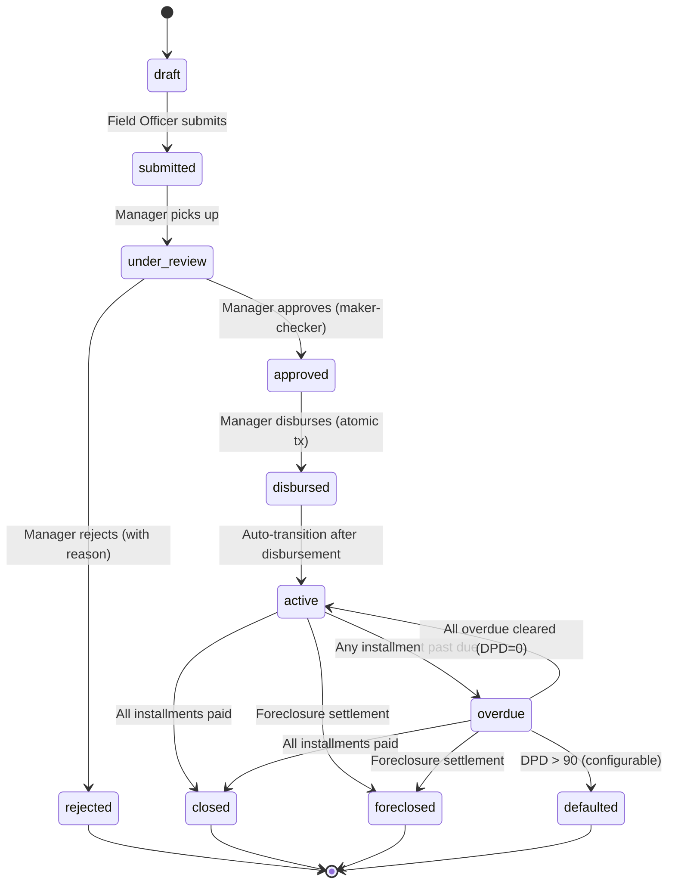

**Allowed Transitions Matrix**:

| From | Allowed To |
|---|---|
| draft | submitted |
| submitted | under_review |
| under_review | approved, rejected |
| approved | disbursed |
| disbursed | active |
| active | overdue, foreclosed, closed |
| overdue | active, foreclosed, defaulted, closed |
| rejected | (terminal) |
| closed | (terminal) |
| foreclosed | (terminal) |
| defaulted | (terminal) |

Any transition not in this matrix is rejected with error `INVALID_STATUS_TRANSITION` including current status and allowed transitions.

**Immutability Rules**:
- After `approved`: principal, tenure, product cannot be modified
- After `disbursed`: schedule is frozen, no recalculation
- After `closed`/`foreclosed`/`defaulted`: no further mutations except audit queries

### Customer Status State Machine

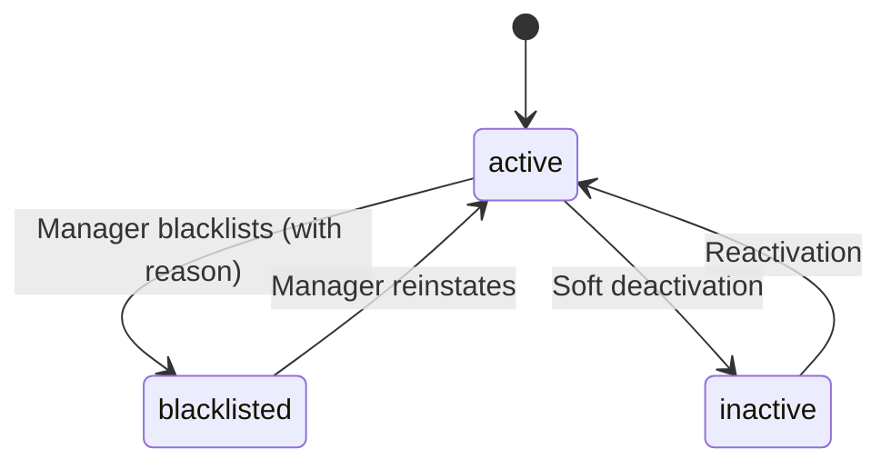

**Rules**:
- Blacklisted customers cannot have new loan applications
- Blacklisting requires Manager or Super Admin role
- Blacklisting is audited with reason

### Collection Status

| Status | Description | Transitions |
|---|---|---|
| posted | Valid collection recorded | → reversed |
| reversed | Compensating entry created | (terminal) |

### Receipt Status

| Status | Description | Transitions |
|---|---|---|
| active | Valid receipt | → reversed |
| reversed | Original marked reversed, compensating receipt issued | (terminal) |

### Group Status

| Status | Description | Transitions |
|---|---|---|
| active | Group operational | → inactive, dissolved |
| inactive | Temporarily suspended | → active, dissolved |
| dissolved | Permanently closed | (terminal) |

**Rules**: Group can only be dissolved when no member has active loans linked to the group.

### Installment Status

| Status | Description | Transitions |
|---|---|---|
| pending | Not yet due or due with no payment | → partial, paid, overdue, closed |
| partial | Partially paid | → paid, overdue, closed |
| paid | Fully paid | → partial (via reversal) |
| overdue | Past due date, not fully paid | → partial, paid, closed |
| closed | Closed via foreclosure/loan closure | (terminal) |

### Outbox Message Status

| Status | Description | Transitions |
|---|---|---|
| pending | Awaiting dispatch | → processing |
| processing | Being sent | → sent, failed |
| sent | Successfully delivered | (terminal) |
| failed | Dispatch failed, retries remaining | → processing, dead_letter |
| dead_letter | Max retries exhausted | (terminal, manual review) |

## Business Rules and Financial Invariants

### 12 Formal Invariants (from Requirement 25)

**Invariant 1 — Schedule Reconciliation**:
`∀ schedule S: sum(S[i].principal_paise) == loan.principal_paise AND sum(S[i].interest_paise) == loan.total_interest_paise`
Rounding difference confined to last installment only.

**Invariant 2 — Outstanding Accuracy**:
`∀ loan L: outstanding(L) == L.total_payable_paise - sum(valid_allocated_payments(L))`
Outstanding must never silently drift. Verified by reconciliation.

**Invariant 3 — Reversal Neutrality**:
`∀ reversal R of collection C: net_ledger_effect(C) + net_ledger_effect(R) == 0`
Every account touched by C is exactly offset by R.

**Invariant 4 — Allocation Preservation**:
`∀ collection C: C.amount_paise == sum(allocations(C).penalty) + sum(allocations(C).interest) + sum(allocations(C).principal)`
No money lost or created during allocation.

**Invariant 5 — Journal Balance**:
`∀ journal_entry JE: sum(JE.lines.debit_paise) == sum(JE.lines.credit_paise)`
Every journal entry balances.

**Invariant 6 — Audit Completeness**:
`∀ finance_action FA: ∃ audit_log AL where AL.target_id == FA.id AND AL.action_type matches FA.type`
Every finance mutation has a corresponding audit entry.

**Invariant 7 — Receipt Immutability**:
`∀ receipt R: read(R, t1) == read(R, t2) for all t2 > t1`
Receipt content never changes after creation.

**Invariant 8 — Non-Negative Outstanding**:
`∀ loan L: outstanding(L) >= 0`
Outstanding cannot go negative. Collections that would cause negative outstanding are rejected.

**Invariant 9 — Idempotency**:
`∀ idempotent operation f with key k: f(k) == f(f(k))`
Processing the same idempotency key twice returns the same result without duplicate effects.

**Invariant 10 — Schedule Determinism**:
`∀ inputs I: generate_schedule(I) at time t1 == generate_schedule(I) at time t2`
Identical inputs always produce identical schedules.

**Invariant 11 — Cash Reconciliation**:
`∀ day D: opening_balance(D) + cash_inflows(D) - cash_outflows(D) == closing_balance(D)`

**Invariant 12 — Model Conformance**:
`∀ loan L with product P: L.schedule conforms to P.interest_type, P.annual_rate_bps, P.tenure range`

### Operational Business Rules

1. **Maker-Checker**: Loan approval requires `approved_by != created_by`. Foreclosure requires `approved_by != requested_by`. Reversal requires Manager/Super Admin role.
2. **Blacklist Block**: No new loans for blacklisted customers. No new loans for customers with defaulted loans.
3. **Product Bounds**: Requested principal and tenure must fall within product's configured min/max ranges.
4. **Concurrent Loan Limit**: Number of active loans per customer per product <= `max_concurrent_loans`.
5. **Collection Validation**: Cannot post collection against closed, defaulted, foreclosed, or rejected loans. Collection amount must not cause negative outstanding.
6. **Reversal Constraints**: Cannot reverse an already-reversed collection. Cannot reverse a reversal (no chaining).
7. **Group Size**: 5 ≤ active members ≤ 15. Member removal blocked if member has active group-linked loans.
8. **Group Collection Sum**: Member-wise breakdown must sum exactly to total group collection amount.
9. **Document Validation**: Only image/jpeg, image/png, application/pdf. Max 5MB per file.
10. **PII Masking**: Aadhaar displayed as XXXX-XXXX-1234. PAN logged as XXXXXX1234.
11. **Holiday Shift**: Due dates falling on holidays shift to next business day.
12. **Penalty Uniqueness**: No duplicate penalty for same installment + period combination.
13. **Foreclosure Quote Expiry**: Foreclosure quotes expire after 24 hours. Expired quotes cannot be executed; a new quote must be generated.
14. **Frequency-Aware Rate Conversion**: For weekly loans, periodic rate = annual_rate / 52. For daily loans, periodic rate = annual_rate / 365. For monthly loans, periodic rate = annual_rate / 12.


## API Design

### Conventions

- Base URL: `/api/v1`
- All responses wrapped in `{ data, meta?, error? }` envelope
- Pagination: `?page=1&pageSize=20` (max pageSize=100)
- Sorting: `?sortBy=created_at&sortOrder=desc`
- Date filters: `?startDate=2024-01-01&endDate=2024-01-31` (ISO 8601)
- All money values in request/response as integer paise
- All dates as ISO 8601 strings
- Idempotency: `X-Idempotency-Key` header for finance-affecting writes
- Request ID: `X-Request-Id` header auto-generated by middleware, returned in responses
- Auth: `Authorization: Bearer <access_token>` header

### Response Envelope

```typescript
// Success
{ "data": T, "meta": { "page": 1, "pageSize": 20, "total": 150 } }

// Error
{ "error": { "code": "INVALID_STATUS_TRANSITION", "message": "Cannot transition from draft to approved", "details": { "currentStatus": "draft", "allowedTransitions": ["submitted"] }, "requestId": "uuid" } }
```

### Endpoint Catalog

#### Auth Module
| Method | Path | Description | Auth | Idempotency |
|---|---|---|---|---|
| POST | `/auth/login` | Login | No | No |
| POST | `/auth/refresh` | Refresh token | Cookie | No |
| POST | `/auth/logout` | Logout | Yes | No |
| POST | `/auth/change-password` | Change password | Yes | No |

#### User Module
| Method | Path | Description | Roles |
|---|---|---|---|
| POST | `/users` | Create user | super_admin, manager |
| GET | `/users` | List users | super_admin, manager |
| GET | `/users/:id` | Get user | super_admin, manager, self |
| PATCH | `/users/:id` | Update user | super_admin, manager |
| PATCH | `/users/:id/role` | Change role | super_admin, manager |
| PATCH | `/users/:id/deactivate` | Deactivate user | super_admin |
| POST | `/users/:id/area-assignments` | Assign area/route | super_admin, manager |
| DELETE | `/users/:id/area-assignments/:areaId` | Remove area assignment | super_admin, manager |
| GET | `/users/:id/area-assignments` | List area assignments | super_admin, manager, self |

#### Customer Module
| Method | Path | Description | Roles |
|---|---|---|---|
| POST | `/customers` | Create customer | field_officer, office_staff, manager, super_admin |
| GET | `/customers` | List customers | all (scoped) |
| GET | `/customers/:id` | Get customer detail | all (scoped) |
| PATCH | `/customers/:id` | Update customer | field_officer (own), office_staff, manager, super_admin |
| POST | `/customers/:id/blacklist` | Blacklist customer | manager, super_admin |
| POST | `/customers/:id/reinstate` | Reinstate customer | manager, super_admin |
| POST | `/customers/:id/family-members` | Add family member | field_officer, office_staff, manager |
| POST | `/customers/:id/guarantors` | Add guarantor | field_officer, office_staff, manager |
| GET | `/customers/:id/documents` | List documents | all (scoped) |
| POST | `/customers/:id/documents` | Upload document | field_officer, office_staff, manager |
| POST | `/customers/duplicate-check` | Check duplicates | field_officer, office_staff, manager |

#### Loan Product Module
| Method | Path | Description | Roles |
|---|---|---|---|
| POST | `/loan-products` | Create product | manager, super_admin |
| GET | `/loan-products` | List products | all |
| GET | `/loan-products/:id` | Get product detail | all |
| PATCH | `/loan-products/:id` | Update product (creates new version) | manager, super_admin |
| POST | `/loan-products/:id/deactivate` | Deactivate product | manager, super_admin |
| GET | `/loan-products/:id/versions` | List versions | manager, super_admin |

#### Loan Module
| Method | Path | Description | Roles | Idempotency |
|---|---|---|---|---|
| POST | `/loans` | Create loan application | field_officer, office_staff, manager | No |
| GET | `/loans` | List loans | all (scoped) | No |
| GET | `/loans/:id` | Get loan detail | all (scoped) | No |
| POST | `/loans/:id/submit` | Submit for review | field_officer, office_staff | No |
| POST | `/loans/:id/review` | Pick up for review | manager, super_admin | No |
| POST | `/loans/:id/approve` | Approve loan | manager, super_admin | No |
| POST | `/loans/:id/reject` | Reject loan | manager, super_admin | No |
| GET | `/loans/:id/schedule` | Get schedule | all (scoped) | No |
| GET | `/loans/:id/outstanding` | Get outstanding balance | all (scoped) | No |
| GET | `/loans/:id/collections` | List collections for loan | all (scoped) | No |
| GET | `/loans/:id/penalties` | List penalties for loan | all (scoped) | No |
| POST | `/loans/:id/close` | Close fully repaid loan | manager, super_admin | No |

#### Disbursement Module
| Method | Path | Description | Roles | Idempotency |
|---|---|---|---|---|
| POST | `/disbursements` | Disburse loan | manager, super_admin | Yes (`X-Idempotency-Key`) |
| GET | `/disbursements/:id` | Get disbursement | all (scoped) | No |
| GET | `/loans/:id/disbursement` | Get disbursement for loan | all (scoped) | No |

#### Collection Module
| Method | Path | Description | Roles | Idempotency |
|---|---|---|---|---|
| POST | `/collections` | Post collection | collection_officer, manager, super_admin | Yes |
| GET | `/collections/:id` | Get collection detail | all (scoped) | No |
| GET | `/collections/:id/allocations` | Get allocation breakdown | all (scoped) | No |

#### Reversal Module
| Method | Path | Description | Roles | Idempotency |
|---|---|---|---|---|
| POST | `/reversals` | Reverse collection | manager, super_admin | Yes |
| GET | `/reversals/:id` | Get reversal detail | all (scoped) | No |

#### Penalty Module
| Method | Path | Description | Roles |
|---|---|---|---|
| POST | `/penalties/calculate` | Trigger penalty calculation (batch) | manager, super_admin |
| GET | `/penalties/:id` | Get penalty detail | all (scoped) |
| POST | `/penalties/:id/waive` | Waive penalty | manager, super_admin |

#### Foreclosure Module
| Method | Path | Description | Roles | Idempotency |
|---|---|---|---|---|
| POST | `/foreclosures/quote` | Get foreclosure quote | manager, super_admin | No |
| POST | `/foreclosures` | Execute foreclosure | manager, super_admin | Yes |
| GET | `/foreclosures/:id` | Get foreclosure detail | all (scoped) | No |

#### Group Module
| Method | Path | Description | Roles |
|---|---|---|---|
| POST | `/groups` | Create group | field_officer, manager, super_admin |
| GET | `/groups` | List groups | all (scoped) |
| GET | `/groups/:id` | Get group detail | all (scoped) |
| POST | `/groups/:id/members` | Add member | field_officer, manager |
| DELETE | `/groups/:id/members/:memberId` | Remove member | field_officer, manager |
| POST | `/groups/:id/collections` | Post group collection | collection_officer, manager | Yes |
| GET | `/groups/:id/summary` | Get group summary | all (scoped) |

#### Accounting Module
| Method | Path | Description | Roles |
|---|---|---|---|
| GET | `/accounting/chart-of-accounts` | List accounts | accountant, manager, super_admin |
| GET | `/accounting/daybook` | Daybook view | accountant, manager, super_admin |
| GET | `/accounting/trial-balance` | Trial balance | accountant, manager, super_admin |
| GET | `/accounting/profit-loss` | P&L statement | accountant, manager, super_admin |
| GET | `/accounting/balance-sheet` | Balance sheet | accountant, manager, super_admin |
| GET | `/accounting/journal-entries` | List journal entries | accountant, manager, super_admin, viewer_auditor |

#### Cashbook Module
| Method | Path | Description | Roles |
|---|---|---|---|
| POST | `/cashbook/expenses` | Record expense | accountant, manager, super_admin |
| GET | `/cashbook/expenses` | List expenses | accountant, manager, super_admin |
| POST | `/cashbook/handovers` | Record cash handover | collection_officer, manager |
| GET | `/cashbook/handovers` | List handovers | accountant, manager, super_admin |
| PATCH | `/cashbook/handovers/:id/verify` | Verify handover | accountant, manager, super_admin |
| GET | `/cashbook/daily-summary` | Daily cash summary | accountant, manager, super_admin |

#### Receipt Module
| Method | Path | Description | Roles |
|---|---|---|---|
| GET | `/receipts/:id` | Get receipt | all (scoped) |
| GET | `/receipts/:id/print` | Get printable receipt | collection_officer, manager, super_admin |

#### Report Module
| Method | Path | Description | Roles |
|---|---|---|---|
| GET | `/reports/:reportType` | Generate report | manager, accountant, super_admin, viewer_auditor |
| GET | `/reports/:reportType/export` | Export report (PDF/XLSX/CSV) | manager, accountant, super_admin |

#### Notification Module
| Method | Path | Description | Roles |
|---|---|---|---|
| GET | `/notifications` | List outbox messages | manager, super_admin |
| POST | `/notifications/:id/retry` | Retry failed message | manager, super_admin |

#### Document Module
| Method | Path | Description | Roles |
|---|---|---|---|
| POST | `/documents/upload` | Upload file | field_officer, office_staff, manager |
| GET | `/documents/:id/url` | Get signed URL | all (scoped) |

#### Audit Module
| Method | Path | Description | Roles |
|---|---|---|---|
| GET | `/audit-logs` | Query audit logs | manager, super_admin, viewer_auditor |

#### Settings Module
| Method | Path | Description | Roles |
|---|---|---|---|
| GET | `/settings` | List settings | manager, super_admin |
| PATCH | `/settings/:key` | Update setting | super_admin |
| GET | `/settings/holidays` | Get holiday calendar | all |
| PUT | `/settings/holidays` | Update holiday calendar | manager, super_admin |

#### Health Module
| Method | Path | Description | Auth |
|---|---|---|---|
| GET | `/health/ready` | Readiness probe | No |
| GET | `/health/live` | Liveness probe | No |


## Role and Permission Matrix

| Module.Action | super_admin | manager | field_officer | collection_officer | accountant | office_staff | viewer_auditor |
|---|---|---|---|---|---|---|---|
| **Customer** | | | | | | | |
| customer.create | ✅ | ✅ | ✅ (assigned) | ❌ | ❌ | ✅ | ❌ |
| customer.read | ✅ | ✅ | ✅ (own) | ✅ (assigned) | ✅ | ✅ | ✅ |
| customer.update | ✅ | ✅ | ✅ (own) | ❌ | ❌ | ✅ | ❌ |
| customer.blacklist | ✅ | ✅ | ❌ | ❌ | ❌ | ❌ | ❌ |
| customer.upload_doc | ✅ | ✅ | ✅ | ❌ | ❌ | ✅ | ❌ |
| **Loan** | | | | | | | |
| loan.create | ✅ | ✅ | ✅ | ❌ | ❌ | ✅ | ❌ |
| loan.read | ✅ | ✅ | ✅ (own) | ✅ (assigned) | ✅ | ✅ | ✅ |
| loan.submit | ✅ | ✅ | ✅ | ❌ | ❌ | ✅ | ❌ |
| loan.approve | ✅ | ✅ | ❌ | ❌ | ❌ | ❌ | ❌ |
| loan.reject | ✅ | ✅ | ❌ | ❌ | ❌ | ❌ | ❌ |
| loan.disburse | ✅ | ✅ | ❌ | ❌ | ❌ | ❌ | ❌ |
| loan.close | ✅ | ✅ | ❌ | ❌ | ❌ | ❌ | ❌ |
| **Collection** | | | | | | | |
| collection.create | ✅ | ✅ | ❌ | ✅ (assigned) | ❌ | ❌ | ❌ |
| collection.read | ✅ | ✅ | ✅ (own) | ✅ (assigned) | ✅ | ✅ | ✅ |
| collection.reverse | ✅ | ✅ | ❌ | ❌ | ❌ | ❌ | ❌ |
| **Receipt** | | | | | | | |
| receipt.read | ✅ | ✅ | ✅ (own) | ✅ (own) | ✅ | ✅ | ✅ |
| receipt.print | ✅ | ✅ | ❌ | ✅ | ❌ | ❌ | ❌ |
| **Accounting** | | | | | | | |
| accounting.read | ✅ | ✅ | ❌ | ❌ | ✅ | ❌ | ✅ |
| accounting.create_expense | ✅ | ✅ | ❌ | ❌ | ✅ | ❌ | ❌ |
| accounting.manage_cashbook | ✅ | ✅ | ❌ | ❌ | ✅ | ❌ | ❌ |
| **Report** | | | | | | | |
| report.read | ✅ | ✅ | ✅ (own scope) | ✅ (own scope) | ✅ | ❌ | ✅ |
| report.export | ✅ | ✅ | ❌ | ❌ | ✅ | ❌ | ❌ |
| **User** | | | | | | | |
| user.create | ✅ | ✅ | ❌ | ❌ | ❌ | ❌ | ❌ |
| user.read | ✅ | ✅ | ❌ | ❌ | ❌ | ❌ | ❌ |
| user.update | ✅ | ✅ | ❌ | ❌ | ❌ | ❌ | ❌ |
| user.change_role | ✅ | ✅ (not super_admin) | ❌ | ❌ | ❌ | ❌ | ❌ |
| **Penalty** | | | | | | | |
| penalty.read | ✅ | ✅ | ✅ (own) | ✅ (assigned) | ✅ | ✅ | ✅ |
| penalty.calculate | ✅ | ✅ | ❌ | ❌ | ❌ | ❌ | ❌ |
| penalty.waive | ✅ | ✅ | ❌ | ❌ | ❌ | ❌ | ❌ |
| **Foreclosure** | | | | | | | |
| foreclosure.quote | ✅ | ✅ | ❌ | ❌ | ❌ | ❌ | ❌ |
| foreclosure.execute | ✅ | ✅ | ❌ | ❌ | ❌ | ❌ | ❌ |
| **Group** | | | | | | | |
| group.create | ✅ | ✅ | ✅ | ❌ | ❌ | ❌ | ❌ |
| group.read | ✅ | ✅ | ✅ (own) | ✅ (assigned) | ✅ | ✅ | ✅ |
| group.manage_members | ✅ | ✅ | ✅ | ❌ | ❌ | ❌ | ❌ |
| group.collect | ✅ | ✅ | ❌ | ✅ (assigned) | ❌ | ❌ | ❌ |
| **Audit** | | | | | | | |
| audit.read | ✅ | ✅ | ❌ | ❌ | ❌ | ❌ | ✅ |
| **Settings** | | | | | | | |
| settings.read | ✅ | ✅ | ❌ | ❌ | ❌ | ❌ | ❌ |
| settings.update | ✅ | ❌ | ❌ | ❌ | ❌ | ❌ | ❌ |
| **Notification** | | | | | | | |
| notification.read | ✅ | ✅ | ❌ | ❌ | ❌ | ❌ | ❌ |
| notification.retry | ✅ | ✅ | ❌ | ❌ | ❌ | ❌ | ❌ |
| **Cash Handover** | | | | | | | |
| handover.create | ✅ | ✅ | ❌ | ✅ | ❌ | ❌ | ❌ |
| handover.verify | ✅ | ✅ | ❌ | ❌ | ✅ | ❌ | ❌ |

**Scope Constraints**:
- `(own)` = field_officer sees only customers/loans they created or are assigned to
- `(assigned)` = collection_officer sees only loans in their assigned routes/areas
- Manager override required for cross-scope access

### Permission Enforcement Implementation

```typescript
// packages/shared/src/constants/permissions.ts
export const PERMISSIONS = {
  'customer.create': ['super_admin', 'manager', 'field_officer', 'office_staff'],
  'customer.read': ['super_admin', 'manager', 'field_officer', 'collection_officer', 'accountant', 'office_staff', 'viewer_auditor'],
  'collection.create': ['super_admin', 'manager', 'collection_officer'],
  'collection.reverse': ['super_admin', 'manager'],
  // ... complete matrix
} as const;

// apps/api/src/common/guards/rbac.guard.ts
@Injectable()
export class RbacGuard implements CanActivate {
  canActivate(context: ExecutionContext): boolean {
    const requiredPermission = this.reflector.get<string>('permission', context.getHandler());
    const user = context.switchToHttp().getRequest().user;
    const allowedRoles = PERMISSIONS[requiredPermission];
    return allowedRoles.includes(user.role);
  }
}

// Usage in controller
@Post()
@SetMetadata('permission', 'collection.create')
@UseGuards(JwtAuthGuard, RbacGuard)
async postCollection(@Body() dto: PostCollectionDto) { ... }
```

## Validation Model

### Three-Layer Validation Strategy

1. **DTO Layer (Controller)**: Structural validation via class-validator decorators. Validates types, formats, required fields, string lengths, enum membership.
2. **Business Rule Layer (Service)**: Domain validation. Validates state transitions, business constraints, cross-entity rules (e.g., blacklist check, concurrent loan limit).
3. **Database Layer**: Referential integrity, unique constraints, check constraints as final safety net.

### Shared Zod Schemas

```typescript
// packages/shared/src/validation/customer.schema.ts
import { z } from 'zod';

export const aadhaarSchema = z.string().regex(/^\d{12}$/, 'Aadhaar must be exactly 12 digits');
export const panSchema = z.string().regex(/^[A-Z]{5}\d{4}[A-Z]$/, 'Invalid PAN format');
export const mobileSchema = z.string().regex(/^[6-9]\d{9}$/, 'Invalid Indian mobile number');
export const pincodeSchema = z.string().regex(/^\d{6}$/, 'Pincode must be 6 digits');
export const paiseSchema = z.number().int().positive('Amount must be positive integer paise');

export const createCustomerSchema = z.object({
  fullName: z.string().min(2).max(200),
  fatherOrHusbandName: z.string().min(2).max(200).optional(),
  mobile: mobileSchema,
  alternateMobile: mobileSchema.optional(),
  aadhaarNumber: aadhaarSchema,
  panNumber: panSchema.optional(),
  dob: z.string().date().optional(),
  age: z.number().int().min(18).max(100).optional(),
  gender: z.enum(['male', 'female', 'other']),
  occupation: z.string().max(200).optional(),
  monthlyIncomePaise: z.number().int().nonnegative().optional(),
  workOrBusinessDetails: z.string().max(1000).optional(),
  addressLine1: z.string().min(1).max(500),
  city: z.string().min(1).max(100),
  district: z.string().min(1).max(100),
  state: z.string().min(1).max(100),
  pincode: pincodeSchema,
});
```

### Backend DTO Example

```typescript
// apps/api/src/modules/collection/dto/post-collection.dto.ts
export class PostCollectionDto {
  @IsUUID()
  loanId: string;

  @IsInt()
  @Min(1)
  amountPaise: number;

  @IsISO8601()
  paymentDate: string;

  @IsEnum(PaymentMode)
  paymentMode: PaymentMode;

  @IsString()
  @MinLength(1)
  @MaxLength(255)
  idempotencyKey: string;
}
```

### Business Rule Validation Examples

```typescript
// In CollectionService.postCollection():
// 1. Loan must be in active or overdue status
if (!['active', 'overdue'].includes(loan.status)) {
  throw new BusinessRuleError('INVALID_LOAN_STATUS', `Cannot post collection against ${loan.status} loan`);
}
// 2. Amount must not exceed outstanding
const outstanding = await this.getOutstandingBalance(loan.id);
if (dto.amountPaise > outstanding) {
  throw new BusinessRuleError('EXCEEDS_OUTSTANDING', `Max payment: ${outstanding} paise`);
}
// 3. Idempotency check
const existing = await this.idempotencyService.find(dto.idempotencyKey);
if (existing) return existing.result;
```


## Error Model

### Error Categories

| Category | HTTP Status | Code Prefix | Description |
|---|---|---|---|
| Validation | 400 | `VALIDATION_*` | DTO/input validation failures |
| Business Rule | 422 | `BUSINESS_*` | Domain rule violations |
| Authentication | 401 | `AUTH_*` | Missing or invalid credentials |
| Authorization | 403 | `AUTHZ_*` | Insufficient permissions |
| Not Found | 404 | `NOT_FOUND_*` | Entity not found |
| Conflict | 409 | `CONFLICT_*` | Idempotency, optimistic lock, unique constraint |
| Rate Limit | 429 | `RATE_LIMIT` | Too many requests |
| Internal | 500 | `INTERNAL_*` | Unexpected server errors |

### Error Response Structure

```typescript
interface ApiError {
  code: string;           // Machine-readable error code
  message: string;        // Human-readable safe message
  details?: Record<string, any>;  // Additional context
  requestId: string;      // Correlation ID for support
}

// Response shape
{ "error": ApiError }
```

### Error Code Catalog

```typescript
// Validation errors
VALIDATION_INVALID_AADHAAR        // Invalid Aadhaar format
VALIDATION_INVALID_PAN            // Invalid PAN format
VALIDATION_INVALID_MOBILE         // Invalid mobile format
VALIDATION_AMOUNT_REQUIRED        // Missing amount
VALIDATION_AMOUNT_NOT_POSITIVE    // Amount must be > 0
VALIDATION_FILE_TOO_LARGE         // File exceeds 5MB
VALIDATION_INVALID_MIME_TYPE      // Unsupported file type
VALIDATION_FIELD_REQUIRED         // Generic required field

// Business rule errors
BUSINESS_CUSTOMER_BLACKLISTED     // Customer is blacklisted
BUSINESS_CUSTOMER_HAS_DEFAULT     // Customer has defaulted loan
BUSINESS_INVALID_STATUS_TRANSITION // Invalid loan status transition
BUSINESS_MAKER_CHECKER_VIOLATION  // Same user as maker and checker
BUSINESS_EXCEEDS_OUTSTANDING      // Payment exceeds outstanding
BUSINESS_LOAN_NOT_DISBURSABLE     // Prerequisites not met
BUSINESS_PRODUCT_BOUNDS_VIOLATION // Principal/tenure out of range
BUSINESS_CONCURRENT_LOAN_LIMIT   // Max concurrent loans reached
BUSINESS_COLLECTION_INVALID_LOAN // Cannot collect against this loan status
BUSINESS_REVERSAL_ALREADY_REVERSED // Collection already reversed
BUSINESS_REVERSAL_OF_REVERSAL    // Cannot reverse a reversal
BUSINESS_GROUP_SIZE_VIOLATION    // Group size out of 5-15 range
BUSINESS_GROUP_SUM_MISMATCH      // Member amounts don't sum to total
BUSINESS_MEMBER_HAS_ACTIVE_LOANS // Cannot remove member with active loans
BUSINESS_DUPLICATE_PENALTY       // Penalty already posted for this period
BUSINESS_NEGATIVE_OUTSTANDING    // Would cause negative outstanding

// Conflict errors
CONFLICT_IDEMPOTENCY_KEY         // Duplicate idempotency key (returns original result)
CONFLICT_OPTIMISTIC_LOCK         // Stale version, retry needed
CONFLICT_DUPLICATE_RECEIPT       // Receipt number collision
CONFLICT_DUPLICATE_CUSTOMER      // Potential duplicate (Aadhaar/mobile match)

// Auth errors
AUTH_INVALID_CREDENTIALS          // Wrong username/password
AUTH_TOKEN_EXPIRED                // JWT expired
AUTH_ACCOUNT_LOCKED               // Account locked after failed attempts
AUTHZ_INSUFFICIENT_PERMISSIONS   // Role lacks required permission
AUTHZ_SCOPE_VIOLATION            // Accessing data outside assigned scope
```

### Error Handling Implementation

```typescript
// apps/api/src/common/filters/global-exception.filter.ts
@Catch()
export class GlobalExceptionFilter implements ExceptionFilter {
  catch(exception: unknown, host: ArgumentsHost) {
    const ctx = host.switchToHttp();
    const response = ctx.getResponse();
    const request = ctx.getRequest();
    const requestId = request.headers['x-request-id'];

    if (exception instanceof BusinessRuleError) {
      response.status(422).json({
        error: { code: exception.code, message: exception.message, details: exception.details, requestId }
      });
    } else if (exception instanceof ConflictError) {
      response.status(409).json({
        error: { code: exception.code, message: exception.message, details: exception.details, requestId }
      });
    }
    // ... other error types
    // Never expose stack traces, SQL, or internal paths
  }
}
```

## Security Design

### Authentication Flow

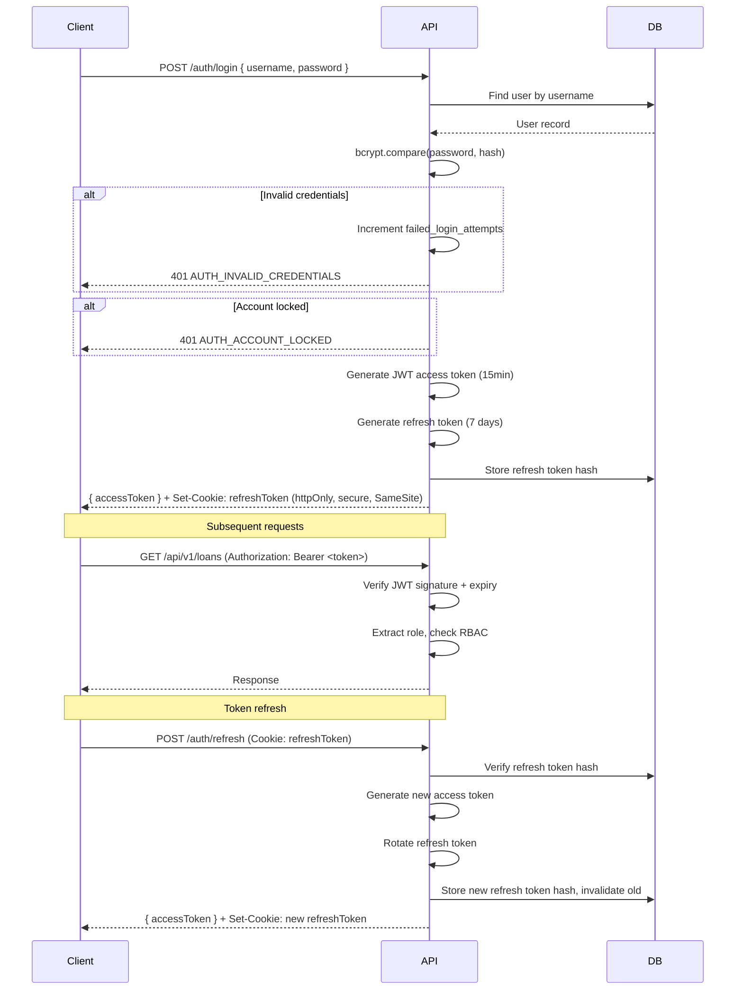

### JWT Lifecycle

- Access token: 15-minute expiry, stateless verification, contains `{ sub, role, iat, exp }`
- Refresh token: 7-day expiry, httpOnly secure cookie, rotated on every use, hash stored in DB
- On password change: all refresh tokens for user invalidated
- On logout: current refresh token invalidated

### RBAC Enforcement

- **API Level**: NestJS `RbacGuard` checks `@SetMetadata('permission', 'action')` against user's role
- **Scope Level**: `ScopeGuard` verifies field_officer/collection_officer can only access assigned entities
- **Route Level**: Next.js middleware checks JWT and role before rendering pages
- **Frontend**: UI elements hidden for unauthorized roles (defense in depth, not primary enforcement)

### IDOR Prevention

Every entity access goes through a scope check:
```typescript
// Before returning any entity
async verifyAccess(userId: string, userRole: UserRole, entityId: string, entityType: string): Promise<void> {
  if (['super_admin', 'manager', 'viewer_auditor'].includes(userRole)) return; // full access
  if (userRole === 'field_officer') {
    const isAssigned = await this.isAssignedToOfficer(entityId, entityType, userId);
    if (!isAssigned) throw new AuthorizationError('AUTHZ_SCOPE_VIOLATION');
  }
  // Similar for collection_officer
}
```

### PII Masking

```typescript
// packages/shared/src/utils/masking.ts
export function maskAadhaar(aadhaar: string): string {
  return `XXXX-XXXX-${aadhaar.slice(-4)}`;
}

export function maskPan(pan: string): string {
  return `XXXXXX${pan.slice(-4)}`;
}

export function maskMobile(mobile: string): string {
  return `XXXXXX${mobile.slice(-4)}`;
}
```

Applied automatically in:
- API response serialization (interceptor)
- Structured log output (pino redaction)
- Audit log before_state/after_state (selective masking)

### File Access Security

- All uploads validated server-side: MIME type (magic bytes, not just extension), file size (≤5MB), no embedded scripts
- Files stored with randomized UUIDs as filenames, never user-provided names
- Access only via signed URLs generated server-side after RBAC check
- Signed URLs expire after 15 minutes
- Separate S3 prefixes: `kyc/`, `loan-docs/`, `receipts/`, `expenses/`

## Notification Design

### Outbox Pattern

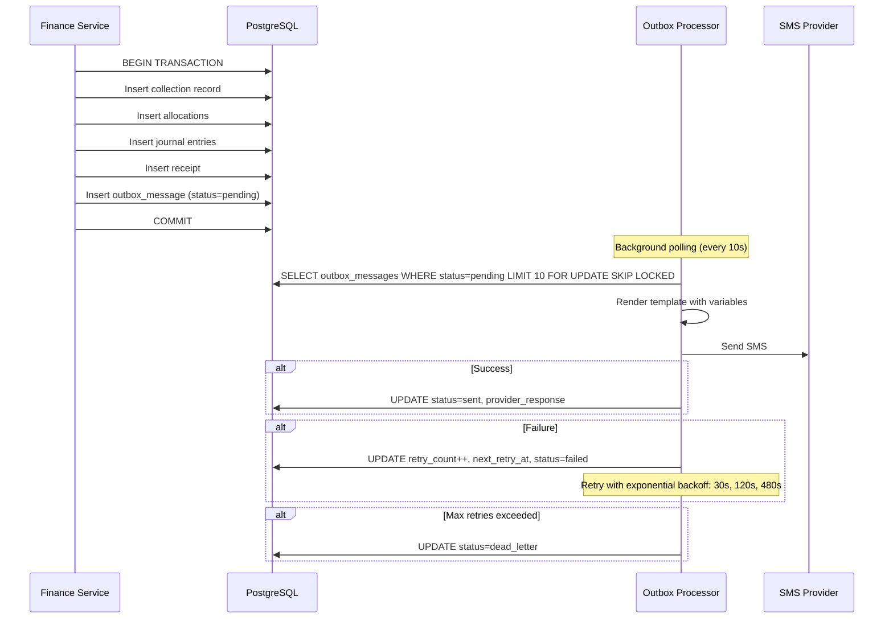

### SMS Provider Abstraction

```typescript
interface SmsProvider {
  send(to: string, message: string): Promise<SmsResult>;
  getDeliveryStatus(messageId: string): Promise<DeliveryStatus>;
}

interface SmsResult {
  success: boolean;
  messageId?: string;
  error?: string;
}

// Implementations: TextLocalProvider, Msg91Provider, MockProvider (for testing)
```

### Retry Strategy

| Attempt | Delay | Total Elapsed |
|---|---|---|
| 1st retry | 30 seconds | 30s |
| 2nd retry | 2 minutes | 2.5 min |
| 3rd retry | 8 minutes | 10.5 min |
| Dead letter | — | Manual review |

### Template System

```
Templates stored in sms_templates table:
- loan_approved: "Dear {{customerName}}, your loan {{loanNumber}} of Rs.{{amount}} has been approved."
- disbursed: "Dear {{customerName}}, Rs.{{amount}} has been disbursed for loan {{loanNumber}}."
- collection_receipt: "Dear {{customerName}}, payment of Rs.{{amount}} received for loan {{loanNumber}}. Receipt: {{receiptNumber}}. Outstanding: Rs.{{outstanding}}."
- overdue_reminder: "Dear {{customerName}}, your EMI of Rs.{{amount}} for loan {{loanNumber}} is overdue by {{dpd}} days."
- penalty_notice: "Dear {{customerName}}, a penalty of Rs.{{amount}} has been applied to loan {{loanNumber}}."
```

## File Storage Design

### S3 Abstraction

```typescript
interface StorageService {
  upload(file: Buffer, key: string, contentType: string): Promise<void>;
  getSignedUrl(key: string, expiresInSeconds: number): Promise<string>;
  delete(key: string): Promise<void>;
}

// Implementation uses @aws-sdk/client-s3 + @aws-sdk/s3-request-presigner
// Works with MinIO locally, S3 in production
```

### Bucket/Prefix Structure

```
as-finance-documents/
├── kyc/{customerId}/{uuid}.{ext}
├── loan-docs/{loanId}/{uuid}.{ext}
├── receipts/{receiptId}/{uuid}.pdf
└── expenses/{expenseId}/{uuid}.{ext}
```

### Upload Validation Pipeline

1. Check file size ≤ 5MB (configurable via settings)
2. Validate MIME type via magic bytes (not file extension): `image/jpeg`, `image/png`, `application/pdf`
3. Scan for embedded scripts (basic pattern matching)
4. Generate randomized filename: `{uuid}.{ext}`
5. Upload to S3 with appropriate prefix
6. Create `file_metadata` record
7. Return file ID (never direct URL)

### Document Lifecycle

- **Upload**: Creates `file_metadata` with `is_active=true`
- **Access**: Generates signed URL (15-min expiry) after RBAC check
- **Soft Delete**: Sets `is_active=false`, file retained in S3
- **Hard Delete**: Never (finance documents are permanent)


## Reporting Design

### Report Query Strategy

Reports are generated via dedicated read-only query paths that aggregate data from source-of-truth tables. Reports never query cached/derived fields — they compute from journal entries, collections, schedules, and allocations directly.

### Report Types and Data Sources

| Report | Primary Tables | Filters |
|---|---|---|
| Daily Collection | collections, receipts, users | date, officer, area |
| Overdue | loans, loan_schedules, overdue_entries | bucket, officer, area |
| Disbursement | disbursements, loans | date range, product |
| Loan Portfolio | loans, loan_product_versions | status, product, officer |
| Customer | customers | risk_level, area |
| Repayment Schedule | loan_schedules | loan_id |
| Receipt Register | receipts | date range, officer |
| Cash Handover | cash_handover_records | officer, date |
| Expense | expenses | category, date range |
| Income | journal_lines (income accounts) | source, date range |
| Trial Balance | journal_lines (all accounts) | as_of_date |
| Profit & Loss | journal_lines (income - expense) | date range |
| Balance Sheet | journal_lines (assets, liabilities, equity) | as_of_date |
| Group Summary | groups, group_members, loans | group_id |
| Group Collection | group_collections, collections | group_id, date |
| Penalty | penalties | loan_id, date range |
| Foreclosure | foreclosures | date range |
| Audit Trail | audit_logs | entity, actor, date range |
| DPD Aging | loans, overdue_entries | as_of_date |
| Officer Performance | collections, disbursements, users | officer, date range |

### RBAC-Scoped Data Access

Every report query applies scope filters based on the requesting user's role:

```typescript
function applyReportScope(query: QueryBuilder, user: AuthUser): QueryBuilder {
  switch (user.role) {
    case 'field_officer':
      return query.where('created_by', user.id).orWhere('assigned_officer_id', user.id);
    case 'collection_officer':
      return query.where('collected_by', user.id);
    case 'manager':
    case 'super_admin':
    case 'viewer_auditor':
    case 'accountant':
      return query; // full access
    default:
      throw new AuthorizationError('AUTHZ_INSUFFICIENT_PERMISSIONS');
  }
}
```

### Export Pipeline

1. Report query executes with pagination for preview
2. Export request triggers full query (no pagination)
3. Data streamed through formatter:
   - **CSV**: Stream rows as comma-separated values
   - **XLSX**: Use `exceljs` library, stream to buffer
   - **PDF**: Use `pdfkit` or `puppeteer` for formatted output
4. Response as file download with appropriate Content-Type and Content-Disposition headers
5. Rate limited: 5 exports per minute per user

### Report Monetary Consistency

All monetary totals in reports are derived from journal_lines (the ledger), ensuring they reconcile with the accounting system. Reports never compute monetary totals from cached fields.

## Observability Design

### Structured Logging

```typescript
// Logger configuration (pino)
const logger = pino({
  level: process.env.LOG_LEVEL || 'info',
  formatters: {
    level: (label) => ({ level: label }),
  },
  redact: {
    paths: ['req.headers.authorization', 'aadhaarNumber', 'panNumber', 'password', 'passwordHash'],
    censor: '[REDACTED]',
  },
  serializers: {
    req: (req) => ({
      method: req.method,
      url: req.url,
      requestId: req.headers['x-request-id'],
    }),
  },
});
```

### Request ID Propagation

```typescript
// apps/api/src/common/middleware/request-id.middleware.ts
@Injectable()
export class RequestIdMiddleware implements NestMiddleware {
  use(req: Request, res: Response, next: NextFunction) {
    const requestId = req.headers['x-request-id'] || randomUUID();
    req.headers['x-request-id'] = requestId;
    res.setHeader('x-request-id', requestId);
    // Attach to async local storage for use in services/repositories
    asyncLocalStorage.run({ requestId }, () => next());
  }
}
```

### Audit Correlation IDs

Every finance mutation logs:
```json
{
  "level": "info",
  "requestId": "uuid-1",
  "auditAction": "collection_posted",
  "actorId": "user-uuid",
  "targetEntity": "collection",
  "targetId": "collection-uuid",
  "loanId": "loan-uuid",
  "amountPaise": 500000,
  "timestamp": "2024-01-15T10:30:00Z"
}
```

### Health Checks

```typescript
// GET /health/ready — checks DB connection, S3 connectivity
// GET /health/live — returns 200 if process is running

@Controller('health')
export class HealthController {
  @Get('ready')
  async readiness() {
    await this.prisma.$queryRaw`SELECT 1`;
    // Optionally check S3 connectivity
    return { status: 'ok', timestamp: new Date().toISOString() };
  }

  @Get('live')
  liveness() {
    return { status: 'ok', timestamp: new Date().toISOString() };
  }
}
```

### Log Levels by Context

| Context | Level | Notes |
|---|---|---|
| Finance mutations | info | Always logged with full context |
| Auth events | info | Login, logout, failed attempts |
| Validation failures | warn | Bad input from clients |
| Business rule violations | warn | Blocked operations |
| Unexpected errors | error | Stack trace server-side only |
| SQL queries (dev only) | debug | Never in production |
| Request/response | debug | Summarized, no PII |

## Concurrency and Idempotency Strategy

### Idempotency Key Lifecycle

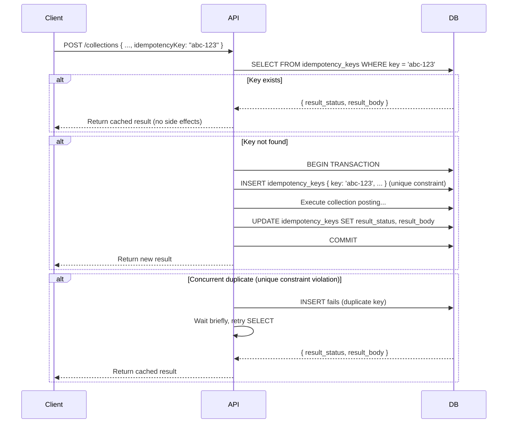

**Key Properties**:
- Keys expire after 24 hours (background cleanup job)
- Key is inserted within the same transaction as the finance operation
- If the transaction rolls back, the key is also rolled back (no false positives)

### Optimistic Locking

```typescript
// Every update to loans, loan_schedules checks version
async updateLoan(id: string, data: Partial<Loan>, expectedVersion: number): Promise<Loan> {
  const result = await this.prisma.loan.updateMany({
    where: { id, version: expectedVersion },
    data: { ...data, version: expectedVersion + 1 },
  });
  if (result.count === 0) {
    throw new ConflictError('CONFLICT_OPTIMISTIC_LOCK', 'Record was modified by another request. Please retry.');
  }
  return this.prisma.loan.findUnique({ where: { id } });
}
```

### Database-Level Serialization for Collections

When posting a collection against a loan, the transaction acquires a row-level lock on the loan record to prevent concurrent double-allocation:

```typescript
async postCollection(dto: PostCollectionDto, actorId: string): Promise<CollectionResult> {
  return this.prisma.$transaction(async (tx) => {
    // 1. Lock the loan row (SELECT ... FOR UPDATE)
    const loan = await tx.$queryRaw`
      SELECT * FROM loans WHERE id = ${dto.loanId}::uuid FOR UPDATE
    `;
    
    // 2. Verify loan status, compute outstanding
    // 3. Run allocation engine
    // 4. Create collection, allocations, journal entries, receipt
    // 5. Update installment statuses
    // 6. Update cached outstanding
    // 7. Enqueue notification
    // 8. Create audit log
    // All within this transaction
  }, {
    isolationLevel: 'ReadCommitted',
    timeout: 10000, // 10 second timeout
  });
}
```

### Receipt Number Sequencing

Receipt numbers are generated using a database sequence or a dedicated counter table with row-level locking:

```sql
-- Option: Database sequence
CREATE SEQUENCE receipt_number_seq START 1;

-- In transaction:
SELECT nextval('receipt_number_seq') as next_receipt;
-- Format: RCP-{year}-{padded_number}
```

This prevents duplicate receipt numbers even under concurrent requests.

## Sequence Diagrams for Critical Flows

### Disbursement Flow

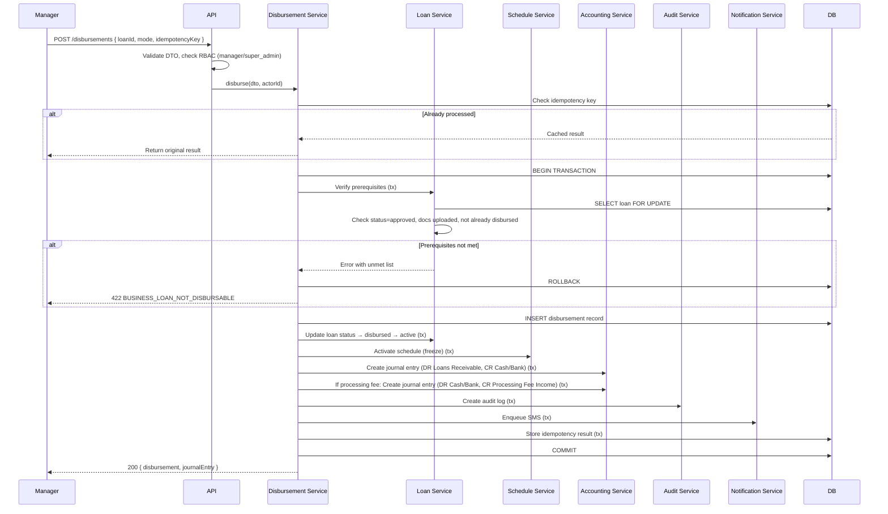

### Collection Posting Flow

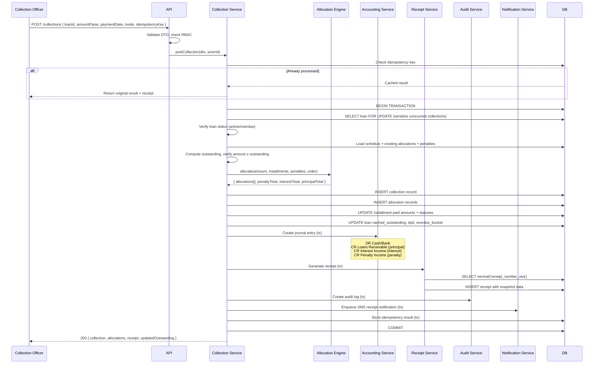

### Collection Reversal Flow

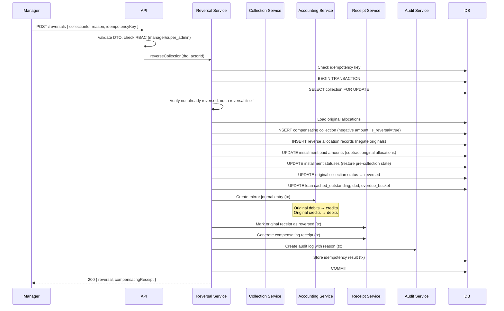

### Foreclosure Flow

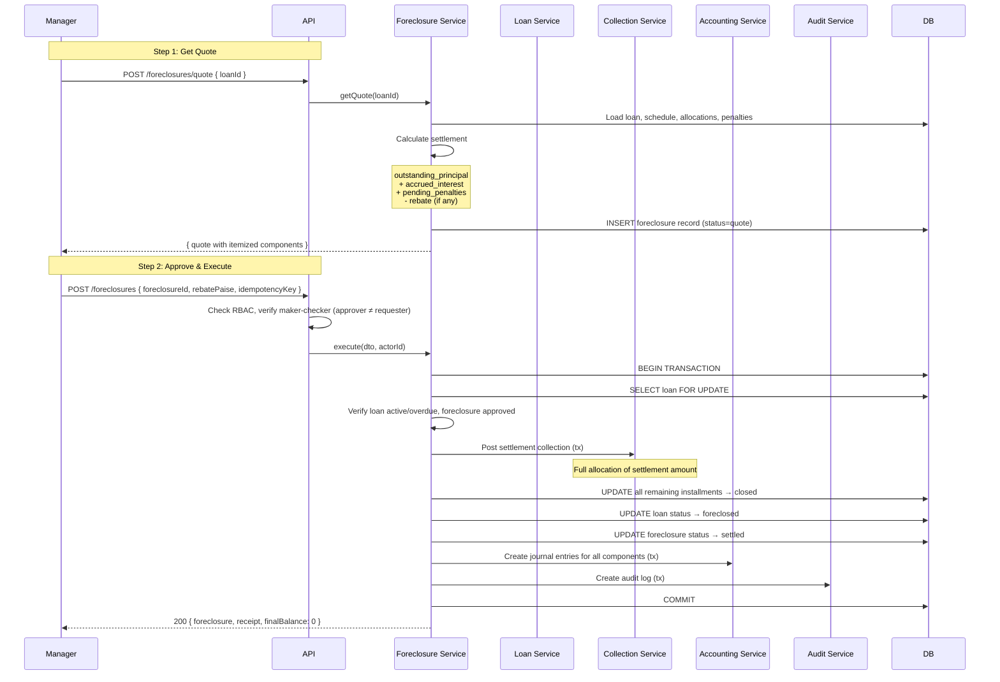

### Group Collection Flow

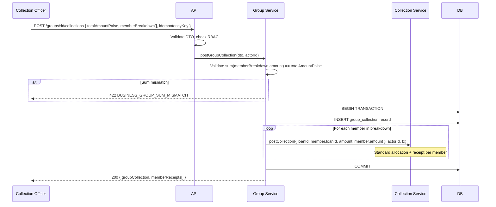


## Correctness Properties

*A property is a characteristic or behavior that should hold true across all valid executions of a system — essentially, a formal statement about what the system should do. Properties serve as the bridge between human-readable specifications and machine-verifiable correctness guarantees.*

### Property 1: Schedule Reconciliation (Flat Interest)

*For all* valid flat-interest loan parameters (principal in paise, annual rate in bps, tenure in months), the generated schedule SHALL satisfy: `sum(installment[i].principal_paise) == principal_paise` AND `sum(installment[i].interest_paise) == total_interest_paise`, with any rounding difference confined to the last installment only.

**Validates: Requirements 4.2, 4.6, 25.1**

### Property 2: Schedule Reconciliation (Reducing Balance)

*For all* valid reducing-balance loan parameters (principal in paise, annual rate in bps, tenure in months), the generated schedule SHALL satisfy: `sum(installment[i].principal_paise) == principal_paise`, with any rounding difference confined to the last installment only. Each installment's interest component SHALL equal `ROUND_HALF_UP(outstanding_at_start_of_period × monthly_rate)`.

**Validates: Requirements 4.3, 4.6, 25.1**

### Property 3: Schedule Determinism

*For all* valid schedule generation inputs (principal, rate, tenure, start date, frequency, interest type, holiday calendar), generating the schedule twice with identical inputs SHALL produce byte-identical output.

**Validates: Requirements 4.5, 21.6, 25.10**

### Property 4: Schedule Round-Trip

*For all* valid generated schedules, serializing the schedule to its storage representation and parsing it back SHALL produce an equivalent schedule object.

**Validates: Requirements 4.10**

### Property 5: Due Date Generation with Holiday Adjustment

*For all* valid start dates, frequencies (daily/weekly/monthly), and holiday calendars, the generated due dates SHALL be correctly spaced by the frequency interval, and no due date SHALL fall on a date present in the holiday calendar. Each holiday-shifted date SHALL be the next calendar day not in the holiday set.

**Validates: Requirements 4.7, 4.8**

### Property 6: Allocation Preservation

*For all* valid collections against a loan, the sum of all allocation components SHALL equal the collection amount exactly: `sum(allocation.penalty_paise) + sum(allocation.interest_paise) + sum(allocation.principal_paise) == collection.amount_paise`. No money is created or lost during allocation.

**Validates: Requirements 6.7, 25.4**

### Property 7: Allocation Order Correctness

*For all* valid partial or advance payments against a loan with outstanding penalties, interest, and principal, the allocation engine SHALL allocate in the order: penalty (oldest first) → interest (current due, then oldest overdue) → principal (current due, then oldest overdue). No principal SHALL be allocated while interest remains unpaid on the same or older installment, and no interest SHALL be allocated while penalties remain unpaid.

**Validates: Requirements 6.5, 6.6**

### Property 8: Outstanding Balance Accuracy

*For all* valid sequences of collections and reversals applied to a loan, the outstanding balance SHALL equal `total_payable_paise - sum(valid_allocated_payments_paise)` at every point. Outstanding SHALL never silently drift from this derived value.

**Validates: Requirements 6.11, 25.2**

### Property 9: Non-Negative Outstanding

*For all* loan states after any valid sequence of operations (disbursement, collections, reversals, penalties), the outstanding balance SHALL be non-negative. Any collection that would cause negative outstanding SHALL be rejected before processing.

**Validates: Requirements 6.12, 25.8**

### Property 10: Reversal Neutrality

*For all* valid collection reversals, the net ledger effect of the original collection plus its reversal SHALL equal zero for every account touched. Specifically: for each account, `sum(original_debits) - sum(original_credits) + sum(reversal_debits) - sum(reversal_credits) == 0`.

**Validates: Requirements 7.4, 25.3**

### Property 11: Reversal Constraints

*For all* collections, a collection that has already been reversed SHALL NOT be reversible again (no double reversal). *For all* reversal records, attempting to reverse a reversal SHALL be rejected (no chained reversals).

**Validates: Requirements 7.5, 7.6**

### Property 12: Journal Entry Balance

*For all* journal entries created by any finance event (disbursement, collection, reversal, penalty, expense, processing fee, foreclosure), `sum(lines.debit_paise) == sum(lines.credit_paise)`. An unbalanced journal entry SHALL be rejected before persistence.

**Validates: Requirements 12.7, 25.5**

### Property 13: Journal Entry Immutability

*For all* posted journal entries, no modification or deletion SHALL be permitted. Any attempt to update or delete a journal entry SHALL be rejected. Corrections SHALL only be possible via new compensating journal entries.

**Validates: Requirements 12.8**

### Property 14: Trial Balance Identity

*For all* sets of posted journal entries up to any point in time, the sum of all debit balances across all accounts SHALL equal the sum of all credit balances across all accounts.

**Validates: Requirements 12.11**

### Property 15: Balance Sheet Equation

*For all* points in time, the balance sheet SHALL satisfy: `total_assets == total_liabilities + total_equity`. This is derived from journal entries against the chart of accounts.

**Validates: Requirements 12.13**

### Property 16: Audit Completeness

*For all* finance-affecting actions (disbursement, collection, reversal, penalty posting, foreclosure, closure, expense recording), a corresponding audit log entry SHALL exist with matching `target_id`, `action_type`, `actor_id`, and `timestamp`. A finance action without a corresponding audit entry is a system integrity violation.

**Validates: Requirements 17.1, 17.6, 25.6**

### Property 17: Audit Log Append-Only

*For all* audit log entries, no entry SHALL be modifiable or deletable after creation. Any attempt to UPDATE or DELETE an audit log record SHALL be rejected.

**Validates: Requirements 17.4**

### Property 18: Receipt Immutability

*For all* receipts, reading the receipt at any time after creation SHALL return identical content (amount, components, customer name, loan number, receipt number, officer name). Receipt content fields are snapshot values that never change.

**Validates: Requirements 19.3, 25.7**

### Property 19: Receipt Uniqueness and Sequentiality

*For all* generated receipts, receipt numbers SHALL be unique. For any two receipts R1 and R2 where R1 was created before R2, the numeric portion of R1's receipt number SHALL be less than R2's.

**Validates: Requirements 19.2**

### Property 20: Idempotency

*For all* finance-affecting operations (collection, disbursement, reversal) with an idempotency key, processing the same key twice SHALL return the same result and SHALL NOT create duplicate records (no duplicate collection, no duplicate journal entry, no duplicate receipt). Formally: `f(key) == f(f(key))` in terms of observable side effects.

**Validates: Requirements 5.5, 6.4, 20.1, 25.9**

### Property 21: Loan State Machine Validity

*For all* loan status transition attempts, only transitions defined in the allowed transition matrix SHALL succeed. Any transition not in the matrix SHALL be rejected with a typed error indicating the current status and allowed transitions. Terminal states (closed, foreclosed, defaulted, rejected) SHALL have no outgoing transitions.

**Validates: Requirements 3.1, 3.9**

### Property 22: Maker-Checker Enforcement

*For all* loan approvals, the approving user SHALL differ from the loan creator. *For all* foreclosure approvals, the approving user SHALL differ from the requester. Any attempt where maker == checker SHALL be rejected.

**Validates: Requirements 3.7, 9.6**

### Property 23: PII Masking

*For all* Aadhaar numbers, the masking function SHALL produce output matching the pattern `XXXX-XXXX-{last4}` where `{last4}` are the last 4 digits of the input. *For all* PAN numbers, the masking function SHALL produce output matching `XXXXXX{last4}` where `{last4}` are the last 4 characters.

**Validates: Requirements 1.10, 1.11**

### Property 24: Input Format Validation

*For all* strings, the Aadhaar validator SHALL accept only exactly 12-digit strings. The PAN validator SHALL accept only strings matching `[A-Z]{5}[0-9]{4}[A-Z]`. The mobile validator SHALL accept only 10-digit strings starting with 6-9. All other inputs SHALL be rejected.

**Validates: Requirements 1.2**

### Property 25: Overdue Bucket Classification

*For all* DPD values, the overdue bucket classification SHALL be: DPD 0 → bucket_0, DPD 1-30 → bucket_1_30, DPD 31-60 → bucket_31_60, DPD 61-90 → bucket_61_90, DPD > 90 → bucket_90_plus. The classification function SHALL be total (defined for all non-negative integers) and deterministic.

**Validates: Requirements 8.2**

### Property 26: Penalty Uniqueness

*For all* penalty posting attempts, no two penalties SHALL exist for the same (loan_id, installment_id, penalty_period) combination. Duplicate penalty posting attempts SHALL be rejected.

**Validates: Requirements 8.5**

### Property 27: Cash Reconciliation

*For all* business days with cash transactions, `opening_balance + sum(cash_inflows) - sum(cash_outflows) == closing_balance`. Any discrepancy SHALL be flagged.

**Validates: Requirements 13.5, 25.11**

### Property 28: Model Conformance

*For all* loans with a linked product version, the generated schedule SHALL conform to the product's interest type (flat or reducing_balance), use the product's annual rate in bps, and have a tenure within the product's min/max tenure range. The principal SHALL be within the product's min/max principal range.

**Validates: Requirements 2.8, 3.3, 25.12**

### Property 29: RBAC Permission Enforcement

*For all* API requests, the system SHALL grant access if and only if the requesting user's role is in the allowed roles list for the requested action. Unauthorized requests SHALL receive HTTP 403. Unauthenticated requests SHALL receive HTTP 401. The enforcement SHALL be consistent between the permission matrix definition and runtime behavior.

**Validates: Requirements 15.2, 15.3, 15.4**

### Property 30: Group Size Constraint

*For all* group member addition or creation operations, the resulting active member count SHALL be between 5 and 15 inclusive. Operations that would violate this constraint SHALL be rejected.

**Validates: Requirements 11.2**

### Property 31: Group Collection Sum Integrity

*For all* group collections with a member-wise breakdown, `sum(member_breakdown[i].amount_paise) == total_amount_paise`. Any discrepancy SHALL cause rejection of the entire group collection.

**Validates: Requirements 11.5**

### Property 32: Foreclosure Settlement Calculation

*For all* active or overdue loans, the foreclosure settlement amount SHALL equal `outstanding_principal_paise + accrued_interest_paise + pending_penalties_paise - rebate_paise`, with each component explicitly itemized and non-negative (except rebate which reduces the total).

**Validates: Requirements 9.1, 9.2**

### Property 33: Notification Outbox Transactional Consistency

*For all* finance transactions that trigger notifications (disbursement, collection receipt, penalty), an outbox message SHALL be created within the same database transaction. If the finance transaction rolls back, the outbox message SHALL also be rolled back.

**Validates: Requirements 18.2**

### Property 34: SMS Template Rendering

*For all* SMS templates and valid variable maps, rendering the template SHALL substitute all `{{variable}}` placeholders with their corresponding values. No unsubstituted placeholders SHALL remain in the rendered output.

**Validates: Requirements 18.5**

### Property 35: Password Validation

*For all* password strings, the validator SHALL accept only passwords with minimum 8 characters containing at least one uppercase letter, one lowercase letter, and one digit. All other passwords SHALL be rejected.

**Validates: Requirements 16.3**


## Error Handling

### Error Handling Strategy

All errors flow through a global exception filter (`GlobalExceptionFilter`) that maps internal error types to HTTP responses. No stack traces, SQL queries, or internal paths are ever exposed to clients.

### Error Flow

```
Service throws typed error → GlobalExceptionFilter catches → Maps to HTTP status + error code → Returns { error: { code, message, details, requestId } }
```

### Error Classes

```typescript
// Base error
abstract class AppError extends Error {
  abstract readonly code: string;
  abstract readonly httpStatus: number;
  readonly details?: Record<string, any>;
}

// Validation error (400)
class ValidationError extends AppError {
  httpStatus = 400;
  constructor(code: string, message: string, details?: Record<string, any>) { ... }
}

// Business rule error (422)
class BusinessRuleError extends AppError {
  httpStatus = 422;
  constructor(code: string, message: string, details?: Record<string, any>) { ... }
}

// Not found error (404)
class NotFoundError extends AppError {
  httpStatus = 404;
  constructor(entityType: string, entityId: string) { ... }
}

// Conflict error (409)
class ConflictError extends AppError {
  httpStatus = 409;
  constructor(code: string, message: string, details?: Record<string, any>) { ... }
}

// Authorization error (403)
class AuthorizationError extends AppError {
  httpStatus = 403;
  constructor(code: string = 'AUTHZ_INSUFFICIENT_PERMISSIONS', message?: string) { ... }
}
```

### Transaction Error Handling

For atomic finance operations, errors within a `prisma.$transaction()` block automatically trigger rollback:

```typescript
try {
  return await this.prisma.$transaction(async (tx) => {
    // All steps...
    // If any step throws, entire transaction rolls back
  });
} catch (error) {
  if (error instanceof Prisma.PrismaClientKnownRequestError) {
    if (error.code === 'P2002') { // Unique constraint violation
      throw new ConflictError('CONFLICT_DUPLICATE', 'Duplicate record detected');
    }
    if (error.code === 'P2025') { // Record not found
      throw new NotFoundError('entity', 'id');
    }
  }
  throw error; // Re-throw for global filter
}
```

### Idempotency Error Handling

When an idempotency key collision occurs during the INSERT (concurrent duplicate request), the system:
1. Catches the unique constraint violation
2. Waits briefly (100ms)
3. Retries the SELECT to get the cached result
4. Returns the cached result to the client

This ensures both concurrent requests get the same response without duplicate side effects.

## Testing Strategy

### Dual Testing Approach

The testing strategy uses both unit tests and property-based tests as complementary layers:

- **Unit tests**: Verify specific examples, edge cases, error conditions, and integration points. Use concrete inputs and expected outputs.
- **Property-based tests**: Verify universal properties that must hold for all valid inputs. Use randomized input generation to explore the input space comprehensively.

Together, unit tests catch concrete bugs while property tests verify general correctness across the entire input domain.

### Property-Based Testing Configuration

- **Library**: fast-check with Vitest
- **Minimum iterations**: 100 per property test (1000 for critical finance properties: schedule reconciliation, outstanding accuracy, allocation preservation, reversal neutrality)
- **Tag format**: Each property test MUST include a comment referencing the design property:
  ```typescript
  // Feature: as-finance-loan-management-system, Property 1: Schedule Reconciliation (Flat Interest)
  ```
- **Each correctness property MUST be implemented by a SINGLE property-based test**
- **File naming**: `{module}.property.spec.ts` co-located with source

### Generator Strategy for Property Tests

Each property test requires custom generators (arbitraries) for its input domain:

#### Financial Generators

```typescript
// Loan parameters generator
const loanParamsArb = fc.record({
  principalPaise: fc.integer({ min: 100000, max: 10000000 }),  // ₹1,000 to ₹1,00,000
  annualRateBps: fc.integer({ min: 100, max: 3600 }),          // 1% to 36%
  tenureMonths: fc.integer({ min: 1, max: 60 }),
  interestType: fc.constantFrom('flat', 'reducing_balance'),
  frequency: fc.constantFrom('daily', 'weekly', 'monthly'),
  startDate: fc.date({ min: new Date('2020-01-01'), max: new Date('2030-12-31') }),
});

// Collection amount generator (relative to outstanding)
const collectionAmountArb = (maxPaise: number) =>
  fc.integer({ min: 1, max: maxPaise });

// Payment sequence generator
const paymentSequenceArb = (schedule: Installment[]) =>
  fc.array(
    fc.record({
      amountPaise: fc.integer({ min: 1, max: totalPayable }),
      paymentDate: fc.date({ min: schedule[0].dueDate, max: addMonths(schedule[schedule.length-1].dueDate, 3) }),
    }),
    { minLength: 0, maxLength: 20 }
  );

// Aadhaar generator
const aadhaarArb = fc.stringOf(fc.constantFrom('0','1','2','3','4','5','6','7','8','9'), { minLength: 12, maxLength: 12 });

// PAN generator
const panArb = fc.tuple(
  fc.stringOf(fc.constantFrom(...'ABCDEFGHIJKLMNOPQRSTUVWXYZ'.split('')), { minLength: 5, maxLength: 5 }),
  fc.stringOf(fc.constantFrom(...'0123456789'.split('')), { minLength: 4, maxLength: 4 }),
  fc.constantFrom(...'ABCDEFGHIJKLMNOPQRSTUVWXYZ'.split(''))
).map(([letters, digits, last]) => letters + digits + last);

// Holiday calendar generator
const holidayCalendarArb = fc.array(
  fc.date({ min: new Date('2024-01-01'), max: new Date('2025-12-31') }),
  { minLength: 0, maxLength: 30 }
);

// Password generator (for validation testing)
const passwordArb = fc.string({ minLength: 0, maxLength: 50 });
const validPasswordArb = fc.tuple(
  fc.string({ minLength: 6, maxLength: 40 }),
  fc.constantFrom(...'ABCDEFGHIJKLMNOPQRSTUVWXYZ'.split('')),
  fc.constantFrom(...'abcdefghijklmnopqrstuvwxyz'.split('')),
  fc.constantFrom(...'0123456789'.split(''))
).map(([base, upper, lower, digit]) => base + upper + lower + digit);
```

### Property Test to Design Property Mapping

| Property Test File | Design Properties Covered |
|---|---|
| `schedule.property.spec.ts` | P1 (Flat Reconciliation), P2 (Reducing Reconciliation), P3 (Determinism), P4 (Round-Trip), P5 (Due Dates) |
| `allocation.property.spec.ts` | P6 (Allocation Preservation), P7 (Allocation Order) |
| `outstanding.property.spec.ts` | P8 (Outstanding Accuracy), P9 (Non-Negative Outstanding) |
| `reversal.property.spec.ts` | P10 (Reversal Neutrality), P11 (Reversal Constraints) |
| `journal.property.spec.ts` | P12 (Journal Balance), P13 (Journal Immutability), P14 (Trial Balance), P15 (Balance Sheet) |
| `audit.property.spec.ts` | P16 (Audit Completeness), P17 (Audit Append-Only) |
| `receipt.property.spec.ts` | P18 (Receipt Immutability), P19 (Receipt Uniqueness) |
| `idempotency.property.spec.ts` | P20 (Idempotency) |
| `loan-state.property.spec.ts` | P21 (State Machine), P22 (Maker-Checker) |
| `masking.property.spec.ts` | P23 (PII Masking), P24 (Input Validation) |
| `overdue.property.spec.ts` | P25 (Overdue Buckets), P26 (Penalty Uniqueness) |
| `cashbook.property.spec.ts` | P27 (Cash Reconciliation) |
| `conformance.property.spec.ts` | P28 (Model Conformance) |
| `rbac.property.spec.ts` | P29 (RBAC Enforcement) |
| `group.property.spec.ts` | P30 (Group Size), P31 (Group Sum) |
| `foreclosure.property.spec.ts` | P32 (Foreclosure Calculation) |
| `notification.property.spec.ts` | P33 (Outbox Consistency), P34 (Template Rendering) |
| `password.property.spec.ts` | P35 (Password Validation) |

### Unit Test Coverage Areas

| Area | Focus | Examples |
|---|---|---|
| Schedule generation | Specific known inputs/outputs | 12% flat on ₹100,000 for 12 months → verify exact installment values |
| Allocation engine | Edge cases | Zero payment, exact EMI payment, overpayment, payment with no penalties |
| State machine | Invalid transitions | draft→approved, closed→active, rejected→disbursed |
| Masking | Known inputs | "123456789012" → "XXXX-XXXX-9012" |
| Validation | Boundary values | 11-digit Aadhaar, 13-digit Aadhaar, empty string |
| Overdue | Boundary DPD values | DPD=0, DPD=1, DPD=30, DPD=31, DPD=90, DPD=91 |
| Penalty | Grace period edge | DPD exactly at grace period, DPD one day past |
| Foreclosure | Known settlement | Specific loan state → verify exact settlement components |
| Receipt | Number formatting | Verify sequential numbering format |
| Error handling | Error codes | Verify correct error code for each business rule violation |

### Integration Test Flows

1. Customer creation → document upload → verify S3 + signed URL
2. Loan creation → submission → review → approval (maker-checker) → schedule generation
3. Approved loan → disbursement → verify journal entry + audit log + status
4. Active loan → collection → verify allocation + receipt + journal + outstanding update
5. Collection → reversal → verify compensating entries + receipt status + outstanding restoration
6. Overdue detection → penalty posting → collection covering penalty
7. Foreclosure quote → approval → settlement → loan closure
8. Group creation → member loans → group collection → individual receipts
9. Expense recording → journal entry → cashbook update
10. SMS outbox → dispatch → retry on failure → dead-letter after max retries
11. Concurrent collection posting → verify serialization (no double allocation)
12. Duplicate idempotency key → verify same result returned
13. RBAC enforcement → verify each role's access per endpoint
14. Unauthorized access → verify 403 + audit log entry

### Test Factory Strategy

```typescript
// packages/testing/src/factories/
export function createTestCustomer(overrides?: Partial<Customer>): Customer { ... }
export function createTestLoanProduct(overrides?: Partial<LoanProduct>): LoanProduct { ... }
export function createTestLoan(overrides?: Partial<Loan>): Loan { ... }
export function createTestSchedule(loan: Loan): Installment[] { ... }
export function createTestCollection(overrides?: Partial<Collection>): Collection { ... }
export function createTestJournalEntry(overrides?: Partial<JournalEntry>): JournalEntry { ... }
export function createTestUser(role: UserRole, overrides?: Partial<User>): User { ... }
```

Each factory produces a valid default entity that can be overridden per test. Factories are used in both unit tests and integration tests.

### Coverage Targets

| Area | Target |
|---|---|
| Finance calculation functions (schedule, allocation, penalty, foreclosure) | 95% |
| Collection/reversal logic | 95% |
| Permission guards | 90% |
| API controllers | 80% |
| Domain services | 85% |
| Repositories | 70% |
| UI components | 60% |
| Overall | 75% |
