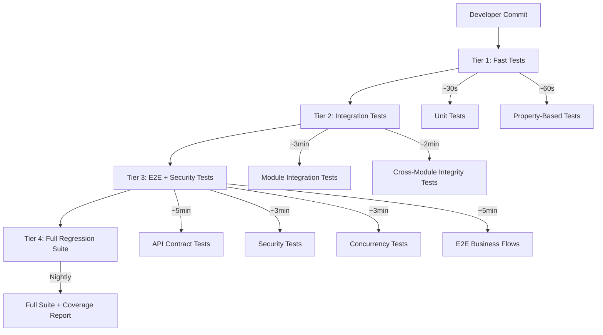
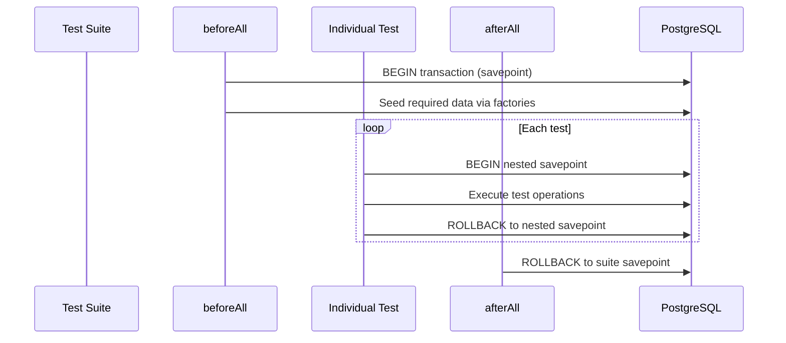
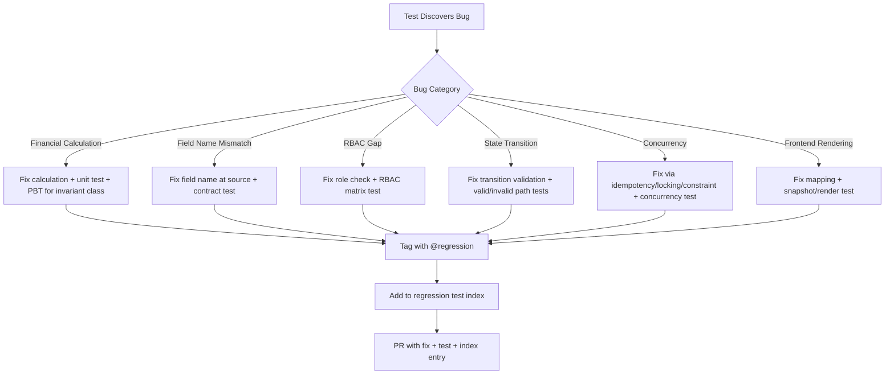

# Design Document — Deep Testing & Bugfix

## Overview

This design specifies the comprehensive testing architecture and bugfix workflow for the AS Finance Loan Management System. The system is a pnpm monorepo with a NestJS backend (`apps/api/`), Next.js 14 frontend (`apps/web/`), shared packages (`packages/shared/`, `packages/testing/`, `packages/config/`), and PostgreSQL via Prisma ORM.

The testing strategy covers seven test categories: unit tests, property-based tests (PBT), integration tests, API contract tests, security tests, concurrency tests, and negative tests. Every discovered bug is permanently fixed with a regression test.

### Key Design Decisions

1. **Vitest as unified runner** — all test categories (unit, PBT, integration, E2E API) run under Vitest with different config profiles.
2. **fast-check for PBT** — property-based tests use fast-check with custom arbitraries per domain entity.
3. **Supertest for API tests** — contract, security, concurrency, and E2E API tests use Supertest agents with pre-authenticated JWT tokens.
4. **Co-located tests** — unit and property tests live alongside source files; integration and E2E tests in dedicated directories.
5. **Transaction-based isolation** — integration tests use Prisma transactions with rollback for isolation; E2E tests use tracked entity cleanup.
6. **Factory-first data** — all test data created via factory functions, never raw SQL inserts.

## Architecture

### Test Execution Tiers



| Tier | When | Tests | Target Duration |
|------|------|-------|-----------------|
| 1 | Every commit / pre-push | Unit + PBT | < 2 min |
| 2 | PR CI | Integration | < 5 min |
| 3 | PR CI (after Tier 2) | Contract + Security + Concurrency + E2E | < 15 min |
| 4 | Nightly / pre-release | Full suite + coverage | < 30 min |

### Vitest Configuration Profiles

```
apps/api/
├── vitest.config.ts          # Unit + PBT (default)
├── vitest.integration.ts     # Integration tests
├── vitest.e2e.ts             # E2E + Contract + Security + Concurrency
```

**Unit + PBT config** (`vitest.config.ts`):
- Includes: `**/*.spec.ts`, `**/*.property.spec.ts`
- Excludes: `**/*.integration.spec.ts`, `test/e2e/**`
- Threads: enabled (parallel)
- No global setup required

**Integration config** (`vitest.integration.ts`):
- Includes: `**/*.integration.spec.ts`
- Threads: disabled (sequential — shared DB)
- Global setup: database migration + seed
- Teardown: transaction rollback per suite

**E2E config** (`vitest.e2e.ts`):
- Includes: `test/e2e/**/*.spec.ts`, `test/security.spec.ts`, `test/concurrency.spec.ts`, `test/negative.spec.ts`
- Threads: disabled (sequential — shared API server)
- Global setup: `test/setup/global-setup.ts` (DB + API health + seed + JWT tokens)
- Teardown: `test/setup/global-teardown.ts` (cleanup all test data)

## Components and Interfaces

### Test File Organization

```
apps/api/src/modules/{domain}/
├── __tests__/
│   ├── {domain}.service.spec.ts          # Unit tests
│   ├── {domain}.controller.spec.ts       # Unit tests (optional)
│   ├── {domain}.property.spec.ts         # Property-based tests
│   └── {domain}-{flow}.integration.spec.ts  # Integration tests

apps/api/src/common/{concern}/
├── __tests__/
│   ├── {concern}.spec.ts
│   └── {concern}.property.spec.ts

apps/api/test/
├── e2e/
│   ├── auth.e2e.spec.ts
│   ├── user-management.e2e.spec.ts
│   ├── loan-lifecycle.e2e.spec.ts
│   ├── collection-posting.e2e.spec.ts
│   ├── reversal-flow.e2e.spec.ts
│   ├── foreclosure-flow.e2e.spec.ts
│   ├── group-collection.e2e.spec.ts
│   ├── penalty-flow.e2e.spec.ts
│   ├── cashbook-flow.e2e.spec.ts
│   ├── report-flow.e2e.spec.ts
│   ├── notification-flow.e2e.spec.ts
│   ├── document-upload.e2e.spec.ts
│   ├── request-id.e2e.spec.ts
│   ├── env-validation.e2e.spec.ts
│   └── family-guarantor.e2e.spec.ts
├── contract/
│   ├── auth.contract.spec.ts
│   ├── customer.contract.spec.ts
│   ├── loan.contract.spec.ts
│   ├── collection.contract.spec.ts
│   ├── disbursement.contract.spec.ts
│   ├── reversal.contract.spec.ts
│   ├── penalty.contract.spec.ts
│   ├── foreclosure.contract.spec.ts
│   ├── receipt.contract.spec.ts
│   ├── accounting.contract.spec.ts
│   ├── cashbook.contract.spec.ts
│   ├── group.contract.spec.ts
│   ├── report.contract.spec.ts
│   ├── audit.contract.spec.ts
│   ├── notification.contract.spec.ts
│   └── settings.contract.spec.ts
├── security.spec.ts
├── concurrency.spec.ts
├── negative.spec.ts
├── rbac-matrix.spec.ts
├── helpers/
│   ├── factories.ts
│   ├── auth-client.ts
│   ├── cleanup.ts
│   └── db-utils.ts
└── setup/
    ├── global-setup.ts
    ├── global-teardown.ts
    └── test-config.ts

packages/shared/src/
├── validation/__tests__/
│   └── password.property.spec.ts
├── utils/__tests__/
│   └── masking.property.spec.ts

packages/testing/src/
├── factories/
│   ├── schedule-params.factory.ts
│   ├── allocation-params.factory.ts
│   ├── journal-entry.factory.ts
│   ├── collection.factory.ts
│   ├── penalty.factory.ts
│   ├── receipt.factory.ts
│   ├── cashbook.factory.ts
│   ├── audit-log.factory.ts
│   ├── user.factory.ts
│   ├── customer.factory.ts
│   ├── loan.factory.ts
│   ├── loan-product.factory.ts
│   └── index.ts
├── arbitraries/
│   ├── money.arbitrary.ts
│   ├── schedule.arbitrary.ts
│   ├── allocation.arbitrary.ts
│   ├── journal.arbitrary.ts
│   ├── penalty.arbitrary.ts
│   ├── receipt.arbitrary.ts
│   ├── cashbook.arbitrary.ts
│   ├── rbac.arbitrary.ts
│   ├── idempotency.arbitrary.ts
│   ├── template.arbitrary.ts
│   └── index.ts
├── helpers/
│   └── index.ts
└── fixtures/
    └── index.ts
```

### Naming Conventions

| Test Type | File Pattern | Example |
|-----------|-------------|---------|
| Unit test | `{name}.spec.ts` | `schedule.service.spec.ts` |
| Property test | `{name}.property.spec.ts` | `schedule.property.spec.ts` |
| Integration test | `{name}.integration.spec.ts` | `loan-lifecycle.integration.spec.ts` |
| E2E test | `{name}.e2e.spec.ts` | `collection-posting.e2e.spec.ts` |
| Contract test | `{name}.contract.spec.ts` | `loan.contract.spec.ts` |

### Mock Strategy per Module

| Module | Unit Test Mocks | Integration Test Approach |
|--------|----------------|--------------------------|
| Schedule | None (pure functions) | N/A — pure functions |
| Allocation Engine | None (pure functions) | N/A — pure functions |
| Collection Service | Mock: repository, accounting service, receipt service, notification service, idempotency service | Real DB via Prisma transaction |
| Reversal Service | Mock: repository, collection service, accounting service, receipt service | Real DB via Prisma transaction |
| Penalty Service | Mock: repository, accounting service, loan service | Real DB via Prisma transaction |
| Foreclosure Service | Mock: repository, collection service, accounting service, schedule service | Real DB via Prisma transaction |
| Disbursement Service | Mock: repository, accounting service, idempotency service, notification service | Real DB via Prisma transaction |
| Loan Service | Mock: repository, schedule service, customer service | Real DB via Prisma transaction |
| Auth Service | Mock: user repository, JWT service, audit service | Real DB for token storage |
| User Service | Mock: repository, bcrypt | Real DB via Prisma transaction |
| Customer Service | Mock: repository, document service | Real DB via Prisma transaction |
| Accounting Service | Mock: repository | Real DB via Prisma transaction |
| Receipt Service | Mock: repository | Real DB via Prisma transaction |
| Cashbook Service | Mock: repository, accounting service | Real DB via Prisma transaction |
| Group Service | Mock: repository, collection service | Real DB via Prisma transaction |
| Notification Service | Mock: SMS provider, repository | Real DB for outbox |
| Report Service | Mock: repository, accounting service | Real DB with seed data |
| Audit Service | Mock: repository | Real DB via Prisma transaction |
| Idempotency Service | Mock: repository | Real DB for concurrency |
| Document Service | Mock: S3Client, repository | MinIO mock container |
| Settings Service | Mock: repository | Real DB via Prisma transaction |
| RBAC Guard | Mock: Reflector, ExecutionContext | N/A — tested via E2E |
| JWT Guard | Mock: JwtService, ExecutionContext | N/A — tested via E2E |
| Exception Filter | Mock: ArgumentsHost | N/A |
| Request ID Middleware | Mock: Request, Response, NextFunction | N/A |
| Audit Interceptor | Mock: ExecutionContext, CallHandler | N/A |
| Throttler Guard | Mock: ExecutionContext | Real API for rate limit tests |

### Test Infrastructure Components

#### Factory Functions (`packages/testing/src/factories/`)

Each factory produces a valid default entity, overridable per test:

```typescript
// Example: schedule-params.factory.ts
export function buildScheduleParams(overrides?: Partial<ScheduleParams>): ScheduleParams {
  return {
    principalPaise: 100_000_00,
    annualRateBps: 1200,
    tenureMonths: 12,
    interestType: InterestType.FLAT,
    frequency: Frequency.MONTHLY,
    startDate: new Date('2024-01-01'),
    holidays: [],
    ...overrides,
  };
}
```

#### fast-check Arbitraries (`packages/testing/src/arbitraries/`)

Reusable generators for property-based tests:

```typescript
// money.arbitrary.ts
export const paiseArb = fc.integer({ min: 1, max: 10_000_000_00 });
export const bigPaiseArb = fc.integer({ min: 100, max: Number.MAX_SAFE_INTEGER });
export const annualRateBpsArb = fc.integer({ min: 100, max: 5000 });
export const tenureMonthsArb = fc.integer({ min: 1, max: 60 });

// schedule.arbitrary.ts
export const scheduleParamsArb: fc.Arbitrary<ScheduleParams> = fc.record({
  principalPaise: fc.integer({ min: 100_00, max: 100_000_00 }),
  annualRateBps: fc.integer({ min: 100, max: 5000 }),
  tenureMonths: fc.integer({ min: 1, max: 60 }),
  interestType: fc.constantFrom(InterestType.FLAT, InterestType.REDUCING_BALANCE),
  frequency: fc.constantFrom(Frequency.MONTHLY, Frequency.WEEKLY, Frequency.DAILY),
  startDate: fc.date({ min: new Date('2020-01-01'), max: new Date('2030-12-31') }),
  holidays: fc.array(fc.date({ min: new Date('2020-01-01'), max: new Date('2031-12-31') }), { maxLength: 20 }),
});

// allocation.arbitrary.ts
export const installmentStateArb = (index: number): fc.Arbitrary<InstallmentState> =>
  fc.record({
    principalPaise: fc.integer({ min: 100, max: 500_000 }),
    interestPaise: fc.integer({ min: 0, max: 100_000 }),
  }).chain(({ principalPaise, interestPaise }) =>
    fc.record({
      principalPaidPaise: fc.integer({ min: 0, max: principalPaise }),
      interestPaidPaise: fc.integer({ min: 0, max: interestPaise }),
    }).map(({ principalPaidPaise, interestPaidPaise }) => ({
      installmentId: `inst-${index}`,
      installmentNumber: index + 1,
      dueDate: new Date(2024, 0, 15 + index * 30),
      principalPaise, interestPaise,
      principalPaidPaise, interestPaidPaise,
    }))
  );
```

#### Integration Test Database Management



For integration tests that need real committed data (e.g., testing concurrent access), use the tracked entity cleanup pattern from `apps/api/test/helpers/cleanup.ts`.

### Bug Identification and Fix Workflow



Each regression test includes a comment block:
```typescript
/**
 * @regression BUG-{number}
 * @description {brief description of the bug}
 * @rootCause {what caused the bug}
 * @fix {what was changed to fix it}
 */
```

### Coverage Measurement

Coverage is collected via Vitest's v8 provider:

```typescript
// vitest.config.ts coverage section
coverage: {
  provider: 'v8',
  reporter: ['text', 'json', 'html', 'lcov'],
  include: ['src/**/*.ts'],
  exclude: ['src/**/*.spec.ts', 'src/**/*.module.ts', 'src/main.ts'],
  thresholds: {
    'src/modules/schedule/schedule.service.ts': { statements: 95, branches: 95 },
    'src/modules/collection/allocation-engine.ts': { statements: 95, branches: 95 },
    'src/modules/collection/collection.service.ts': { statements: 85, branches: 85 },
    'src/modules/reversal/reversal.service.ts': { statements: 90, branches: 90 },
    'src/common/guards/rbac.guard.ts': { statements: 90, branches: 90 },
  },
}
```

| Area | Target | Enforcement |
|------|--------|-------------|
| Finance calculations (schedule, allocation) | 95% | CI gate |
| Reversal logic | 90% | CI gate |
| Permission guards | 90% | CI gate |
| Domain services | 85% | CI gate |
| Controllers | 80% | CI warning |
| Repositories | 70% | CI warning |
| Overall | 75% | CI gate |


## Data Models

### Test Entity Factories

Each factory maps to a Prisma model and produces valid defaults:

| Factory | Prisma Model | Key Fields | Used By |
|---------|-------------|------------|---------|
| `buildScheduleParams` | N/A (input params) | principalPaise, annualRateBps, tenureMonths, interestType, frequency | Schedule unit + PBT |
| `buildInstallmentState` | `loan_schedules` | installmentId, principalPaise, interestPaise, paid amounts | Allocation PBT |
| `buildPenaltyState` | `penalties` | penaltyId, amountPaise, paidPaise | Allocation PBT |
| `buildJournalEntry` | `journal_entries` | description, date, lines[] | Accounting PBT |
| `buildJournalLine` | `journal_lines` | accountCode, debitPaise, creditPaise | Accounting PBT |
| `buildCollectionInput` | `collections` | loanId, amountPaise, paymentMode, idempotencyKey | Collection unit + integration |
| `buildReceiptData` | `receipts` | receiptNumber, amountPaise, components | Receipt PBT |
| `buildDailySummaryInput` | N/A (input params) | openingBalance, inflows[], outflows[] | Cashbook PBT |
| `buildAuditLogEntry` | `audit_logs` | actionType, actorId, actorRole, targetEntity | Audit PBT |
| `buildIdempotencyRecord` | `idempotency_keys` | key, operationType, cachedResult | Idempotency PBT |
| `buildUser` | `users` | username, passwordHash, role, isActive | Auth + User unit |
| `buildCustomer` | `customers` | fullName, aadhaarNumber, mobile, status | Customer unit |
| `buildLoan` | `loans` | loanNumber, principalPaise, status, customerId | Loan unit |
| `buildLoanProduct` | `loan_products` | name, interestType, annualRateBps | Product unit |
| `buildSmsTemplate` | N/A (input params) | templat