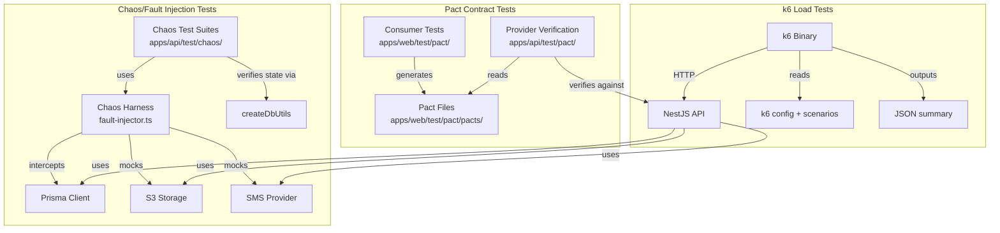
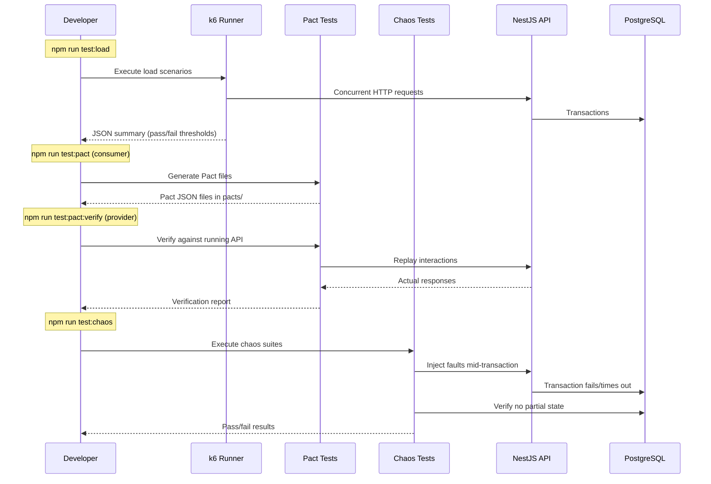

# Design Document: Expanded Test Automation

## Overview

This design covers three new test automation areas for the AS Finance LMS: k6 load/performance testing, Pact consumer-driven contract testing, and chaos/fault injection testing. These fill the gaps identified in the QA coverage plan (P2/P3 areas: load testing, chaos engineering, and Pact contract testing).

The three areas are independent but share common infrastructure: test factories from `packages/testing/`, seed data from the E2E global setup, and the existing Vitest + Supertest stack. k6 is the only external tool addition; Pact uses the already-installed `@pact-foundation/pact`, and chaos tests run as Vitest integration tests with fault injection helpers.

### Design Decisions

1. **k6 over Artillery/autocannon**: k6 uses JavaScript for test scripts, has built-in threshold assertions, and produces JSON summary output natively. It runs outside Node.js (Go runtime) so it doesn't compete with the API for event loop resources.

2. **Pact v3 consumer-first**: Consumer tests live in `apps/web/test/pact/` since the frontend is the consumer. Provider verification lives in `apps/api/test/pact/`. Pact files are generated locally (no broker needed for this phase).

3. **Chaos tests as Vitest integration tests**: Rather than a separate chaos framework, we use Vitest with Prisma client interception and mock overrides to simulate failures. This keeps the toolchain unified and leverages existing test helpers.

4. **Fault injection via Prisma middleware + service mocking**: Database failures are simulated by injecting Prisma middleware that throws at specific points. S3 failures are simulated by replacing the storage service with a throwing mock. SMS failures are simulated by mocking the notification service.

## Architecture



### Test Execution Flow



## Components and Interfaces

### 1. k6 Load Test Infrastructure

**Location**: `apps/api/test/load/`

| File | Purpose |
|------|---------|
| `config.js` | Shared k6 configuration: base URL, default headers, thresholds |
| `helpers/auth.js` | JWT token generation for authenticated load test requests |
| `helpers/data.js` | Payload generators for collection, disbursement, reversal requests |
| `scenarios/collection-load.js` | 20 VU × 60s collection posting scenario |
| `scenarios/mixed-workload.js` | 10 VU collections + 5 VU reports concurrent scenario |
| `scenarios/disbursement-reversal.js` | 10 VU disbursements + 5 VU reversals scenario |

**Interface**: k6 scripts are standalone JavaScript (ES modules) executed by the k6 binary. They import from `config.js` and `helpers/`. Results are output as JSON summary.

**npm script**: `"test:load": "k6 run test/load/scenarios/collection-load.js --summary-export=test/load/results.json"`

### 2. Pact Consumer Contract Tests

**Location**: `apps/web/test/pact/`

| File | Purpose |
|------|---------|
| `setup.ts` | Pact mock server configuration, shared matchers |
| `auth.consumer.pact.spec.ts` | Login/refresh token interactions |
| `customer.consumer.pact.spec.ts` | Customer CRUD interactions |
| `loan.consumer.pact.spec.ts` | Loan lifecycle interactions (create/approve/disburse) |
| `collection.consumer.pact.spec.ts` | Collection posting interactions (happy + error paths) |
| `reversal.consumer.pact.spec.ts` | Reversal interactions |
| `report.consumer.pact.spec.ts` | Report generation interactions |
| `schedule.consumer.pact.spec.ts` | Loan schedule retrieval interactions |
| `pacts/` | Generated Pact JSON files (gitignored, generated on test run) |

**Dependencies**: `@pact-foundation/pact` (already installed in API, needs adding to web devDependencies)

**npm script**: `"test:pact": "vitest run --config test/pact/vitest.pact.ts"`

### 3. Pact Provider Verification

**Location**: `apps/api/test/pact/`

| File | Purpose |
|------|---------|
| `provider-verification.spec.ts` | Verifies all consumer Pact files against the running API |
| `state-handlers.ts` | Provider state setup functions (create test data for each state) |

**npm script**: `"test:pact:verify": "vitest run test/pact/provider-verification.spec.ts -c vitest.e2e.ts"`

### 4. Chaos Test Harness

**Location**: `apps/api/test/chaos/`

| File | Purpose |
|------|---------|
| `fault-injector.ts` | Core harness: DB drop, DB timeout, S3 failure, SMS failure helpers |
| `collection-db-failure.chaos.spec.ts` | DB failure during collection posting |
| `reversal-db-failure.chaos.spec.ts` | DB failure during reversal |
| `s3-outage.chaos.spec.ts` | S3 unavailability during document upload |
| `network-latency.chaos.spec.ts` | DB latency/timeout during finance operations |
| `sms-isolation.chaos.spec.ts` | SMS provider failure isolation |

**npm script**: `"test:chaos": "vitest run test/chaos/ -c vitest.integration.ts"`

### Fault Injector Interface

```typescript
interface FaultInjector {
  /** Simulate DB connection drop by making Prisma throw on next query */
  injectDbConnectionDrop(prisma: PrismaClient): () => void;

  /** Simulate DB query timeout by adding artificial delay */
  injectDbTimeout(prisma: PrismaClient, delayMs: number): () => void;

  /** Replace S3 storage service with a throwing mock */
  injectS3Outage(app: INestApplication): () => void;

  /** Replace SMS/notification service with a throwing mock */
  injectSmsFailure(app: INestApplication): () => void;
}
```

Each inject function returns a cleanup/restore function that MUST be called in `afterEach` to prevent test pollution.

## Data Models

### k6 Test Result Schema (JSON output)

```typescript
interface K6Summary {
  metrics: {
    http_req_duration: {
      avg: number;
      min: number;
      max: number;
      p95: number;
      p99: number;
    };
    http_req_failed: {
      rate: number;  // 0.0 to 1.0
    };
    http_reqs: {
      count: number;
      rate: number;  // requests per second
    };
  };
  thresholds: Record<string, { ok: boolean }>;
}
```

### Pact Interaction Models

**Collection Posting Request**:
```typescript
{
  loanId: string;        // UUID
  amountPaise: number;   // positive integer
  paymentDate: string;   // ISO 8601 date
  paymentMode: string;   // 'cash' | 'bank_transfer' | 'upi'
  idempotencyKey: string;
}
```

**Collection Posting Response (201)**:
```typescript
{
  data: {
    collectionId: string;
    loanNumber: string;
    amountPaise: number;       // integer paise
    allocations: {
      penaltyPaise: number;    // integer paise
      interestPaise: number;   // integer paise
      principalPaise: number;  // integer paise
    };
    outstandingAfterPaise: number; // integer paise
  }
}
```

**Loan Schedule Response**:
```typescript
{
  data: {
    loan_number: string;
    principal_paise: number;
    status: string;
    cached_outstanding_paise: number;
    schedules: Array<{
      installment_number: number;
      due_date: string;
      principal_paise: number;
      interest_paise: number;
      total_paise: number;
      status: string;
    }>;
  }
}
```

### Chaos Test State Snapshot

```typescript
interface PreTransactionSnapshot {
  loanOutstandingPaise: bigint;
  collectionCount: number;
  journalEntryCount: number;
  receiptCount: number;
  trialBalance: { totalDebits: bigint; totalCredits: bigint };
}
```

This snapshot is captured before fault injection and compared after to verify no partial state leaked.


## Correctness Properties

*A property is a characteristic or behavior that should hold true across all valid executions of a system — essentially, a formal statement about what the system should do. Properties serve as the bridge between human-readable specifications and machine-verifiable correctness guarantees.*

### Property 1: Idempotency under concurrent load

*For any* finance operation (collection, disbursement, or reversal) and any idempotency key, when multiple concurrent requests use the same idempotency key, at most one record of that operation type is created in the database.

**Validates: Requirements 2.3, 4.3, 4.4**

### Property 2: Allocation preservation under load

*For any* set of successful collection postings during a load test, the sum of all allocation components (penalty + interest + principal) for each collection must equal the posted payment amount for that collection.

**Validates: Requirements 2.4**

### Property 3: Money fields as integer paise in Pact contracts

*For any* finance-related Pact interaction (collection, disbursement, loan schedule, report), all money fields in the expected response body must be matched as integers (not floats or strings).

**Validates: Requirements 5.5**

### Property 4: Collection atomicity under DB failure

*For any* collection posting that fails due to a database connection drop mid-transaction, zero collection records, allocation records, journal entries, and receipts are persisted, and the loan outstanding balance remains identical to its pre-transaction value.

**Validates: Requirements 9.1, 9.2**

### Property 5: Reversal atomicity under DB failure

*For any* reversal that fails due to a database connection drop mid-transaction, the original collection status remains "posted", zero compensating journal entries or reverse allocation records are persisted, and the ledger trial balance (total debits = total credits) remains identical to its pre-transaction value.

**Validates: Requirements 11.1, 11.2, 11.3**

### Property 6: Document upload atomicity under S3 outage

*For any* document upload attempted while S3-compatible storage is unavailable, the API returns an error and zero partial document metadata records exist in the database.

**Validates: Requirements 10.1**

### Property 7: S3 fault isolation from non-document operations

*For any* customer CRUD or loan operation performed while S3-compatible storage is unavailable, the operation completes successfully without errors.

**Validates: Requirements 10.2**

### Property 8: Finance transaction atomicity under network latency/timeout

*For any* finance transaction (collection, disbursement, penalty posting) that encounters a database timeout, the outcome is either full success or full failure with no partial state — specifically: no orphaned records exist without their corresponding dependent records, and entity statuses remain in their pre-transaction values on failure.

**Validates: Requirements 12.1, 12.2, 12.3**

### Property 9: SMS failure isolation

*For any* finance transaction (collection or disbursement) completed while the SMS provider is unreachable, all finance records (collection, allocation, journal entry, receipt, or disbursement record) are persisted successfully, and an outbox message is enqueued for later retry.

**Validates: Requirements 13.1, 13.2**

## Error Handling

### k6 Load Tests

| Error Scenario | Handling |
|---|---|
| API server unreachable | k6 reports connection errors in summary; test fails threshold check |
| JWT token expired mid-test | k6 helper pre-generates long-lived tokens (1h expiry) for load test duration |
| 409 Conflict (idempotency) | Excluded from error rate calculation via k6 `expectedStatuses` |
| k6 binary not installed | npm script checks for k6 availability and prints install instructions |
| Test data insufficient | Load test setup phase creates required loans/customers before VU execution |

### Pact Contract Tests

| Error Scenario | Handling |
|---|---|
| Pact mock server port conflict | Use dynamic port allocation via Pact's `port: 0` option |
| Provider state setup fails | State handler throws descriptive error; Pact reports which state failed |
| Pact file not found during verification | Provider verification lists expected Pact directory; fails with clear message |
| API response shape mismatch | Pact reports field-level diff between expected and actual response |

### Chaos/Fault Injection Tests

| Error Scenario | Handling |
|---|---|
| Fault not properly restored | `afterEach` hook calls all cleanup functions; test suite has `afterAll` safety net |
| DB connection actually drops (not simulated) | Chaos tests use Prisma middleware interception, not actual network disruption |
| Test pollution from leaked faults | Each chaos test captures pre-transaction snapshot and verifies post-test state matches |
| Timeout in fault injection setup | Chaos test helpers have configurable timeout with descriptive error messages |

## Testing Strategy

### Dual Testing Approach

This feature uses both unit/example tests and property-based tests:

- **Unit/example tests**: Verify specific scenarios (e.g., "20 VUs for 60s produces P95 < 2000ms", "POST /collections Pact interaction has correct fields", "recovery after DB failure succeeds")
- **Property-based tests**: Verify universal invariants (e.g., "for all idempotency keys under load, at most one record exists", "for all failed transactions, no partial state")

### Property-Based Testing Configuration

- **Library**: fast-check with Vitest (already in use across the project)
- **Minimum iterations**: 100 per property test (chaos properties may use fewer iterations due to setup cost, minimum 20)
- **Tag format**: Each property test includes a comment: `// Feature: expanded-test-automation, Property {N}: {title}`
- **Each correctness property is implemented by a single property-based test**

### Test Execution Tiers

| Test Type | npm Script | Config | Execution Mode | CI Tier |
|---|---|---|---|---|
| k6 load tests | `test:load` | k6 native | External binary | Nightly only |
| Pact consumer | `test:pact` | vitest.pact.ts | Vitest threads | PR (fast) |
| Pact provider verify | `test:pact:verify` | vitest.e2e.ts | Vitest forks, sequential | PR (after e2e) |
| Chaos tests | `test:chaos` | vitest.integration.ts | Vitest forks, sequential | Nightly only |

### k6 Test Strategy

k6 tests run outside the Node.js process. They are not Vitest tests. They use k6's built-in threshold mechanism for pass/fail:

```javascript
export const options = {
  thresholds: {
    'http_req_duration{endpoint:collection}': ['p(95)<2000'],
    'http_req_failed{endpoint:collection}': ['rate<0.05'],
  },
};
```

Post-run verification scripts (Node.js) parse the JSON summary to check idempotency and allocation invariants against the database.

### Pact Test Strategy

Consumer tests use `@pact-foundation/pact` PactV3 API to define interactions against a mock server. Each interaction specifies:
- Provider state (e.g., "an active loan exists")
- Request (method, path, headers, body with matchers)
- Expected response (status, headers, body with matchers)

Provider verification replays these interactions against the real API with state handlers that create test data.

### Chaos Test Strategy

Chaos tests follow a consistent pattern:
1. **Setup**: Create test data (customer, loan, collection) using existing factories
2. **Snapshot**: Capture pre-transaction state using `createDbUtils`
3. **Inject**: Activate fault injection (DB drop, S3 outage, SMS failure)
4. **Execute**: Attempt the finance operation via API
5. **Assert**: Verify state matches snapshot (no partial state) or verify correct error response
6. **Restore**: Deactivate fault injection
7. **Recovery** (optional): Verify system accepts new operations after fault is cleared
