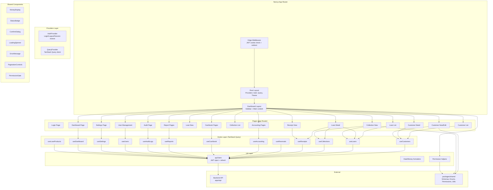

# Design Document: AS Finance LMS Frontend Implementation

## Overview

This design covers evolving the existing Next.js 14+ App Router frontend shells at `apps/web/` into production-ready, finance-safe pages that consume the complete backend API surface. The frontend already has foundational infrastructure in place: an API client with JWT refresh (`api-client.ts`), an auth provider, RBAC-aware sidebar navigation, shared UI components (MoneyDisplay, StatusBadge, ConfirmDialog, LoadingSpinner, ErrorMessage, PaginationControls), TanStack Query hooks for customers/loans/collections, and page shells for dashboard, customer CRUD, loan detail, collection posting, accounting, cashbook, and audit.

The design focuses on:
1. Completing all page implementations to be fully functional against the API
2. Adding missing TanStack Query hooks for receipts, reversals, accounting, cashbook, reports, audit, users, and settings
3. Enforcing RBAC at the UI layer using the shared `PERMISSIONS` constant
4. Ensuring finance-safe UX patterns: no optimistic updates, idempotency keys on mutations, confirm dialogs on all finance-affecting actions
5. Mobile-first design for collection workflows, desktop-optimized for office/accounting
6. Consistent money display (paise → INR at component level only), date formatting in IST, and PII masking

## Architecture

### High-Level Component Architecture



### Data Flow Pattern

All pages follow a consistent data flow:

1. Page component mounts → TanStack Query hook fires `queryFn`
2. `queryFn` calls `apiClient.get/post/patch` → JWT injected automatically
3. On 401 → `apiClient` attempts single refresh → retries or redirects to login
4. Data returned → hook provides `{ data, isLoading, error }` to component
5. Mutations: hook returns `mutateAsync` → component awaits server response → invalidates queries on success
6. No optimistic updates for any finance mutation

### RBAC Architecture

```
PERMISSIONS (packages/shared) → imported by:
  ├── SidebarNav: filters visible nav items
  ├── PermissionGate: wraps action buttons, conditionally renders children
  ├── Page-level checks: "Access Denied" for unauthorized routes
  └── All client-side — server is authoritative
```

A new `PermissionGate` component wraps any UI element that requires a specific permission. It reads the user's role from `useAuth()` and checks against the shared `PERMISSIONS` constant. This is purely a UX convenience — the API enforces authorization server-side.


## Components and Interfaces

### New Shared Components

#### PermissionGate

Conditionally renders children based on the current user's role and a required permission key.

```typescript
interface PermissionGateProps {
  permission: string;       // e.g. 'loan.approve'
  children: React.ReactNode;
  fallback?: React.ReactNode; // optional fallback (default: null)
}
```

Usage: `<PermissionGate permission="loan.approve"><Button>Approve</Button></PermissionGate>`

#### AccessDenied

A full-page "Access Denied" component displayed when a user navigates to a route they lack permission for.

#### DateDisplay

Formats ISO date strings to IST display format (`DD-MMM-YYYY` or `DD-MMM-YYYY HH:mm`).

```typescript
interface DateDisplayProps {
  date: string;             // ISO 8601 string
  showTime?: boolean;       // include HH:mm in IST (default: false)
}
```

#### SuccessToast / Toast System

Lightweight toast notifications for successful write operations. Uses a simple context-based toast provider.

### New TanStack Query Hooks

Each hook follows the established pattern from `useCustomers`, `useLoans`, `useCollections`:

| Hook | Queries | Mutations |
|------|---------|-----------|
| `useDashboard` | `GET /dashboard` | — |
| `useLoanProducts` | `GET /loan-products` | — |
| `useReceipts` | `GET /receipts`, `GET /receipts/:id`, `GET /receipts?loanId=` | — |
| `useReversals` | — | `POST /reversals` |
| `useAccounting` | `GET /accounting/chart-of-accounts`, `/daybook`, `/trial-balance`, `/profit-loss`, `/balance-sheet` | — |
| `useCashbook` | `GET /cashbook/daily-summary`, `GET /cashbook/handovers` | `POST /cashbook/expenses`, `POST /cashbook/handovers`, `PATCH /cashbook/handovers/:id/verify` |
| `useReports` | `GET /reports/:type` | — |
| `useAuditLogs` | `GET /audit-logs` | — |
| `useUsers` | `GET /users`, `GET /users/:id` | `POST /users`, `PATCH /users/:id` |
| `useSettings` | `GET /settings`, `GET /settings/holidays` | `PATCH /settings`, `POST /settings/holidays`, `DELETE /settings/holidays/:id` |

### Mutation Hooks Pattern

All mutation hooks that perform finance-affecting operations:
- Accept an `idempotencyKey` parameter (generated via `crypto.randomUUID()` at the form level)
- Pass it as `X-Idempotency-Key` header via the apiClient
- Invalidate relevant query keys on success
- Do NOT use `onMutate` for optimistic updates

```typescript
// Example: usePostCollection mutation with idempotency
mutationFn: (data: { loanId: string; amountPaise: number; paymentDate: string; paymentMode: string; idempotencyKey: string }) => {
  return apiClient.post('/collections', data, {
    headers: { 'X-Idempotency-Key': data.idempotencyKey }
  });
}
```

### Page Component Interfaces

#### Dashboard Page (existing shell → complete)
- Fetches KPIs from `GET /dashboard`
- KPI cards link to relevant list pages
- Overdue card highlighted with danger variant when count > 0
- All money via `MoneyDisplay`

#### Customer List Page (needs: search debounce, status filter, empty state)
- Debounced search input (300ms) filtering by name or mobile
- Status filter dropdown (Active, Blacklisted, Inactive)
- Table columns: Name (link), Mobile, City, Status badge
- Responsive: hide City on mobile
- PaginationControls at bottom

#### Customer New Page (needs: complete fields, shared schema)
- Replace inline Zod schema with `createCustomerSchema` from `@as-finance/shared/validation`
- Add missing fields: alternate mobile, PAN, DOB, age, occupation, monthly income, address line 2, notes
- Handle 409 conflict for duplicate Aadhaar/mobile
- Convert `monthlyIncomePaise` from rupee input to paise on submit

#### Customer Detail Page (needs: documents, blacklist/reinstate, linked loans)
- Document upload section (gated by `customer.upload_doc` permission)
- Blacklist/Reinstate buttons (gated by `customer.blacklist` permission) with ConfirmDialog
- Linked loans section fetched from API, showing loan number, principal, status, outstanding

#### Loan New Page (new)
- Customer search/select input (typeahead against `GET /customers?search=`)
- Loan product dropdown from `GET /loan-products`
- Principal input in rupees → converted to paise on submit
- Tenure in months, purpose text field
- Validation: positive principal, tenure ≥ 1

#### Loan List Page (needs: status filter tabs, responsive table)
- Status filter buttons: All, Draft, Submitted, Under Review, Approved, Active, Overdue, Closed
- Table: Loan Number (link), Customer Name, Principal (INR), Status Badge, Outstanding (INR)
- Overdue loans highlighted via StatusBadge

#### Loan Detail Page (needs: action buttons, collection history, receipts)
- Approve/Reject buttons (gated by `loan.approve`, visible for submitted/under_review)
- Disburse button (gated by `loan.disburse`, visible for approved) with idempotency key
- Reject requires reason input in ConfirmDialog
- Collection history section
- Receipts section with links to receipt detail
- All action buttons disabled while any action is in progress

#### Collection New Page (needs: mobile-first redesign, loan search, confirm dialog)
- Loan search by loan number or customer name
- Display selected loan info (outstanding, customer, loan number)
- Amount input in rupees with large touch-friendly numeric input
- Payment mode as large tappable buttons (Cash, Bank Transfer, Online)
- Date defaults to today IST
- ConfirmDialog before posting showing all details
- Idempotency key generated once per form session
- Navigate to receipt on success

#### Collection List Page (needs: reverse button, status display)
- Table: Date, Loan Number, Customer, Amount (INR), Mode, Status Badge
- Reverse button per row (gated by `collection.reverse`, only for posted status)

#### Receipt View Page (new)
- Fetch receipt from `GET /receipts/:id`
- Display: receipt number, date, customer, loan number, amount, mode, allocation breakdown, outstanding after, officer name
- Print button → `window.print()` with `@media print` CSS
- Thermal printer (58mm/80mm) and A4 compatible print layout
- "REVERSED" watermark overlay for reversed receipts

#### Accounting Pages (existing shell → complete sub-pages)
- Trial Balance: date range filter, account name + debit/credit totals
- Profit & Loss: date range filter, income/expense categories with totals
- Balance Sheet: date filter, assets/liabilities/equity with totals

#### Cashbook Pages (existing shell → complete expense form, handover page)
- Expense form at `/cashbook/expenses/new`: category, amount (rupees→paise), date, description, mode
- Handover page at `/cashbook/handovers`: list pending handovers, initiate handover form, verify button (gated by `handover.verify`)

#### Report Pages (new)
- Report index listing available types
- Report detail with date range filters
- Tabular data display with INR formatting
- Export PDF/Excel buttons (gated by `report.export`)

#### User Management Pages (new)
- User list with pagination
- Create user form: username, full name, mobile, password (shared `passwordSchema`), role, area
- Edit user form: full name, mobile, role (gated by `user.change_role`), active status, area

#### Settings Page (existing shell → complete)
- Editable key-value settings with dirty tracking
- Holiday calendar: list, add (date + description), remove
- Save only changed settings via `PATCH /settings`

#### Audit Page (existing shell → complete)
- Add action type filter dropdown
- Format timestamps in IST via DateDisplay component
- Responsive column hiding already implemented


## Data Models

### API Response Types (Frontend TypeScript Interfaces)

The frontend uses snake_case field names matching the API response format. Existing types in hooks are extended as needed.

#### Core Types (already defined in hooks, extended where noted)

```typescript
// Customer types — already in useCustomers.ts
// Extended: CustomerDetail includes family_members, guarantors (already present)

// Loan types — already in useLoans.ts  
// Extended: LoanDetail includes schedules (already present)

// Collection types — already in useCollections.ts
// Extended: Collection includes loan relation (already present)

// Receipt type — already in useCollections.ts
```

#### New Types

```typescript
// Dashboard KPIs — already defined inline in dashboard page
interface DashboardKPIs {
  totalCustomers: number;
  activeLoans: number;
  overdueLoans: number;
  totalOutstandingPaise: number;
  todayCollectionsPaise: number;
  todayDisbursementsPaise: number;
  cashInHandPaise: number;
  pendingApprovals: number;
}

// Loan Product (for loan creation dropdown)
interface LoanProduct {
  id: string;
  name: string;
  version: number;
  interest_type: 'flat' | 'reducing_balance';
  annual_rate: number;
  min_principal_paise: number;
  max_principal_paise: number;
  min_tenure_months: number;
  max_tenure_months: number;
  frequency: 'daily' | 'weekly' | 'monthly';
}

// Accounting types
interface ChartAccount {
  id: string;
  code: string;
  name: string;
  category: 'asset' | 'liability' | 'income' | 'expense' | 'equity';
}

interface JournalEntry {
  id: string;
  date: string;
  description: string;
  sourceType: string;
  lines: { accountName: string; debitPaise: number; creditPaise: number }[];
}

interface TrialBalanceRow {
  accountCode: string;
  accountName: string;
  debitPaise: number;
  creditPaise: number;
}

interface ProfitLossReport {
  income: { category: string; totalPaise: number }[];
  expenses: { category: string; totalPaise: number }[];
  netProfitPaise: number;
}

interface BalanceSheet {
  assets: { name: string; totalPaise: number }[];
  liabilities: { name: string; totalPaise: number }[];
  equity: { name: string; totalPaise: number }[];
}

// Cashbook types
interface CashbookSummary {
  date: string;
  openingBalancePaise: string;
  cashInflowsPaise: string;
  cashOutflowsPaise: string;
  closingBalancePaise: string;
  hasDiscrepancy: boolean;
  transactionCount: number;
}

interface CashHandover {
  id: string;
  officer_id: string;
  officer_name: string;
  amount_paise: number;
  remarks: string;
  status: 'pending' | 'verified';
  verified_by?: string;
  created_at: string;
}

// Report types
interface ReportMeta {
  type: string;
  label: string;
  description: string;
}

// User types
interface User {
  id: string;
  username: string;
  full_name: string;
  mobile: string;
  role: string;
  is_active: boolean;
  area?: string;
  created_at: string;
}

// Settings types
interface Setting {
  key: string;
  value: string;
  description?: string;
}

interface Holiday {
  id: string;
  date: string;
  description: string;
}

// Audit log type — already defined inline in audit page
interface AuditLog {
  id: string;
  action_type: string;
  actor_id: string;
  actor_role: string;
  target_entity: string;
  target_id: string;
  created_at: string;
  remarks?: string;
}
```

### Money Handling Convention

| Layer | Representation |
|-------|---------------|
| API transport | Integer paise (JSON number) |
| TanStack Query cache | Integer paise (as received) |
| Component state | Integer paise |
| Form input | Rupees (user-friendly) |
| Form submit | Convert rupees → paise: `Math.round(parseFloat(value) * 100)` |
| Display | `MoneyDisplay` component converts paise → formatted INR |

The conversion from rupees input to paise happens at the form submission boundary only. All internal state and API communication uses integer paise.

### Date Handling Convention

| Layer | Format |
|-------|--------|
| API transport | ISO 8601 string (UTC) |
| Display | `DD-MMM-YYYY` or `DD-MMM-YYYY HH:mm` in IST |
| Form input | HTML date input (`YYYY-MM-DD`) |
| Form submit | ISO 8601 string |
| Default date | Today in IST via `new Date().toLocaleDateString('en-CA', { timeZone: 'Asia/Kolkata' })` |

A `formatDateIST(isoString)` utility and `DateDisplay` component handle all date formatting consistently.

### Shared Validation Schemas Usage

| Form | Schema Source |
|------|-------------|
| Customer Create | `createCustomerSchema` from `@as-finance/shared/validation` |
| Customer KYC fields | `aadhaarSchema`, `panSchema`, `mobileSchema`, `pincodeSchema` |
| User Create (password) | `passwordSchema` from `@as-finance/shared/validation` |
| Collection amount | `paiseSchema` (after rupee→paise conversion) |

### Permission Check Pattern

```typescript
// Utility function (already exists in sidebar-nav.tsx, extracted to lib/permissions.ts)
function hasPermission(role: string, permission: string): boolean {
  const allowed = PERMISSIONS[permission];
  if (!allowed) return false;
  return (allowed as readonly string[]).includes(role);
}
```


## Correctness Properties

*A property is a characteristic or behavior that should hold true across all valid executions of a system — essentially, a formal statement about what the system should do. Properties serve as the bridge between human-readable specifications and machine-verifiable correctness guarantees.*

### Property 1: MoneyDisplay formatting correctness

*For any* integer paise value, `formatPaiseToINR(paise)` should produce a string that: (a) starts with `₹` (or `-₹` for negative values), (b) uses Indian comma grouping (last 3 digits, then groups of 2), (c) has exactly 2 decimal places, and (d) the numeric value equals `Math.abs(paise) / 100` when parsed back.

**Validates: Requirements 20.1, 20.2, 20.3, 20.4**

### Property 2: Date formatting in IST

*For any* valid ISO 8601 date string, `formatDateIST(date)` should produce a string matching the pattern `DD-MMM-YYYY` in the Asia/Kolkata timezone, and `formatTimestampIST(date)` should produce `DD-MMM-YYYY HH:mm` in IST. The formatted date must correspond to the correct IST calendar date for the given UTC timestamp.

**Validates: Requirements 23.1, 23.2, 23.3**

### Property 3: PII masking round-trip consistency

*For any* 4-digit string `lastFour`, `maskAadhaar` applied to any 12-digit Aadhaar ending in `lastFour` should produce `XXXX-XXXX-{lastFour}`. *For any* 4-character string `lastFour`, `maskPan` applied to any valid PAN ending in `lastFour` should produce `XXXXXX{lastFour}`. The last 4 characters of the masked output must always equal the last 4 characters of the input.

**Validates: Requirements 6.2, 6.3, 25.1, 25.2**

### Property 4: Shared validation schema correctness

*For any* string, the shared validation schemas should correctly classify inputs: `aadhaarSchema` accepts exactly 12-digit strings, `panSchema` accepts exactly `[A-Z]{5}[0-9]{4}[A-Z]`, `mobileSchema` accepts exactly 10-digit strings starting with 6-9, `pincodeSchema` accepts exactly 6-digit strings, and `passwordSchema` accepts strings with ≥8 chars containing at least one uppercase, one lowercase, and one digit. All other strings should be rejected.

**Validates: Requirements 5.1, 5.2, 5.3, 5.4, 18.3**

### Property 5: Rupee-to-paise conversion integrity

*For any* non-negative rupee amount entered as a string with at most 2 decimal places, converting to paise via `Math.round(parseFloat(value) * 100)` and then formatting back via `MoneyDisplay` should display the original rupee amount. This is a round-trip property ensuring no precision loss in the rupee→paise→display pipeline.

**Validates: Requirements 7.3, 10.3**

### Property 6: RBAC permission gate consistency

*For any* user role from the `UserRole` enum and *for any* permission key in the `PERMISSIONS` constant, the `hasPermission(role, permission)` function returns `true` if and only if the role appears in `PERMISSIONS[permission]`. The `PermissionGate` component renders its children if and only if `hasPermission` returns `true` for the current user's role.

**Validates: Requirements 2.1, 2.3, 6.7, 6.8, 6.9, 9.5, 9.8, 13.1, 15.9, 16.5, 18.2, 18.5, 18.6, 19.6**

### Property 7: Sidebar navigation filtering

*For any* user role, the `SidebarNav` component renders exactly those navigation items whose permission key passes `hasPermission(role, item.permission)`. No extra items are shown, and no permitted items are hidden.

**Validates: Requirements 2.1**

### Property 8: Status badge variant mapping

*For any* status string and status type (loan, installment, collection, customer, overdue_bucket), the `StatusBadge` component maps to the correct visual variant. Specifically, `overdue` loan status maps to `warning`, `overdue` installment status maps to `danger`, and `reversed` collection status maps to `danger`.

**Validates: Requirements 8.5, 9.4, 11.6, 12.4**

### Property 9: Pagination calculation correctness

*For any* total item count and page size, the computed `totalPages` should equal `Math.ceil(total / pageSize)`, and the `skip` parameter should equal `(page - 1) * pageSize`. Page navigation should be disabled at boundaries (page 1 for previous, last page for next).

**Validates: Requirements 4.5, 8.6, 17.5**

### Property 10: Filter application resets to page 1

*For any* list page (customers, loans, audit logs) and *for any* filter change (status, search, entity type), the page number should reset to 1 when a filter is applied.

**Validates: Requirements 4.3, 8.3, 17.3**

### Property 11: Search debounce behavior

*For any* sequence of keystrokes in a search input, the API should only be called after the debounce period (300ms) has elapsed since the last keystroke. Intermediate keystrokes should not trigger API calls.

**Validates: Requirements 4.2**

### Property 12: Idempotency key presence on finance mutations

*For any* finance-affecting mutation (collection posting, disbursement, reversal), the API request must include an `X-Idempotency-Key` header with a valid UUID v4 value. The same form session must reuse the same idempotency key for retries.

**Validates: Requirements 10.7, 10.12, 13.3**

### Property 13: ConfirmDialog gate for finance actions

*For any* finance-affecting action (approve, reject, disburse, post collection, reverse, blacklist, reinstate, record expense, handover), a ConfirmDialog must be displayed before the API call is made. The dialog must show the action title and relevant details (amount, entity name). The dialog must remain open and buttons disabled until the server responds.

**Validates: Requirements 21.1, 21.2, 21.5**

### Property 14: Rejection and reversal reason validation

*For any* loan rejection, a non-empty reason string is required. *For any* collection reversal, the reason string must be at least 10 characters. The form should prevent submission when the reason constraint is not met.

**Validates: Requirements 9.7, 13.2**

### Property 15: Default date is today in IST

*For any* date input field that defaults to "today", the default value should equal the current date in the Asia/Kolkata timezone, formatted as `YYYY-MM-DD` for the HTML date input.

**Validates: Requirements 10.5, 15.2, 23.5**

### Property 16: API error display includes message and request ID

*For any* failed API request where the response body contains a `message` field, the error display should show that message. When a `requestId` is available, it should also be displayed for support reference.

**Validates: Requirements 22.2, 22.3**

### Property 17: Overdue dashboard card highlighting

*For any* dashboard KPI state where `overdueLoans > 0`, the overdue loans card should render with the danger/destructive variant styling. When `overdueLoans === 0`, it should render with default styling.

**Validates: Requirements 3.3**

### Property 18: Cashbook discrepancy warning

*For any* cashbook daily summary where `hasDiscrepancy` is `true`, the UI should display a visible warning indicator. When `hasDiscrepancy` is `false`, no warning should be shown.

**Validates: Requirements 15.3**

### Property 19: Settings dirty tracking — only changed values submitted

*For any* set of settings where a subset has been modified by the user, the PATCH request payload should contain only the keys whose values differ from the original fetched values. Unmodified settings should not be included in the request.

**Validates: Requirements 19.2**

### Property 20: Receipt display completeness

*For any* receipt object, the rendered receipt view should contain: receipt number, date, customer name, loan number, amount paid, payment mode, allocation breakdown (penalty, interest, principal amounts), outstanding balance after payment, and collected-by officer name. No required field should be missing from the display.

**Validates: Requirements 11.2**

### Property 21: Token refresh on 401

*For any* API call that receives an HTTP 401 response, the API client should attempt exactly one token refresh via `POST /auth/refresh`. If the refresh succeeds, the original request should be retried with the new token. If the refresh fails, the user should be redirected to login.

**Validates: Requirements 1.5**

### Property 22: Middleware redirect for unauthenticated requests

*For any* protected route (not in the public paths list) and *for any* request without a valid JWT cookie, the middleware should redirect to `/login` with a `redirect` query parameter set to the original path.

**Validates: Requirements 1.6**


## Error Handling

### API Error Handling Strategy

All API errors flow through the `ApiClientError` class defined in `api-client.ts`. The error handling strategy is layered:

#### Layer 1: API Client (Global)
- **401 Unauthorized**: Automatic single refresh attempt. On refresh failure, redirect to `/login`.
- **Network errors**: Caught by `fetch` rejection, surfaced as generic connection error.
- All other HTTP errors: Wrapped in `ApiClientError` with `statusCode`, `message`, and `requestId`.

#### Layer 2: TanStack Query (Per-Hook)
- `retry: 1` for queries (configured in QueryProvider), `retry: false` for mutations.
- `staleTime: 30_000` prevents unnecessary refetches.
- Failed queries expose `error` via the hook return value.
- Failed mutations expose `error` via the mutation return value.

#### Layer 3: Component (Per-Page)
- Each page checks `isLoading` → shows `LoadingSpinner`.
- Each page checks `error` → shows `ErrorMessage` with the error message.
- Mutation errors shown inline above forms or in toast notifications.
- 404 responses show entity-specific "not found" messages.

### Specific Error Scenarios

| Scenario | HTTP Code | User-Facing Message | Component Behavior |
|----------|-----------|--------------------|--------------------|
| Invalid credentials | 401 | "Invalid username or password." | Alert on login page |
| Account locked | 423 | "Account is locked. Please try again later." | Alert on login page |
| Network failure | — | "Unable to connect to server. Please check your connection." | Alert on login page / ErrorMessage elsewhere |
| Validation error | 400 | Server-provided message | Inline error above form |
| Duplicate Aadhaar/mobile | 409 | "Customer with this Aadhaar/mobile already exists." | Inline error above form |
| Unauthorized action | 403 | "Access Denied" | Full-page AccessDenied component |
| Entity not found | 404 | "{Entity} not found" | Inline message replacing content |
| Server error | 500 | "Something went wrong. Please try again." with requestId | ErrorMessage component |
| Idempotency conflict | 409 | Server-provided message (duplicate detected) | Error shown, form not reset |

### Finance Mutation Error Recovery

For finance mutations (collection, disbursement, reversal):
1. Error displayed in the ConfirmDialog or inline
2. Form inputs remain populated (not cleared)
3. Submit button re-enabled for retry
4. Idempotency key preserved for the same form session (safe to retry)
5. No partial UI state updates — UI only updates after successful server response and query invalidation

### Toast Notifications

Success toasts are shown for:
- Customer created/updated
- Loan submitted/approved/rejected/disbursed
- Collection posted
- Reversal completed
- Expense recorded
- Settings saved
- User created/updated

Toasts auto-dismiss after 5 seconds and include a dismiss button.

## Testing Strategy

### Testing Framework

- **Unit/Component tests**: Vitest + React Testing Library
- **Property-based tests**: fast-check with Vitest
- **E2E tests**: Playwright
- **API mocking**: MSW (Mock Service Worker) for component tests

### Unit Tests

Unit tests cover specific examples, edge cases, and integration points:

- **MoneyDisplay**: Specific formatting examples (0 paise, 100 paise, large amounts, negative amounts)
- **StatusBadge**: Specific status-to-variant mappings for each status type
- **DateDisplay**: Specific date formatting examples including timezone edge cases (midnight UTC → IST date boundary)
- **PermissionGate**: Specific role-permission combinations
- **Login flow**: Mock API responses for success, 401, 423, network error
- **Form submissions**: Mock API for success and error paths
- **ConfirmDialog**: Open/close behavior, loading state, button states
- **Pagination**: Boundary conditions (page 1, last page, single page)
- **Search debounce**: Timer-based testing with fake timers

### Property-Based Tests

Each correctness property from the design is implemented as a single property-based test using fast-check. Tests are co-located as `*.property.spec.ts`.

Configuration:
- Minimum 100 iterations per property test
- Each test tagged with: `Feature: frontend-implementation, Property {N}: {title}`

Property test files:
- `apps/web/src/components/shared/__tests__/money-display.property.spec.ts` — Properties 1, 5
- `apps/web/src/lib/__tests__/date-utils.property.spec.ts` — Properties 2, 15
- `apps/web/src/lib/__tests__/masking.property.spec.ts` — Property 3 (delegates to shared utils)
- `apps/web/src/lib/__tests__/validation.property.spec.ts` — Property 4 (delegates to shared schemas)
- `apps/web/src/lib/__tests__/permissions.property.spec.ts` — Properties 6, 7
- `apps/web/src/components/shared/__tests__/status-badge.property.spec.ts` — Property 8
- `apps/web/src/components/shared/__tests__/pagination.property.spec.ts` — Property 9
- `apps/web/src/lib/__tests__/api-client.property.spec.ts` — Properties 16, 21

### E2E Tests (Playwright)

Critical user flows tested end-to-end:
1. Login → Dashboard → Navigate to customers
2. Customer creation with validation errors → successful creation
3. Loan creation → approval → disbursement flow
4. Collection posting (mobile viewport) → receipt view → print
5. Collection reversal with reason
6. RBAC: verify unauthorized routes show Access Denied
7. Session expiry → refresh → continued operation

### Test Organization

```
apps/web/
├── src/
│   ├── components/shared/__tests__/
│   │   ├── money-display.spec.ts          # Unit tests
│   │   ├── money-display.property.spec.ts # Property tests
│   │   ├── status-badge.spec.ts
│   │   ├── status-badge.property.spec.ts
│   │   ├── confirm-dialog.spec.ts
│   │   └── pagination.property.spec.ts
│   ├── lib/__tests__/
│   │   ├── date-utils.spec.ts
│   │   ├── date-utils.property.spec.ts
│   │   ├── permissions.spec.ts
│   │   ├── permissions.property.spec.ts
│   │   ├── api-client.spec.ts
│   │   └── api-client.property.spec.ts
│   └── hooks/__tests__/
│       ├── useCustomers.spec.ts
│       ├── useLoans.spec.ts
│       └── useCollections.spec.ts
├── test/
│   ├── e2e/
│   │   ├── auth.e2e.spec.ts
│   │   ├── customer-flow.e2e.spec.ts
│   │   ├── loan-lifecycle.e2e.spec.ts
│   │   ├── collection-mobile.e2e.spec.ts
│   │   └── rbac.e2e.spec.ts
│   └── setup/
│       └── msw-handlers.ts
```

### Coverage Targets

| Area | Target |
|------|--------|
| Shared components (MoneyDisplay, StatusBadge, etc.) | 90% |
| Utility functions (date, permissions, formatting) | 95% |
| TanStack Query hooks | 80% |
| Page components | 60% |
| Overall frontend | 75% |

